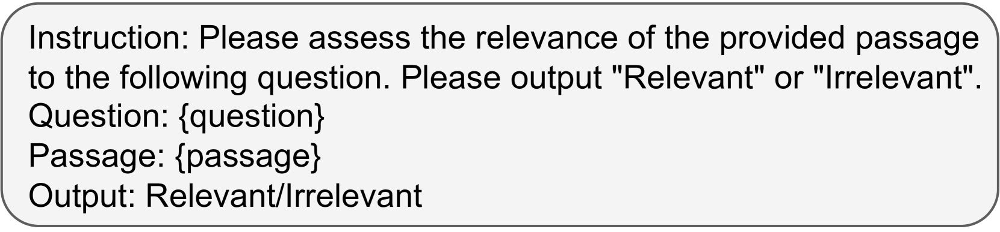
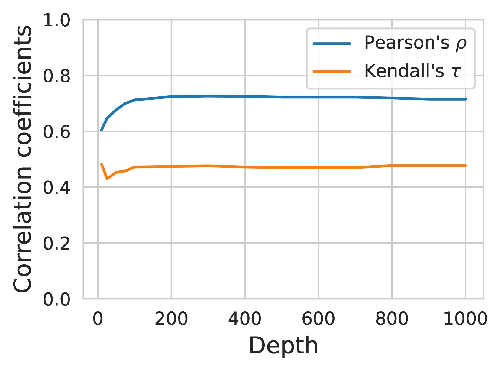
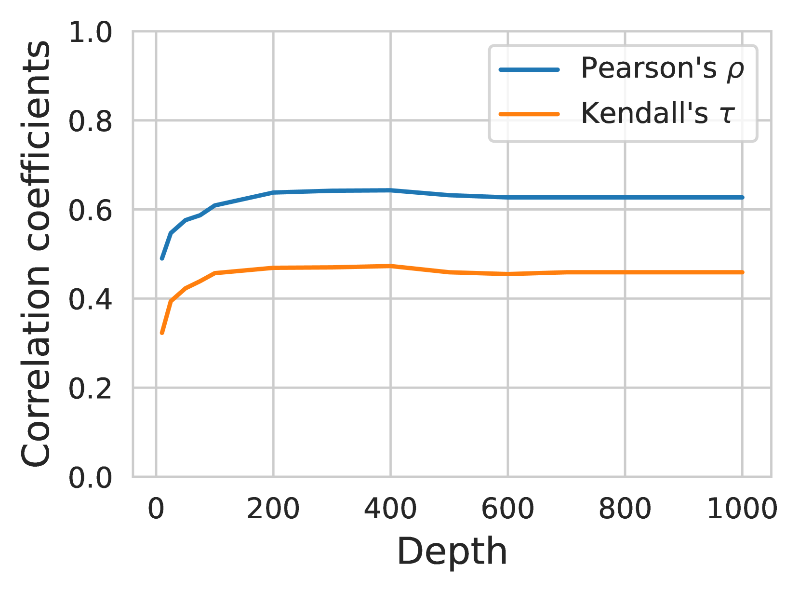
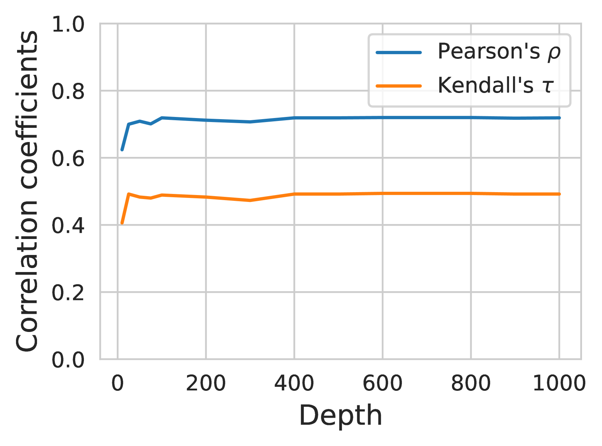
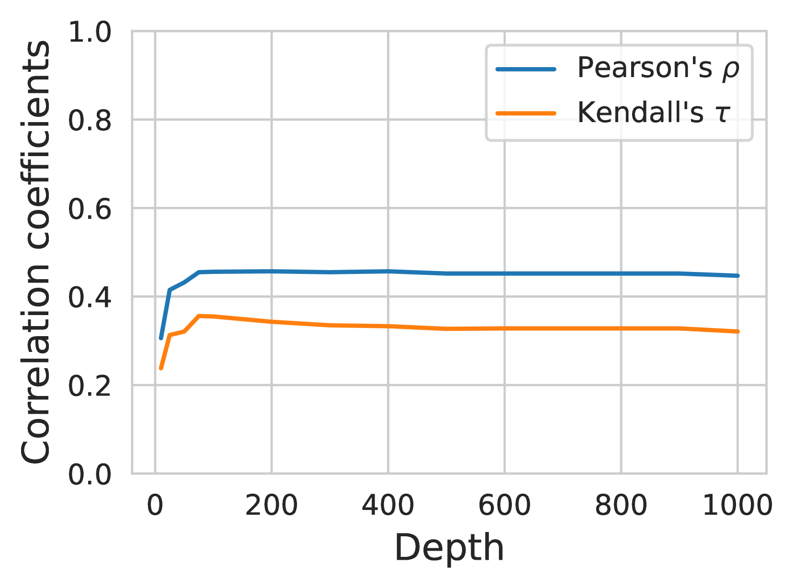
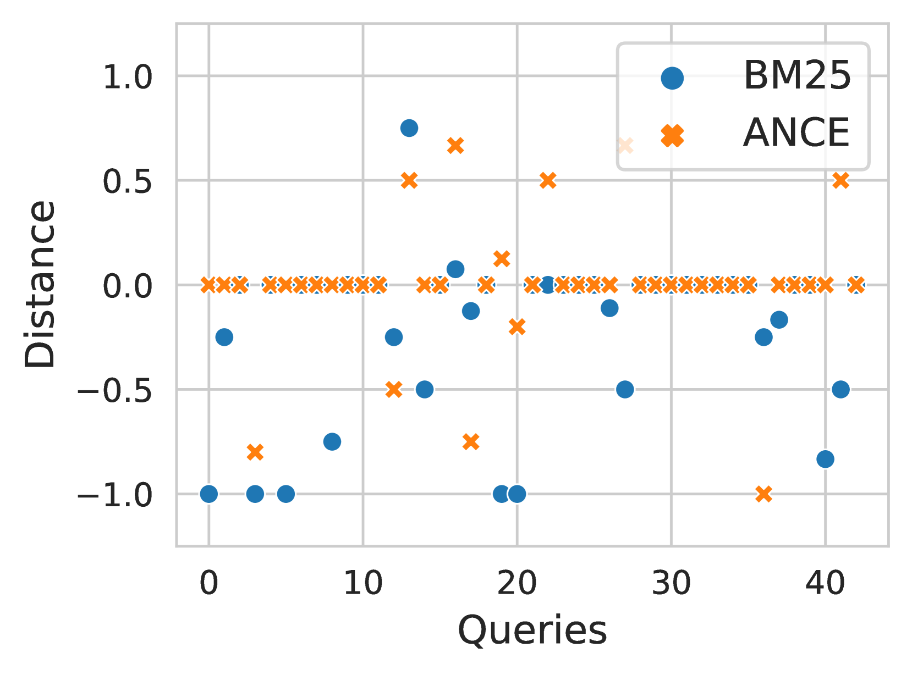
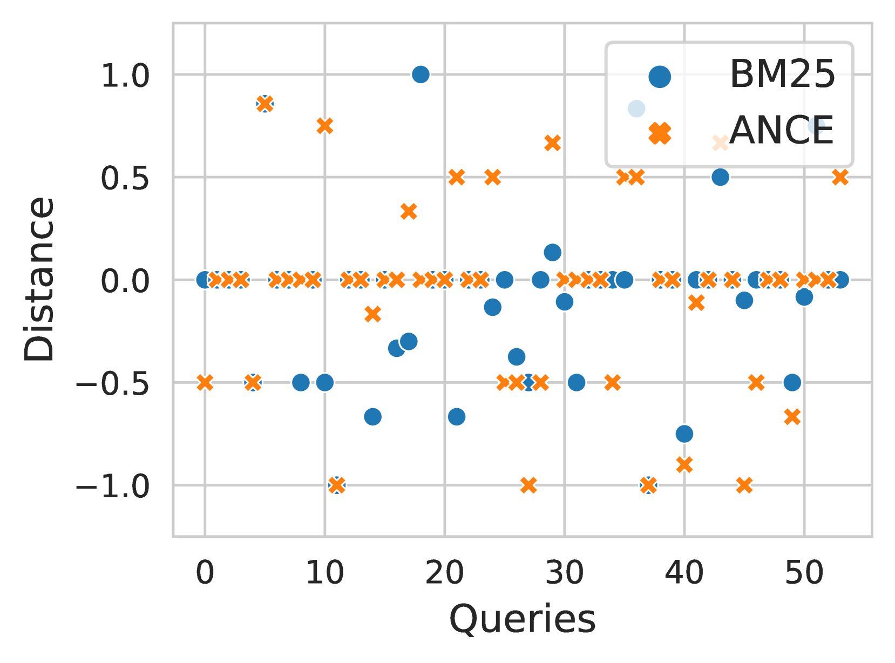

# 通过大型语言模型生成的相关性评估来预测查询性能

发布时间：2024年04月01日

`LLM应用` `信息检索` `自动化评估`

> Query Performance Prediction using Relevance Judgments Generated by Large Language Models

# 摘要

> 查询性能预测（QPP）致力于评估搜索系统对特定查询的检索效果，无需人工评判相关性。传统QPP方法仅提供单一数值预测，未能贴近实际的信息检索（IR）评价标准，存在局限：一是单一数值难以全面反映多样的IR评价指标，特别是在各项指标关联性不强的情况下；二是单一数值的预测结果缺乏足够的解释力。为克服这些问题，我们提出了一种新颖的QPP框架——QPP-GenRE，它通过自动生成的相关性评判，将QPP拆解为对给定查询的排名列表中各项内容的相关性评判的独立子任务。这不仅使我们能够利用生成的相关性评判作为伪标签来预测各种IR评价指标，还能帮助我们解读预测结果，发现、追踪并纠正相关性评判中的错误，从而提升QPP的准确性。我们运用顶尖的开源大型语言模型LLaMA来判断相关性，确保研究的科学性和可复现性。在此过程中，我们应对了两大挑战：一是在预测基于召回率的指标时，对整个语料库进行评判所带来的巨大计算负担；二是在零/少次射击情境下，LLaMA的表现不尽人意。我们制定了一种预测召回率导向IR指标的近似策略，并提出利用人工标记的相关性评判对LLaMA进行微调。在TREC 2019至2022年深度学习赛道的实验中，QPP-GenRE在精确度和召回率导向的指标上，都达到了最先进的QPP准确度，无论是对于词汇型还是神经型排名器。

> Query performance prediction (QPP) aims to estimate the retrieval quality of a search system for a query without human relevance judgments. Previous QPP methods typically return a single scalar value and do not require the predicted values to approximate a specific information retrieval (IR) evaluation measure, leading to certain drawbacks: (i) a single scalar is insufficient to accurately represent different IR evaluation measures, especially when metrics do not highly correlate, and (ii) a single scalar limits the interpretability of QPP methods because solely using a scalar is insufficient to explain QPP results. To address these issues, we propose a QPP framework using automatically generated relevance judgments (QPP-GenRE), which decomposes QPP into independent subtasks of judging the relevance of each item in a ranked list to a given query. This allows us to predict any IR evaluation measure using the generated relevance judgments as pseudo-labels; Also, this allows us to interpret predicted IR evaluation measures, and identify, track and rectify errors in generated relevance judgments to improve QPP quality. We judge relevance by leveraging a leading open-source large language model (LLM), LLaMA, to ensure scientific reproducibility. In doing so, we address two main challenges: (i) excessive computational costs of judging the entire corpus for predicting a recall-based metric, and (ii) poor performance in prompting LLaMA in a zero-/few-shot manner. We devise an approximation strategy to predict a recall-oriented IR measure and propose to fine-tune LLaMA using human-labeled relevance judgments. Experiments on the TREC 2019-2022 deep learning tracks show that QPP-GenRE achieves state-of-the-art QPP accuracy for both lexical and neural rankers in both precision- and recall-oriented metrics.

[Arxiv](https://arxiv.org/abs/2404.01012)