# 为确保语言模型对齐，我们采用正则化的最优 N 选一抽样策略，以降低奖励操纵行为的风险。

发布时间：2024年04月01日

`LLM应用` `人工智能`

> Regularized Best-of-N Sampling to Mitigate Reward Hacking for Language Model Alignment

# 摘要

> 在解码阶段，采用奖励模型引导的大型语言模型（LLMs）通过最佳N个（BoN）抽样与人类偏好保持一致，已被证实是一种有效方法。然而，BoN抽样可能会遭遇奖励黑客的问题。由于奖励模型并非真实目标的完美代表，过度追求其优化可能会影响其在实际目标上的效果。为了在偏好学习中防止奖励黑客，通常采用接近正则化（如KL正则化）来优化奖励，确保语言模型不偏离参考模型太远。本研究提出了一种新策略——规范化最佳N个（RBoN），它通过在响应选择过程中加入接近性条款来减少奖励黑客的风险，与偏好学习技术中的处理方式相似。我们在AlpacaFarm数据集上对RBoN的两种变体进行了评估，发现它们在代理奖励模型与真实目标关联度较低的情况下，表现尤为突出，超越了传统的BoN方法。

> Best-of-N (BoN) sampling with a reward model has been shown to be an effective strategy for aligning Large Language Models (LLMs) to human preferences at the time of decoding. BoN sampling is susceptible to a problem known as reward hacking. Because the reward model is an imperfect proxy for the true objective, over-optimizing its value can compromise its performance on the true objective. A common solution to prevent reward hacking in preference learning techniques is to optimize a reward using proximity regularization (e.g., KL regularization), which ensures that the language model remains close to the reference model. In this research, we propose Regularized Best-of-N (RBoN), a variant of BoN that aims to mitigate reward hacking by incorporating a proximity term in response selection, similar to preference learning techniques. We evaluate two variants of RBoN on the AlpacaFarm dataset and find that they outperform BoN, especially when the proxy reward model has a low correlation with the true objective.

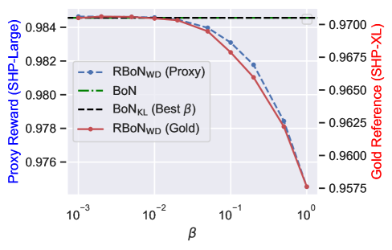

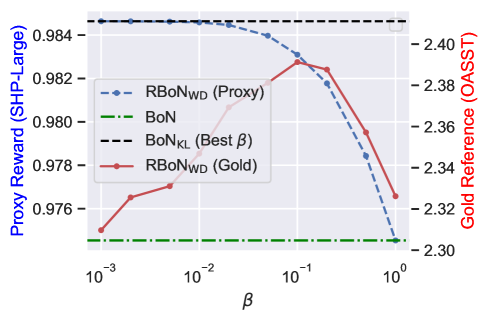

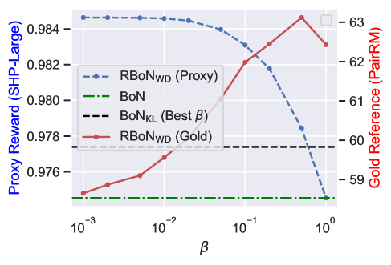

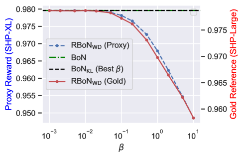

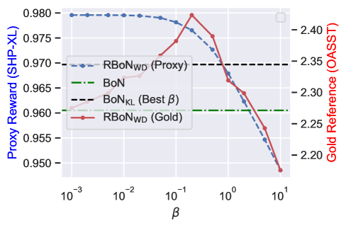

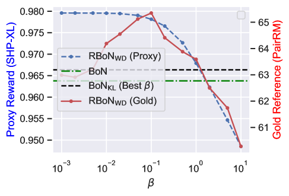

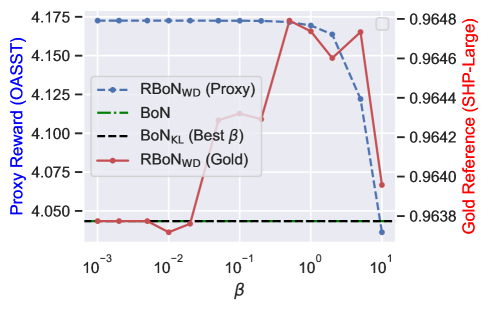

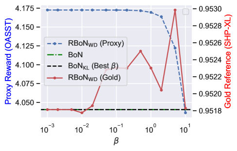

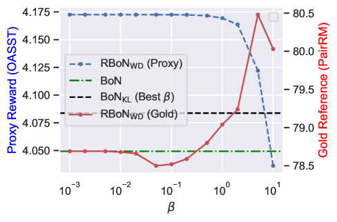

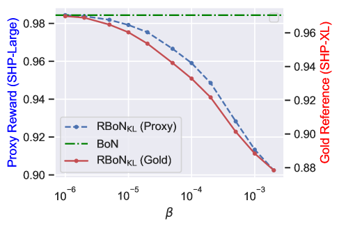

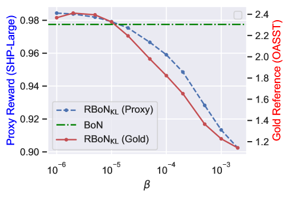

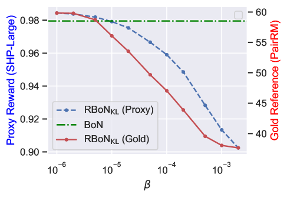

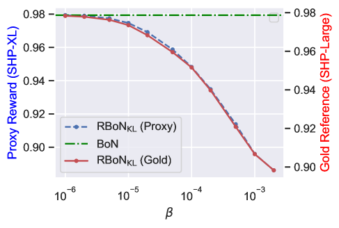

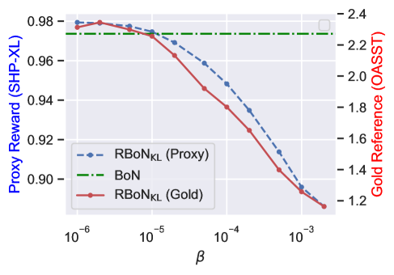

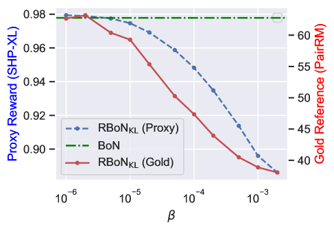

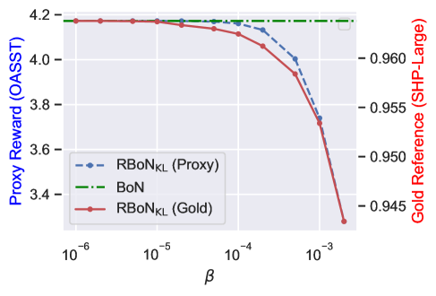

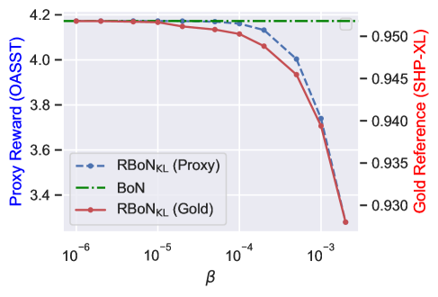

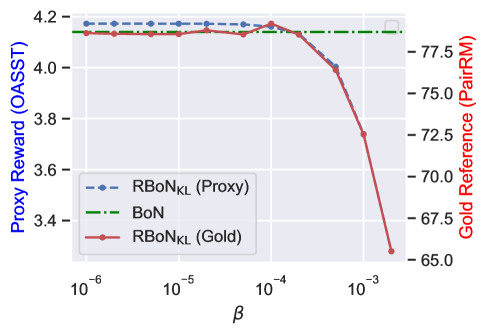

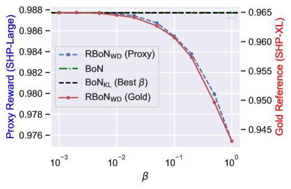

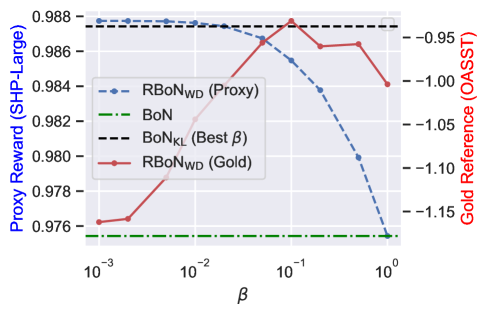

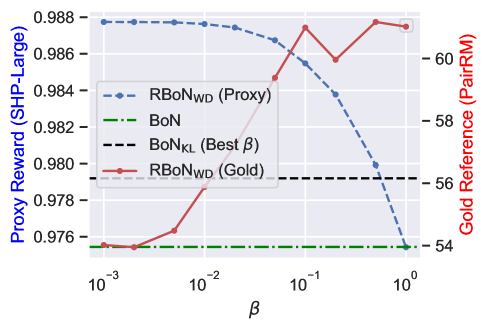

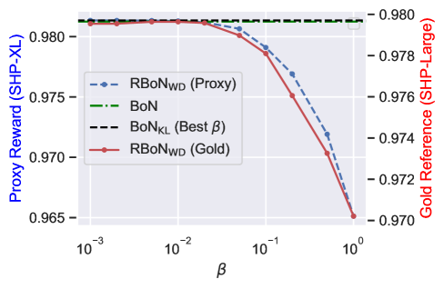

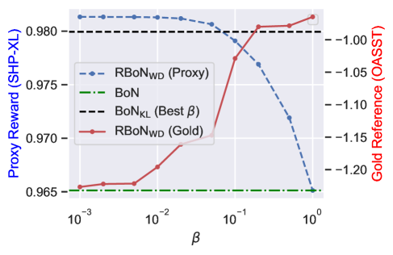

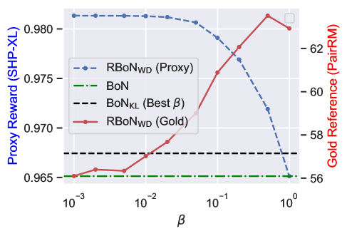

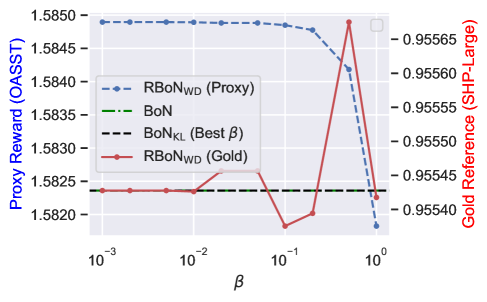

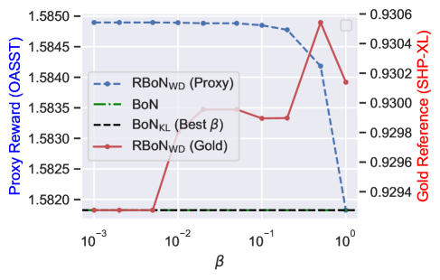

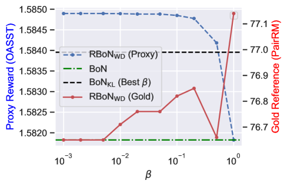

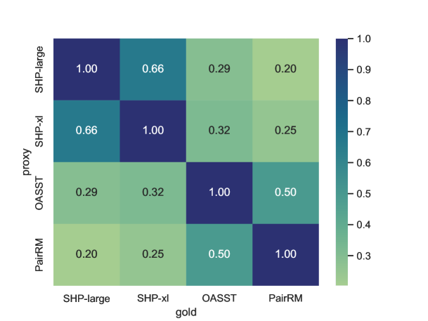

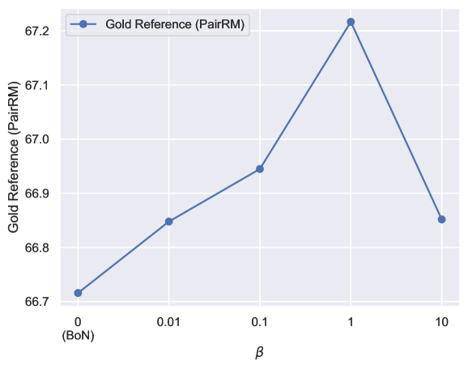

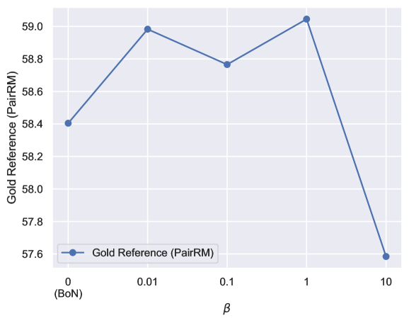

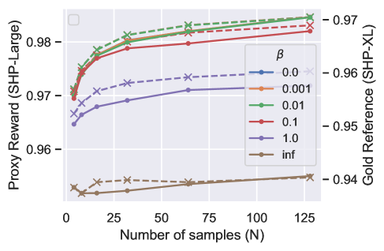

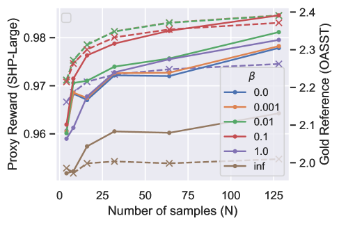

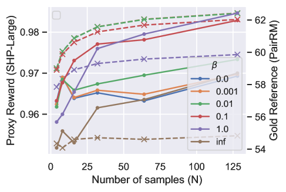

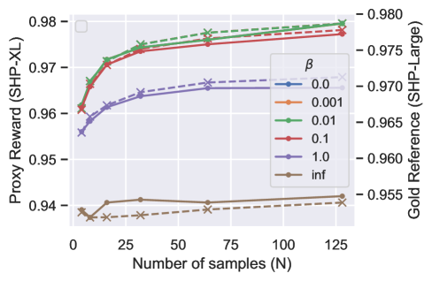

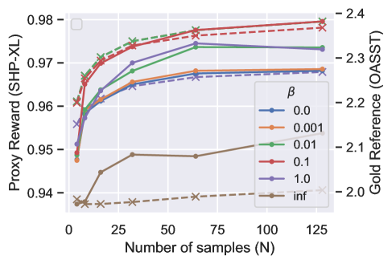

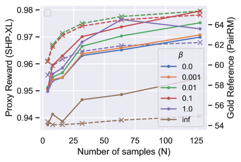

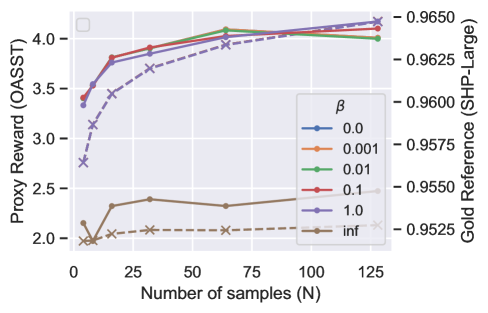

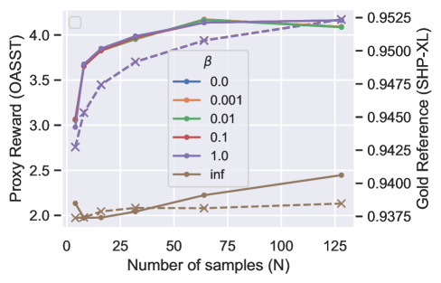

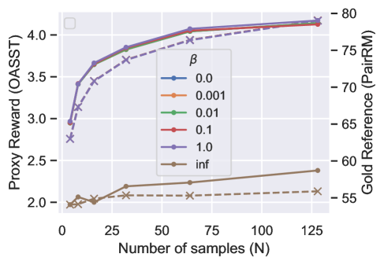

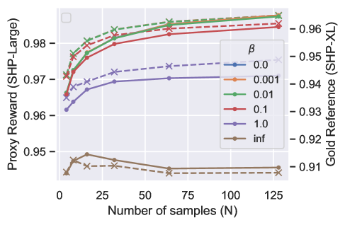

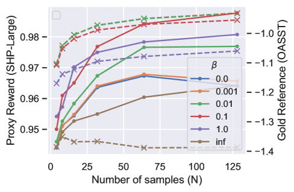

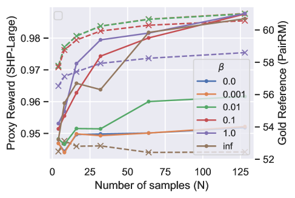

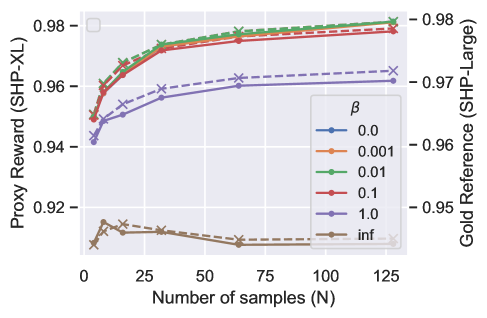

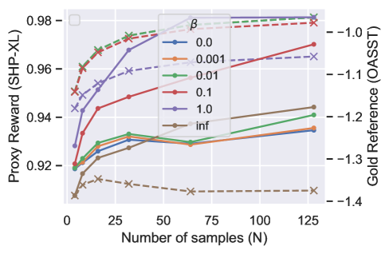

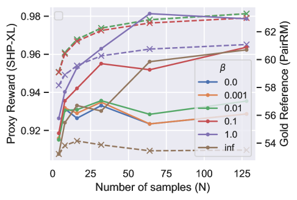

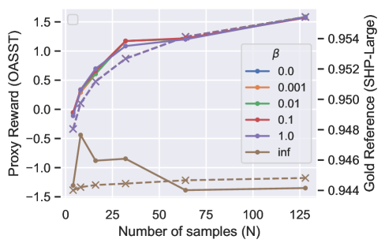

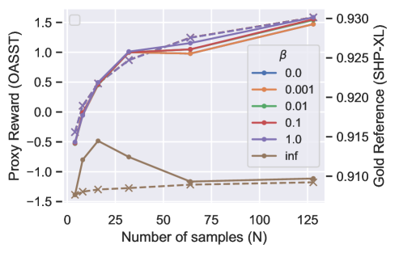

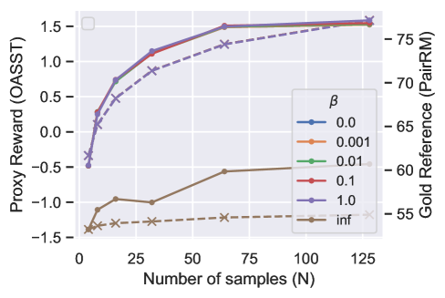

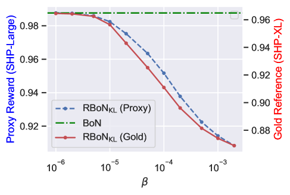

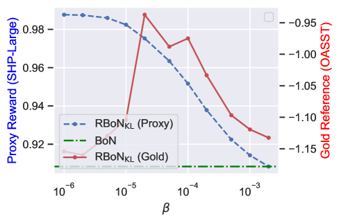

[Arxiv](https://arxiv.org/abs/2404.01054)