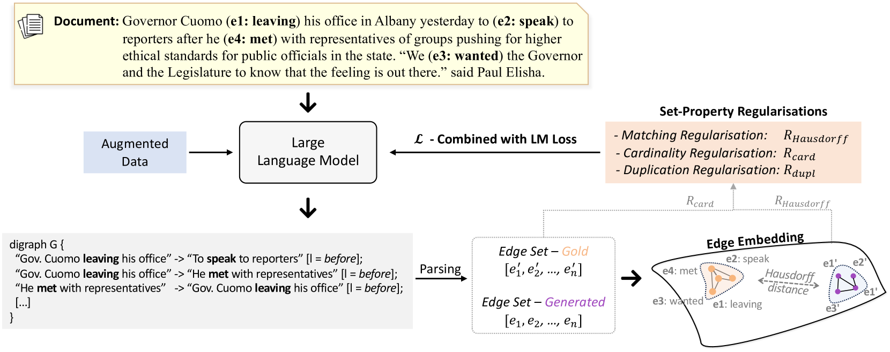
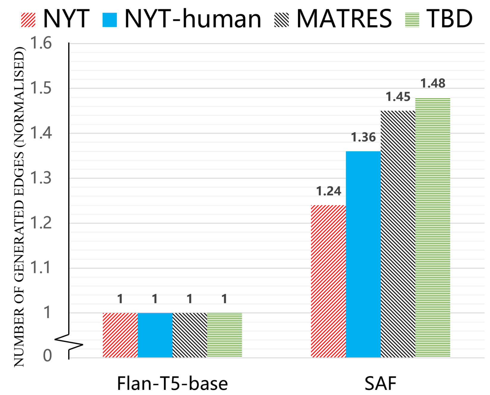
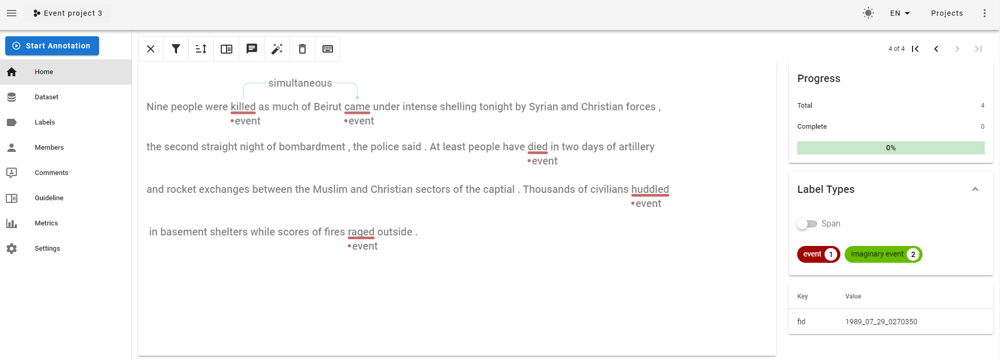
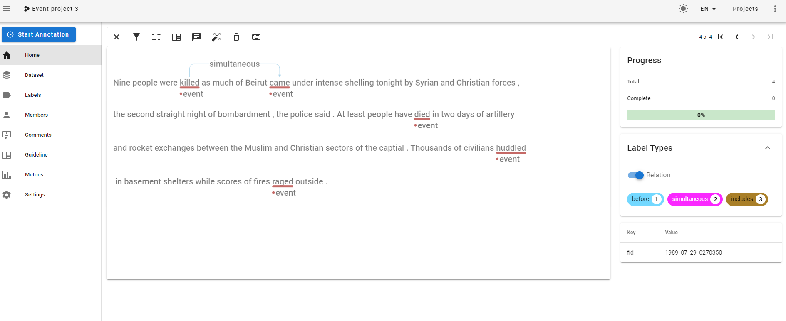
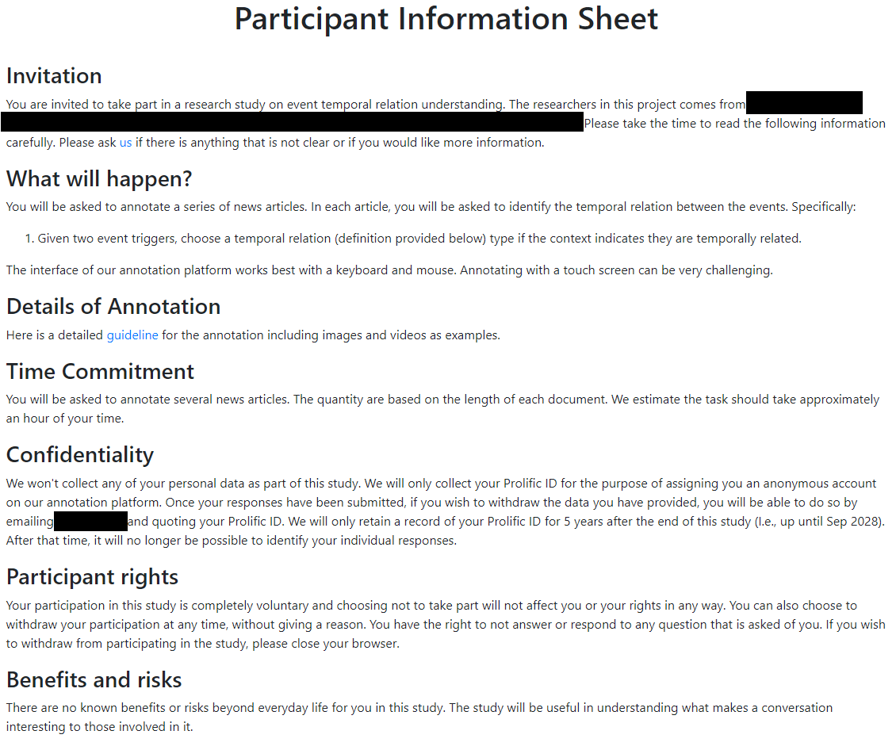
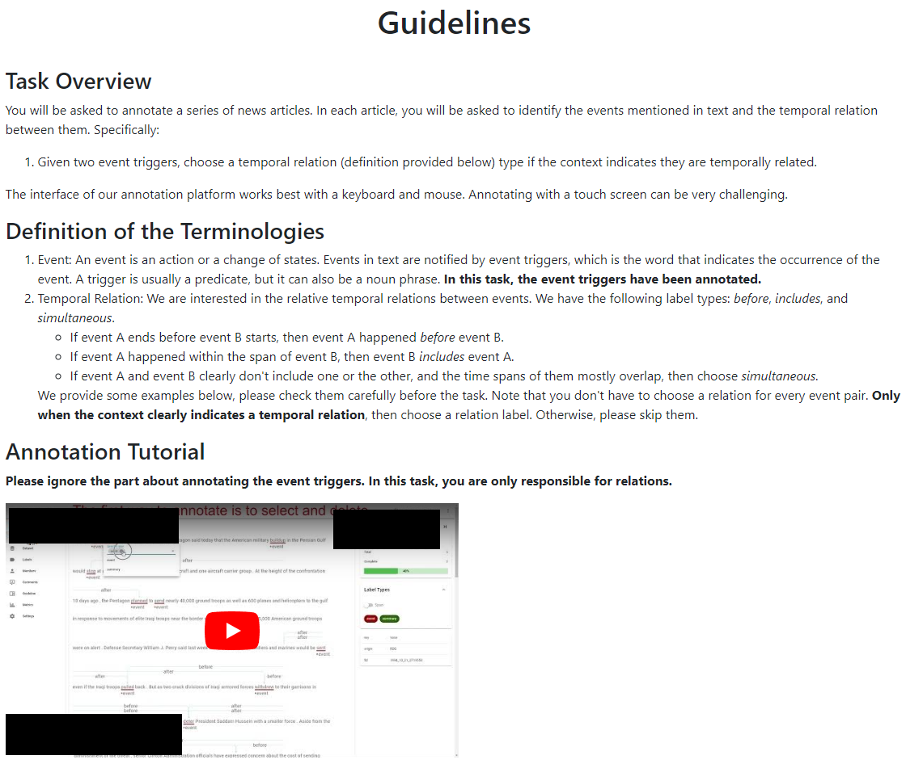

# 自回归事件时序图的生成采用集合对齐框架

发布时间：2024年04月01日

`LLM应用` `文本分析` `事件时间图`

> Set-Aligning Framework for Auto-Regressive Event Temporal Graph Generation

# 摘要

> 事件时间图作为一种表达文本中事件间复杂时间关系的有效方式，已被广泛认可。近期研究利用预训练语言模型自动生成线性图构建事件时间图，取得了令人鼓舞的成果。然而，这些方法往往因线性图的集合特性与语言模型的序列处理方式不匹配，导致生成的图不尽如人意。这种不匹配通常源于传统文本生成目标，使得正确预测受到不当惩罚。为解决这一问题，我们提出了一种新的框架——集合对齐框架，将任务定义为条件集合生成问题，以充分发挥大型语言模型（LLMs）的潜力。该框架通过数据增强和集合属性规则，减少了线性图边序列带来的文本生成损失，促进了更多关系边的生成。实验结果显示，我们的框架在生成事件时间图方面超越了现有技术。更值得一提的是，在零样本条件下，我们的框架通过引入结构知识显著提升了模型的泛化能力，尤其是在训练样本有限的情况下。

> Event temporal graphs have been shown as convenient and effective representations of complex temporal relations between events in text. Recent studies, which employ pre-trained language models to auto-regressively generate linearised graphs for constructing event temporal graphs, have shown promising results. However, these methods have often led to suboptimal graph generation as the linearised graphs exhibit set characteristics which are instead treated sequentially by language models. This discrepancy stems from the conventional text generation objectives, leading to erroneous penalisation of correct predictions caused by the misalignment of elements in target sequences. To address these challenges, we reframe the task as a conditional set generation problem, proposing a Set-aligning Framework tailored for the effective utilisation of Large Language Models (LLMs). The framework incorporates data augmentations and set-property regularisations designed to alleviate text generation loss penalties associated with the linearised graph edge sequences, thus encouraging the generation of more relation edges. Experimental results show that our framework surpasses existing baselines for event temporal graph generation. Furthermore, under zero-shot settings, the structural knowledge introduced through our framework notably improves model generalisation, particularly when the training examples available are limited.

[Arxiv](https://arxiv.org/abs/2404.01532)