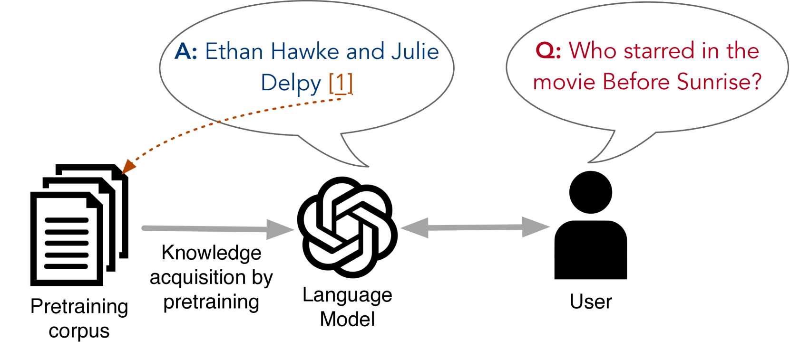
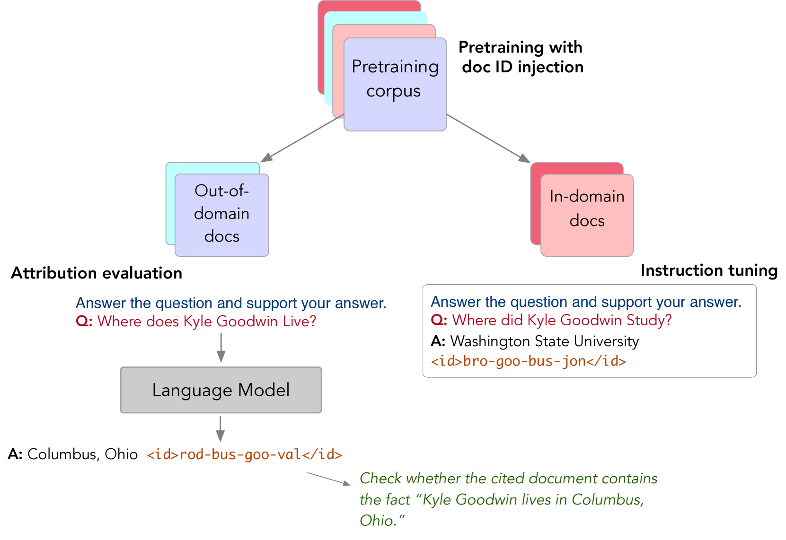
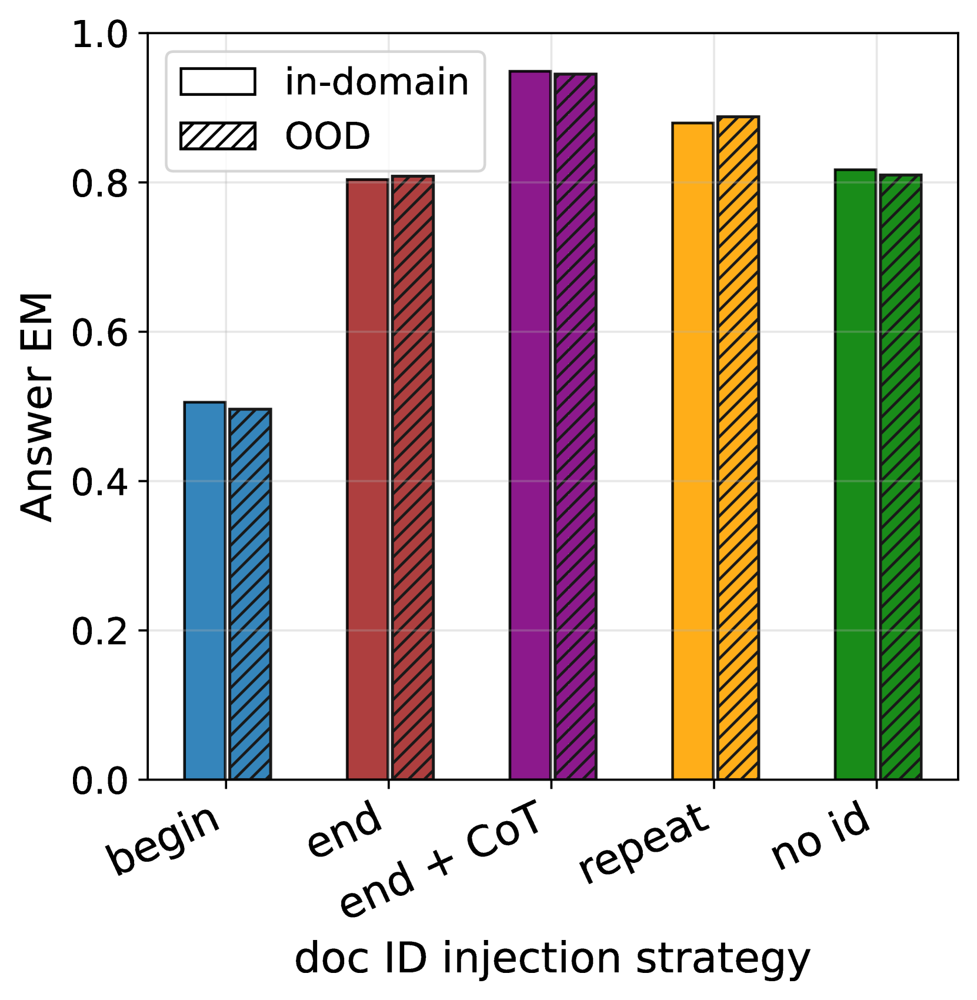
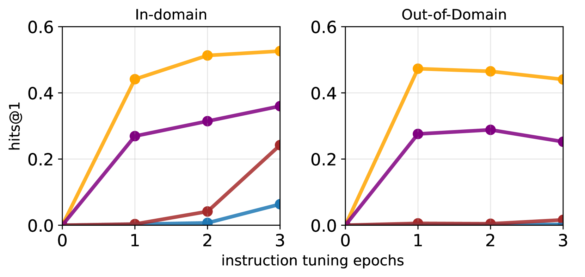
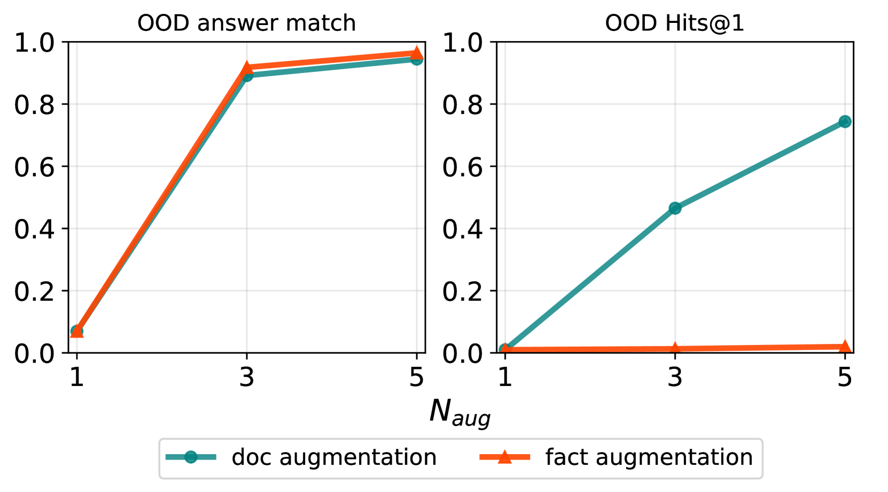
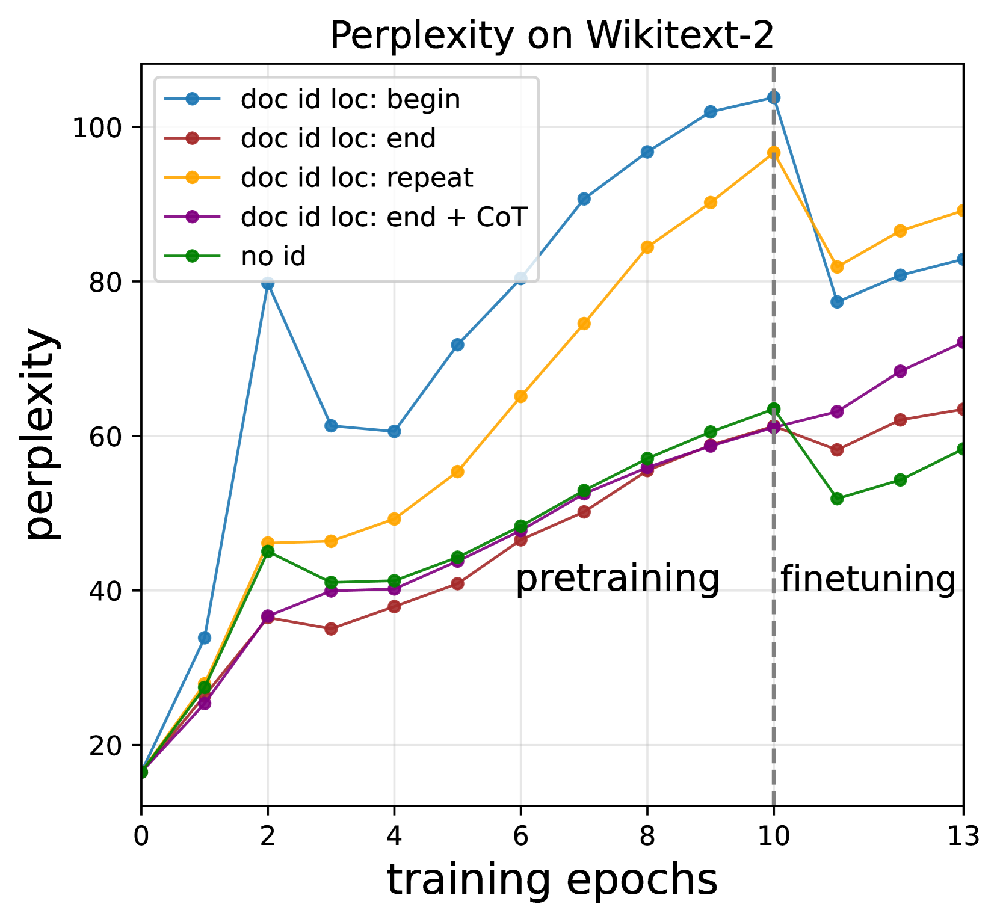
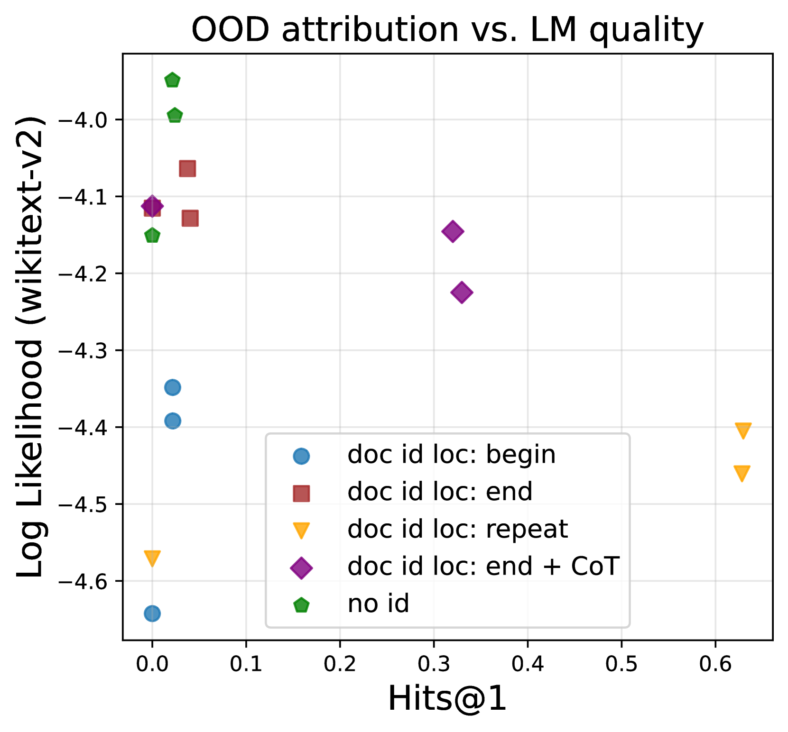
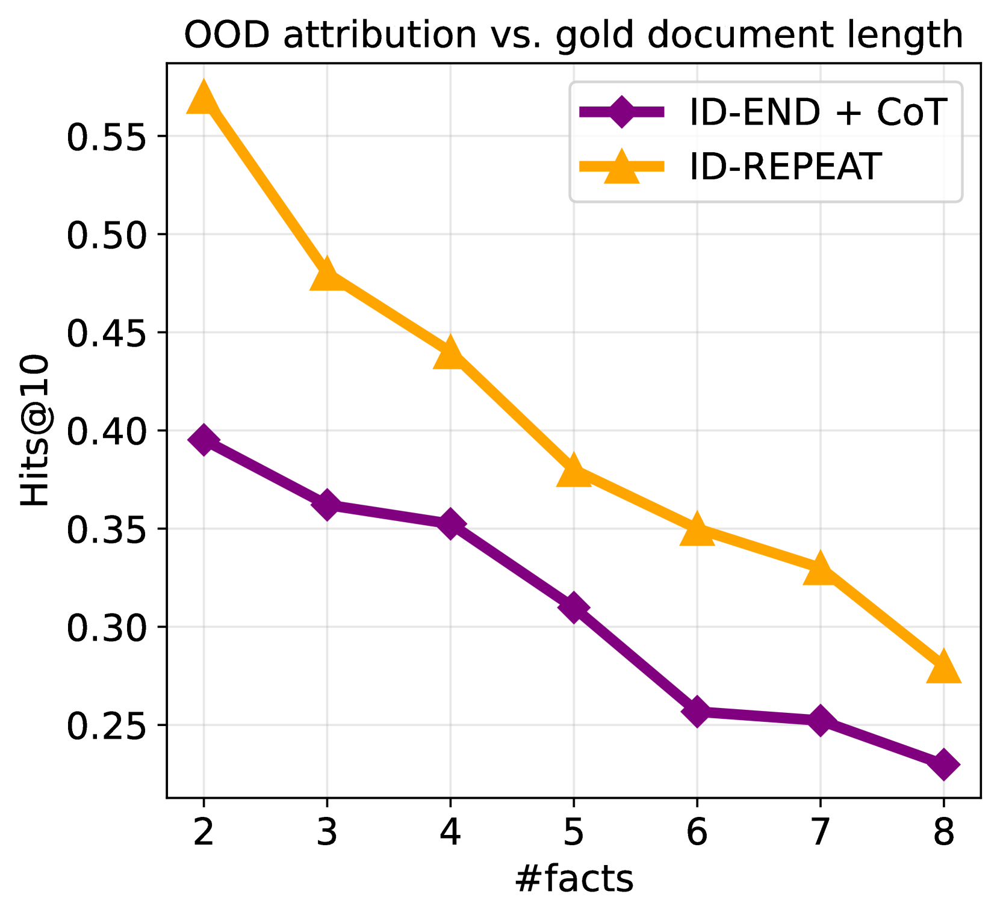

# 通过源感知训练，我们能够在语言模型中对知识进行追溯和归属。

发布时间：2024年04月01日

`LLM理论` `知识追踪` `信息检索`

> Source-Aware Training Enables Knowledge Attribution in Language Models

# 摘要

> 大型语言模型（LLMs）在预训练阶段积累了海量知识，却往往忽视了知识的出处。本研究探讨了如何让LLMs追溯并引用支撑其生成回答的原始资料来源，这一内在的源引用机制有助于提高LLM的透明度、解释力和可信度。为此，我们提出了一种源感知训练方法——一种预训练后的补充方案，它包括（i）让LLM学会将每份文档中的独特标识符与相应知识关联起来，以及（ii）通过指令调整让LLM学会在需要时引用相应的预训练资料。这种训练方法可以轻松地应用于市面上的预训练LLMs，且与现行的预训练和微调框架相去甚远。通过一系列精心设计的数据实验，我们证实了这种方法能够在基本不影响模型性能的前提下，有效地将生成内容追溯到预训练数据。研究还特别指出，数据增强在实现有效归属方面发挥着至关重要的作用。

> Large language models (LLMs) learn a vast amount of knowledge during pretraining, but they are often oblivious to the source(s) of such knowledge. We investigate the problem of intrinsic source citation, where LLMs are required to cite the pretraining source supporting a generated response. Intrinsic source citation can enhance LLM transparency, interpretability, and verifiability. To give LLMs such ability, we explore source-aware training -- a post pretraining recipe that involves (i) training the LLM to associate unique source document identifiers with the knowledge in each document, followed by (ii) an instruction-tuning to teach the LLM to cite a supporting pretraining source when prompted. Source-aware training can easily be applied to pretrained LLMs off the shelf, and diverges minimally from existing pretraining/fine-tuning frameworks. Through experiments on carefully curated data, we demonstrate that our training recipe can enable faithful attribution to the pretraining data without a substantial impact on the model's quality compared to standard pretraining. Our results also highlight the importance of data augmentation in achieving attribution.

[Arxiv](https://arxiv.org/abs/2404.01019)