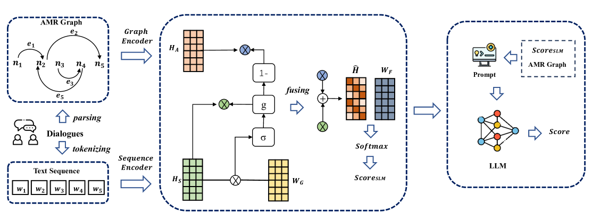

# 结构化信息至关重要：在大型语言模型中整合抽象意义表示，以优化开放领域对话的评估效果。

发布时间：2024年04月01日

`LLM应用` `对话系统`

> Structured Information Matters: Incorporating Abstract Meaning Representation into LLMs for Improved Open-Domain Dialogue Evaluation

# 摘要

> 自动开放领域对话评估正日益受到重视。通常，评估指标通过真实肯定回答和随机否定回答进行训练，这使得它们倾向于对与特定上下文内容更为相似的回答给予较高评分。然而，对抗性负面回答虽然与上下文高度相似，却在语义上大相径庭。因此，现有评估指标在评价这类回答时显得不够稳固，与人的评价往往关联性不高。尽管最新研究显示，大型语言模型（LLMs）在开放领域对话评估中展现出一定潜力，但在应对对抗性负面示例时仍存在难题。本文提出了一个结合特定领域语言模型（SLMs）与LLMs的创新框架，SLMs通过门控机制明确引入对话的AMR图信息，以加强语义理解。SLMs的评估成果和AMR图信息被嵌入LLM的提示中，进一步提升了基于上下文的学习效果。实验结果显示，相较于众多先进基线方法，本方法在开放领域对话评估任务上表现卓越，特别是在识别对抗性负面回答方面。相关代码已在 https://github.com/Bernard-Yang/SIMAMR 上发布。

> Automatic open-domain dialogue evaluation has attracted increasing attention. Trainable evaluation metrics are commonly trained with true positive and randomly selected negative responses, resulting in a tendency for them to assign a higher score to the responses that share higher content similarity with a given context. However, adversarial negative responses possess high content similarity with the contexts whilst being semantically different. Therefore, existing evaluation metrics are not robust enough to evaluate such responses, resulting in low correlations with human judgments. While recent studies have shown some efficacy in utilizing Large Language Models (LLMs) for open-domain dialogue evaluation, they still encounter challenges in effectively handling adversarial negative examples. In this paper, we propose a simple yet effective framework for open-domain dialogue evaluation, which combines domain-specific language models (SLMs) with LLMs. The SLMs can explicitly incorporate Abstract Meaning Representation (AMR) graph information of the dialogue through a gating mechanism for enhanced semantic representation learning. The evaluation result of SLMs and AMR graph information are plugged into the prompt of LLM, for the enhanced in-context learning performance. Experimental results on open-domain dialogue evaluation tasks demonstrate the superiority of our method compared to a wide range of state-of-the-art baselines, especially in discriminating adversarial negative responses. Our code is available at https://github.com/Bernard-Yang/SIMAMR.

[Arxiv](https://arxiv.org/abs/2404.01129)