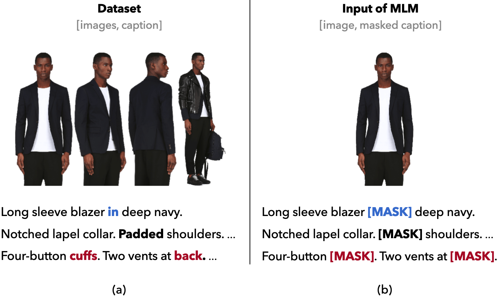
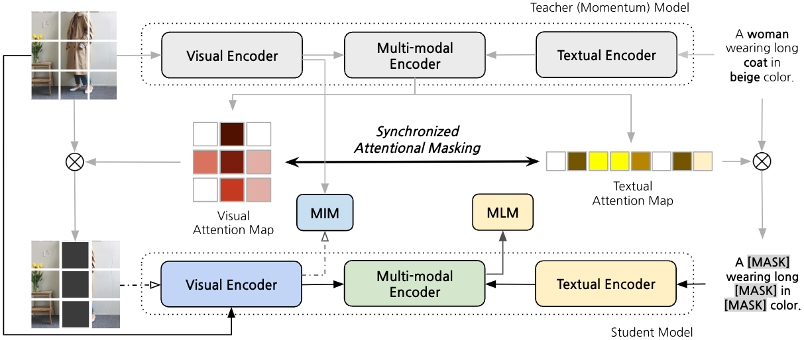
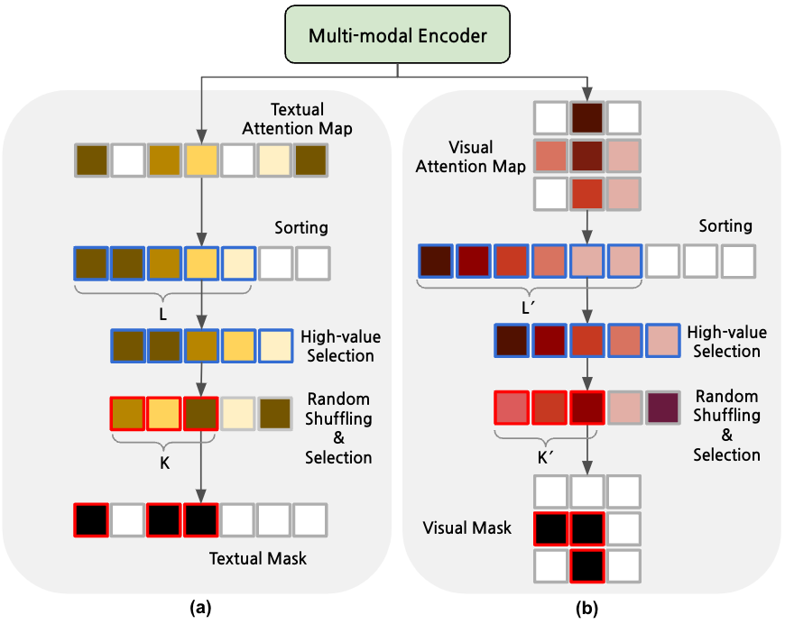
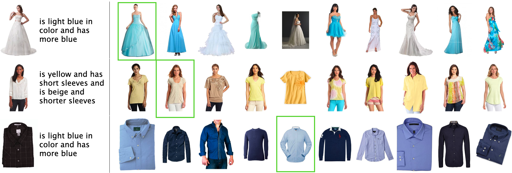
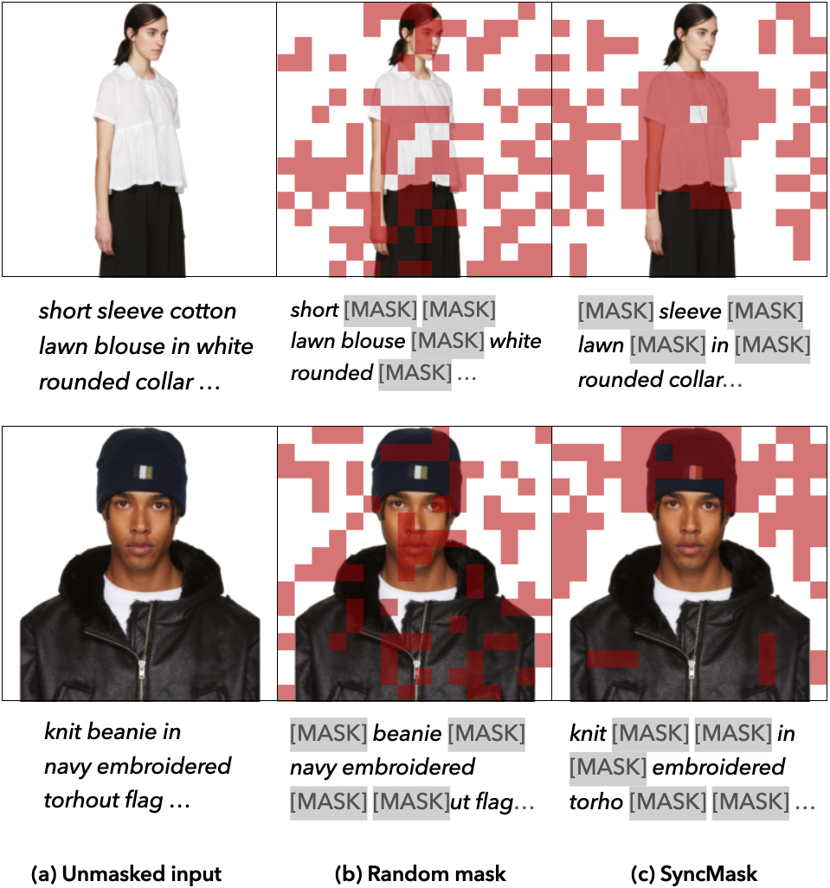
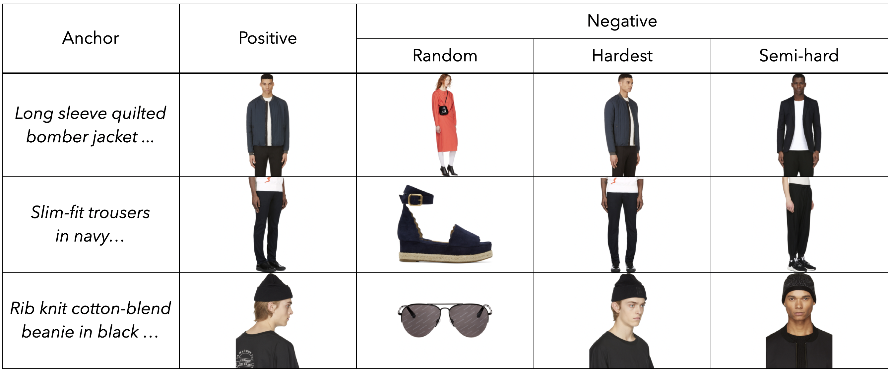

# SyncMask：为时尚导向视觉-语言预训练设计的同步注意力屏蔽技术

发布时间：2024年04月01日

`RAG` `跨模态理解`

> SyncMask: Synchronized Attentional Masking for Fashion-centric Vision-Language Pretraining

# 摘要

> 视觉-语言模型（VLMs）在跨模态理解上取得了长足进步，但时尚领域的数据集往往存在图像与文本信息不一致的问题。这种差异通常因为一个时尚单品的多个图像仅对应一段文本，导致某些文本细节无法在单一图像中呈现。尤其在非共现元素被遮蔽时，这种现象会削弱传统VLM训练效果，影响模型对精细视觉和文本特征的准确匹配。为此，我们提出了同步注意力掩蔽技术（SyncMask），它能生成精确指向图像区域和单词的掩蔽，这些区域和单词在图像和文本中共现信息。通过利用动量模型中的交叉注意力特征，实现了两种模态间的精确同步。我们还改进了分组批处理采样，加入了半硬负样本，有效减少了时尚数据集中图像-文本匹配和对比学习任务的误匹配问题。实验证明，我们的方法在三项下游任务中均优于现有技术。

> Vision-language models (VLMs) have made significant strides in cross-modal understanding through large-scale paired datasets. However, in fashion domain, datasets often exhibit a disparity between the information conveyed in image and text. This issue stems from datasets containing multiple images of a single fashion item all paired with one text, leading to cases where some textual details are not visible in individual images. This mismatch, particularly when non-co-occurring elements are masked, undermines the training of conventional VLM objectives like Masked Language Modeling and Masked Image Modeling, thereby hindering the model's ability to accurately align fine-grained visual and textual features. Addressing this problem, we propose Synchronized attentional Masking (SyncMask), which generate masks that pinpoint the image patches and word tokens where the information co-occur in both image and text. This synchronization is accomplished by harnessing cross-attentional features obtained from a momentum model, ensuring a precise alignment between the two modalities. Additionally, we enhance grouped batch sampling with semi-hard negatives, effectively mitigating false negative issues in Image-Text Matching and Image-Text Contrastive learning objectives within fashion datasets. Our experiments demonstrate the effectiveness of the proposed approach, outperforming existing methods in three downstream tasks.

[Arxiv](https://arxiv.org/abs/2404.01156)