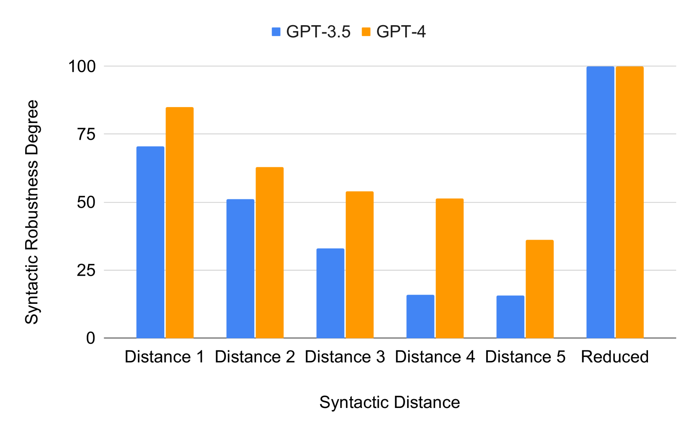
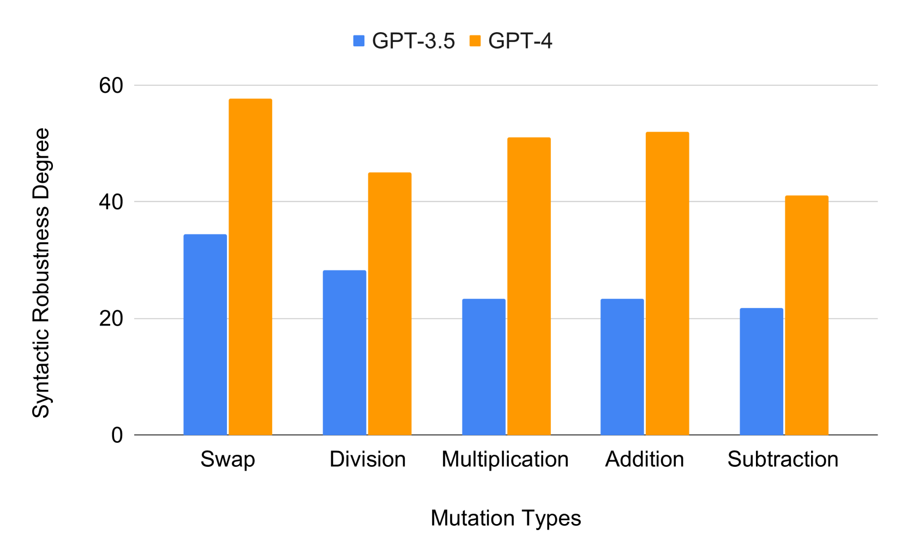
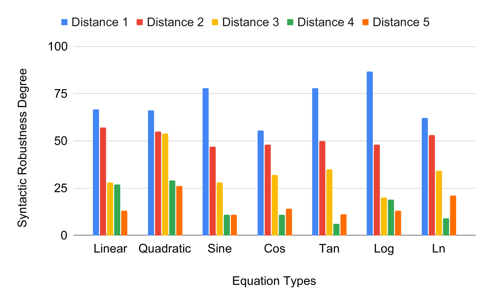
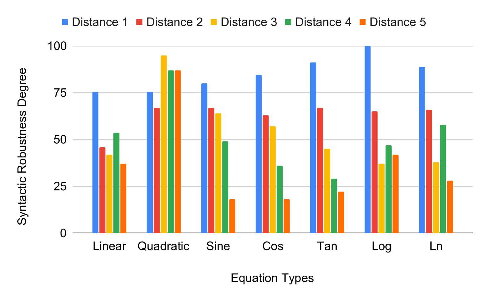
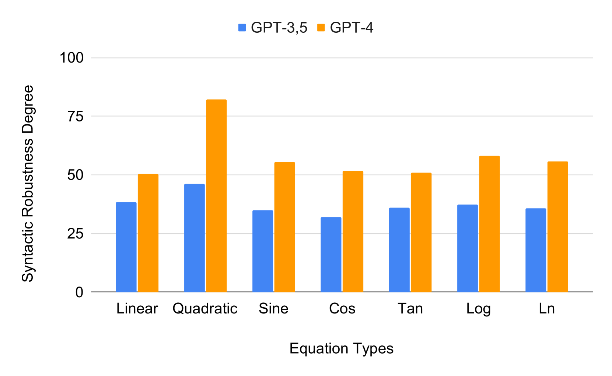

# 在大型语言模型（LLM）支持下，代码生成的句法鲁棒性研究

发布时间：2024年04月01日

`LLM应用` `软件工程` `代码生成`

> Syntactic Robustness for LLM-based Code Generation

# 摘要

> 随着大型语言模型（LLMs）技术的飞速发展，基于LLM的代码生成已成为研究的热点。这类代码生成器通过解析输入的提示信息，编写出满足要求的代码。在众多软件需求中，数学公式扮演着关键角色，它们定义了期望代码的行为。如果对包含数学公式的代码生成提示进行语法调整，而不影响其本质含义，理想情况下，新提示生成的代码应与原提示生成的代码在语义上保持一致。我们将这一特性定义为“语法鲁棒性”，并在本文中探讨了GPT-3.5-Turbo与GPT-4作为代码生成器的语法鲁棒性。为了验证这一点，我们利用一系列变异工具，仅对提示中的数学公式进行修改，生成了语法结构不同但语义相同的多个提示版本。研究重点放在那些要求代码解决方程中变量的提示上，这些提示在输入方程系数后生成答案。实验结果显示，GPT-3.5-Turbo和GPT-4对这类提示的语法鲁棒性不足。为了增强语法鲁棒性，我们提出了一套将公式转换为简化形式的方法，并将其作为预处理步骤。实验证明，通过这种方法，我们能够有效提升基于LLM的代码生成在语法鲁棒性方面的表现。

> Rapid advances in the field of Large Language Models (LLMs) have made LLM-based code generation an important area for investigation. An LLM-based code generator takes a prompt as input and produces code that implements the requirements specified in the prompt. Many software requirements include mathematical formulas that specify the expected behavior of the code to be generated. Given a code generation prompt that includes a mathematical formula, a reasonable expectation is that, if the formula is syntactically modified without changing its semantics, the generated code for the modified prompt should be semantically equivalent. We formalize this concept as syntactic robustness and investigate the syntactic robustness of GPT-3.5-Turbo and GPT-4 as code generators. To test syntactic robustness, we generate syntactically different but semantically equivalent versions of prompts using a set of mutators that only modify mathematical formulas in prompts. In this paper, we focus on prompts that ask for code that generates solutions to variables in an equation, when given coefficients of the equation as input. Our experimental evaluation demonstrates that GPT-3.5-Turbo and GPT-4 are not syntactically robust for this type of prompts. To improve syntactic robustness, we define a set of reductions that transform the formulas to a simplified form and use these reductions as a pre-processing step. Our experimental results indicate that the syntactic robustness of LLM-based code generation can be improved using our approach.

[Arxiv](https://arxiv.org/abs/2404.01535)