# TWIN-GPT：借助大型语言模型，为临床试验打造数字孪生技术

发布时间：2024年04月01日

`LLM应用` `数字孪生`

> TWIN-GPT: Digital Twins for Clinical Trials via Large Language Model

# 摘要

> 近期，虚拟临床试验受到广泛关注，这类试验通过模拟真实场景，有望大幅提升患者安全、加速新药开发、降低成本，并为医疗科学知识库贡献力量。传统研究多聚焦于运用电子健康记录预测临床试验结果，但受限于临床数据的不足，这些方法在准确性上往往力不从心。尽管有研究尝试通过生成EHRs来加强模型开发，但在个性化匹配患者档案方面却成效不彰。大型语言模型的兴起为这一领域带来了新机遇，其丰富的临床知识在医疗问题处理上显示出巨大优势。本文提出了一种新型的基于大型语言模型的数字孪生技术——TWIN-GPT，它能够在数据受限的情况下，为每位患者创建个性化的医疗信息数字孪生，精准捕捉患者个体特征。实验证明，TWIN-GPT生成的数字孪生能有效提升临床试验结果的预测准确率，超越了多种传统预测技术。此外，TWIN-GPT还能生成与特定患者高度相似的高质量试验数据，助力在数据稀缺环境下实现精准预测。本研究还为数字孪生在医疗领域的应用提供了实证支持，突显了其在未来医疗发展中的巨大潜力。

> Recently, there has been a burgeoning interest in virtual clinical trials, which simulate real-world scenarios and hold the potential to significantly enhance patient safety, expedite development, reduce costs, and contribute to the broader scientific knowledge in healthcare. Existing research often focuses on leveraging electronic health records (EHRs) to support clinical trial outcome prediction. Yet, trained with limited clinical trial outcome data, existing approaches frequently struggle to perform accurate predictions. Some research has attempted to generate EHRs to augment model development but has fallen short in personalizing the generation for individual patient profiles. Recently, the emergence of large language models has illuminated new possibilities, as their embedded comprehensive clinical knowledge has proven beneficial in addressing medical issues. In this paper, we propose a large language model-based digital twin creation approach, called TWIN-GPT. TWIN-GPT can establish cross-dataset associations of medical information given limited data, generating unique personalized digital twins for different patients, thereby preserving individual patient characteristics. Comprehensive experiments show that using digital twins created by TWIN-GPT can boost clinical trial outcome prediction, exceeding various previous prediction approaches. Besides, we also demonstrate that TWIN-GPT can generate high-fidelity trial data that closely approximate specific patients, aiding in more accurate result predictions in data-scarce situations. Moreover, our study provides practical evidence for the application of digital twins in healthcare, highlighting its potential significance.

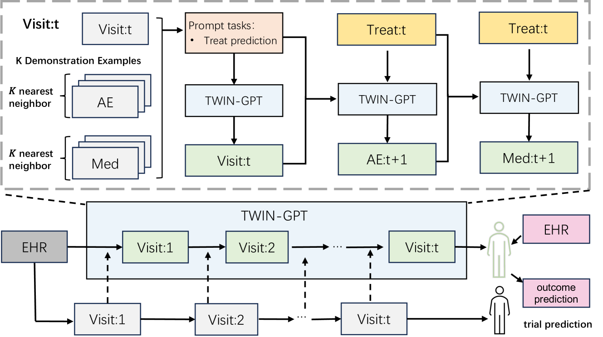

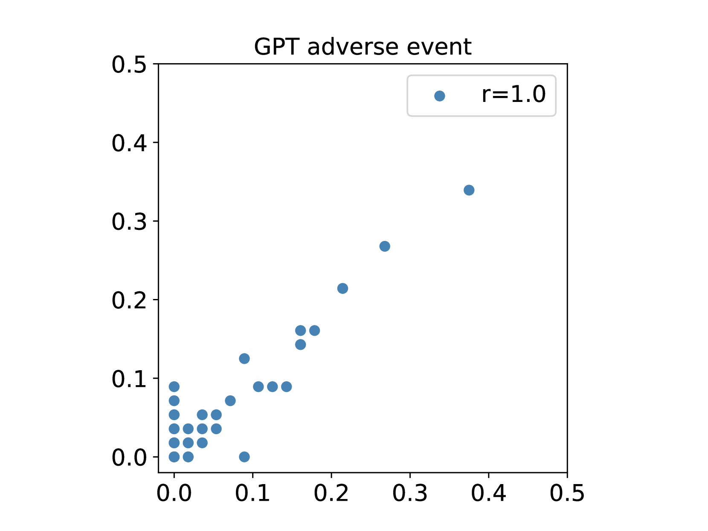

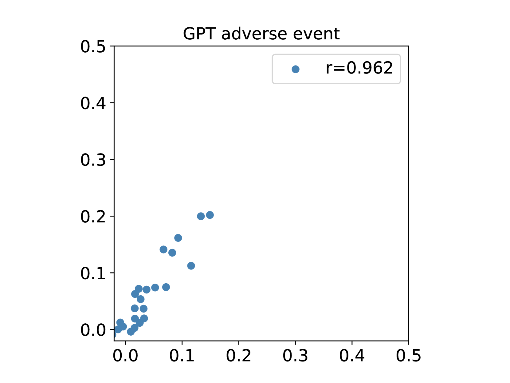

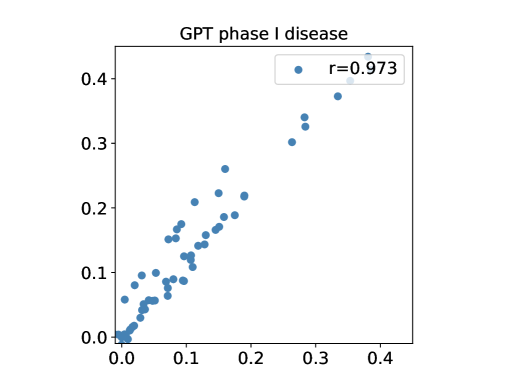

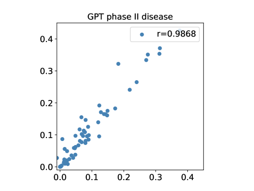

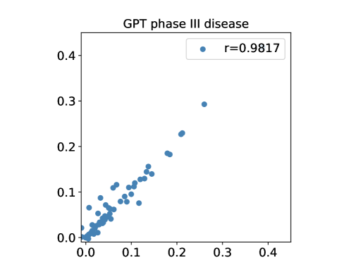

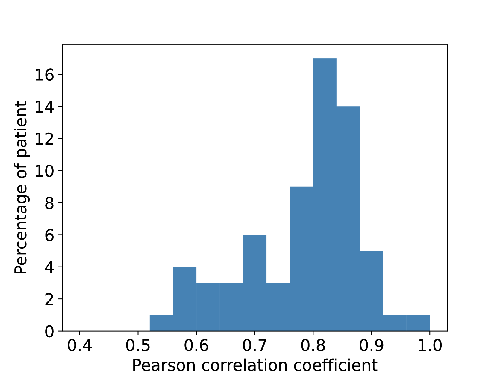

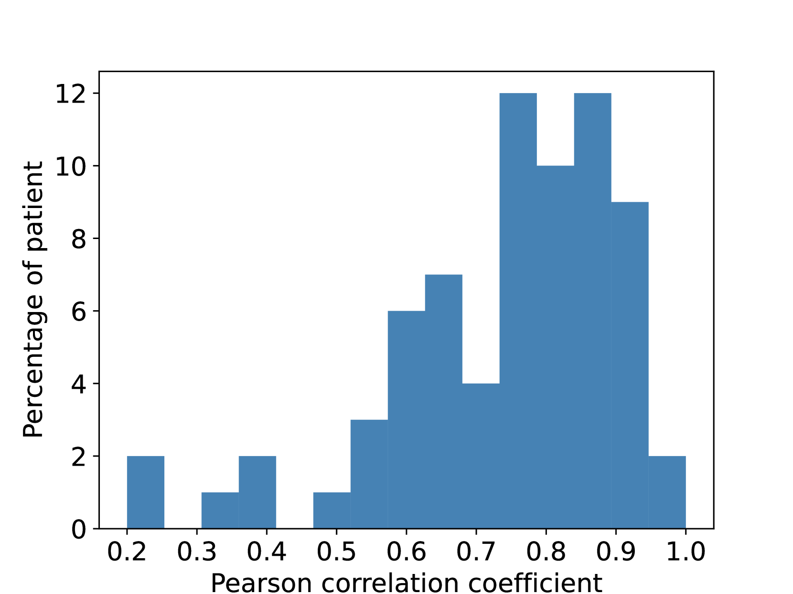

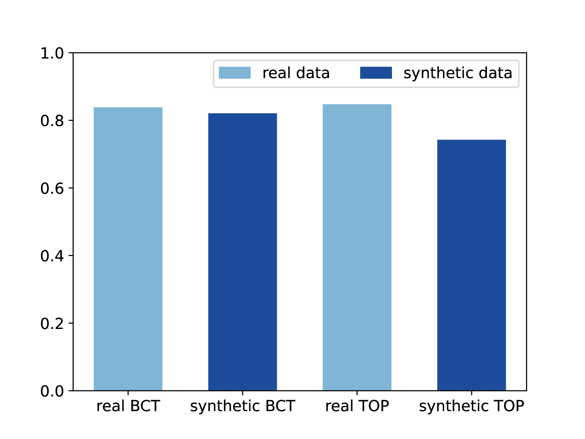

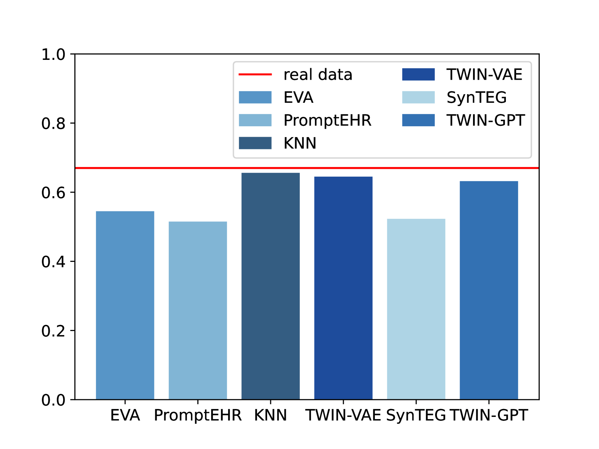

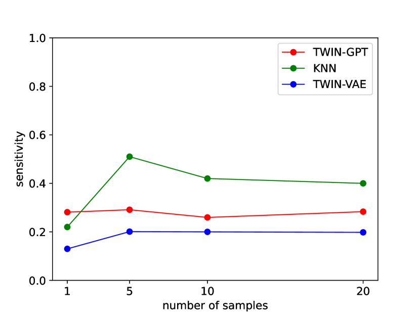

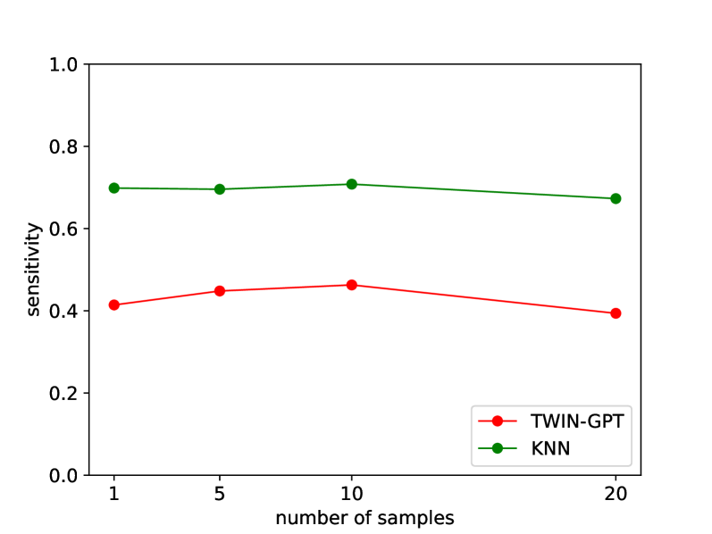

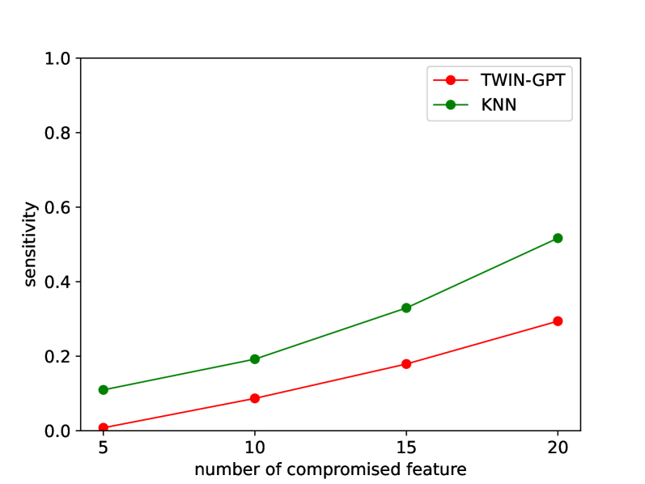

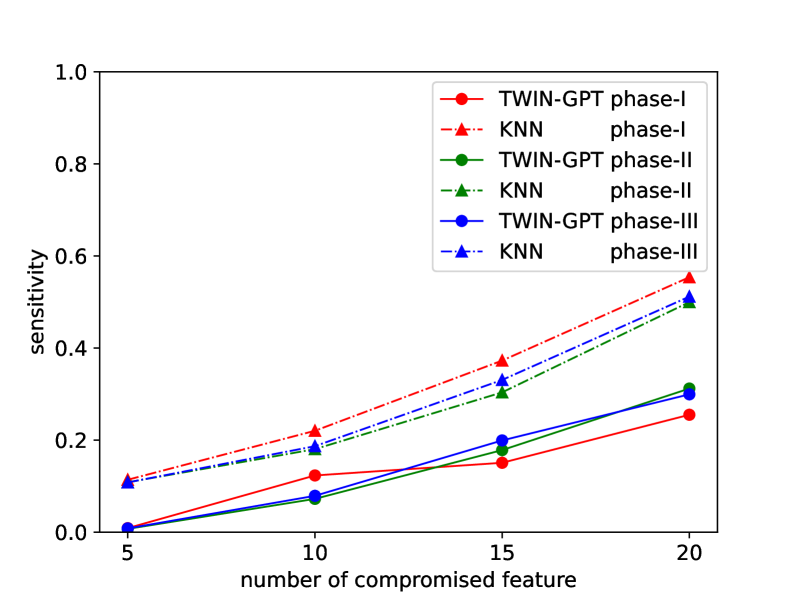

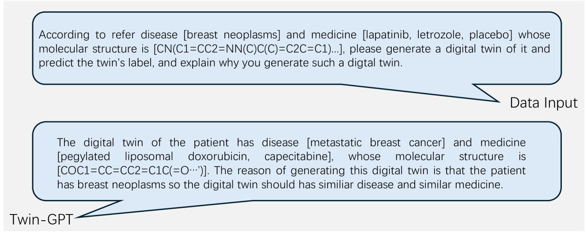

[Arxiv](https://arxiv.org/abs/2404.01273)