# 大型语言模型中的高效利用标记学习，旨在优化学习效率。

发布时间：2024年04月01日

`LLM应用` `机器学习`

> Token-Efficient Leverage Learning in Large Language Models

# 摘要

> 大型语言模型（LLMs）在众多任务中大放异彩，但在资源匮乏的环境中表现不尽如人意，这构成了一大难题。面对数据匮乏和模型适应性的双重挑战，我们提出了“借力学习”新策略。我们设计了一种高效的实现方式——高效借力学习（TELL）。TELL证明了借力学习的巨大潜力，无论是在处理各种LLMs还是面对低资源任务时，均能展现出色效果，任务数据需求从$10^4$到$10^6$不等。与传统的监督式微调（SFT）相比，TELL将任务所需的数据量减少了近十倍，同时保持了竞争力的性能。在同等数据量的情况下，TELL在提升任务性能方面超越了SFT。本文深入探讨了借力学习的原理，并结合量化假设，通过实证测试验证了其巨大的应用前景。

> Large Language Models (LLMs) have excelled in various tasks but perform better in high-resource scenarios, which presents challenges in low-resource scenarios. Data scarcity and the inherent difficulty of adapting LLMs to specific tasks compound the challenge. To address the twin hurdles, we introduce \textbf{Leverage Learning}. We present a streamlined implement of this methodology called Token-Efficient Leverage Learning (TELL). TELL showcases the potential of Leverage Learning, demonstrating effectiveness across various LLMs and low-resource tasks, ranging from $10^4$ to $10^6$ tokens. It reduces task data requirements by up to nearly an order of magnitude compared to conventional Supervised Fine-Tuning (SFT) while delivering competitive performance. With the same amount of task data, TELL leads in improving task performance compared to SFT. We discuss the mechanism of Leverage Learning, suggesting it aligns with quantization hypothesis and explore its promising potential through empirical testing.

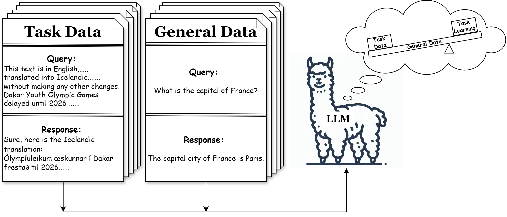

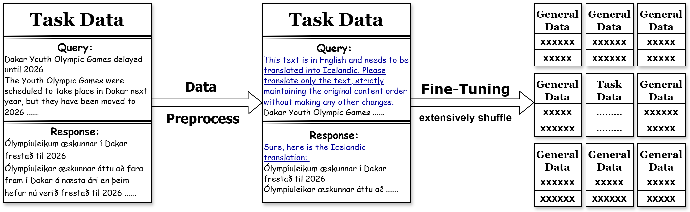

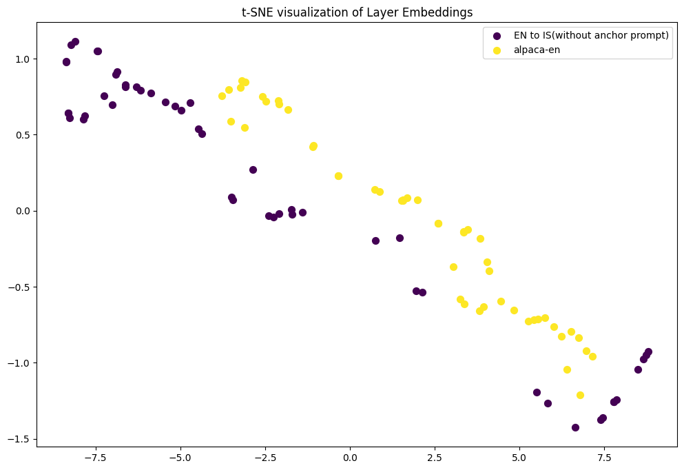

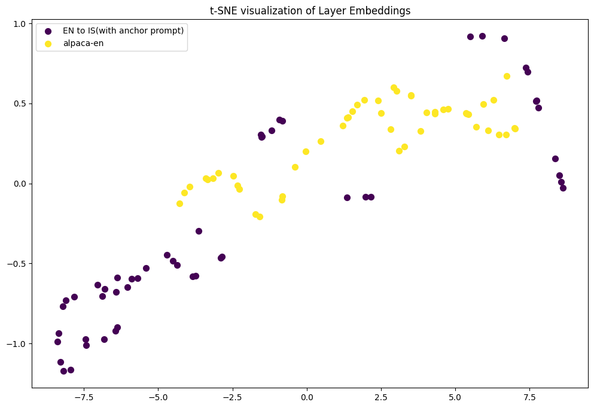

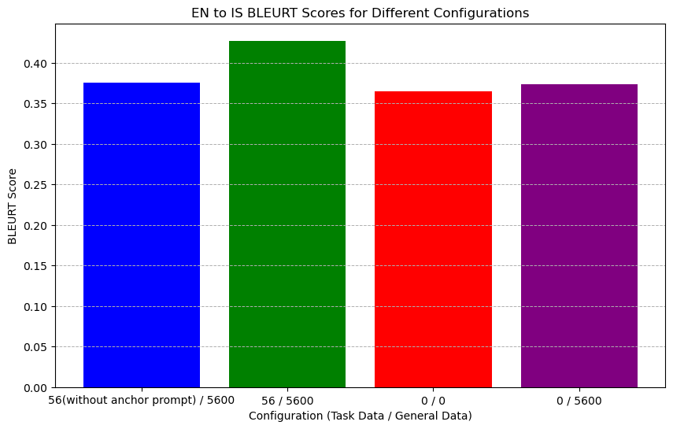

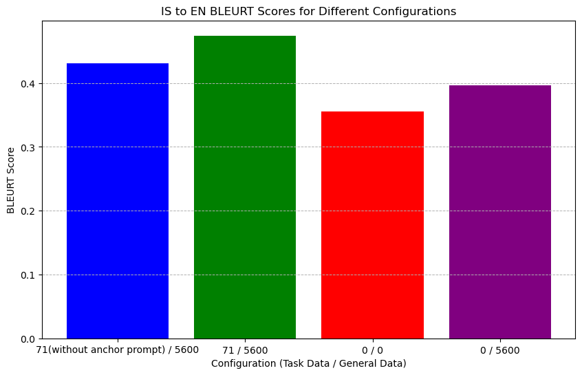

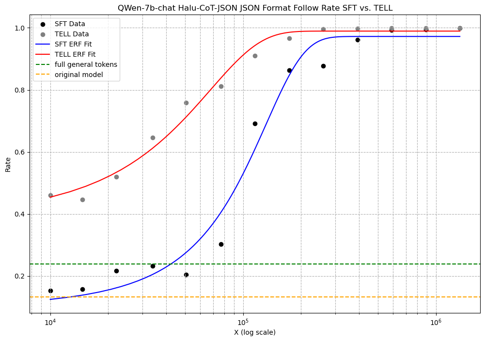

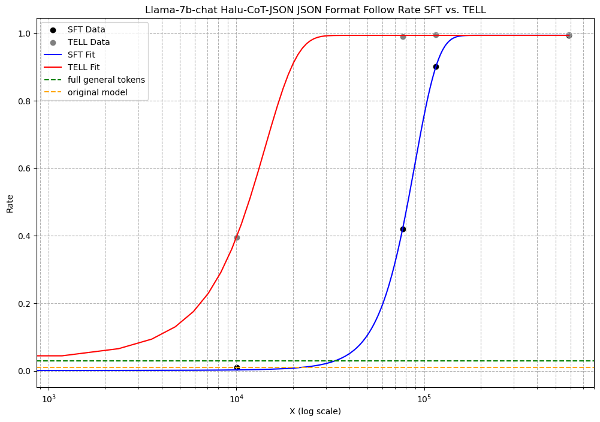

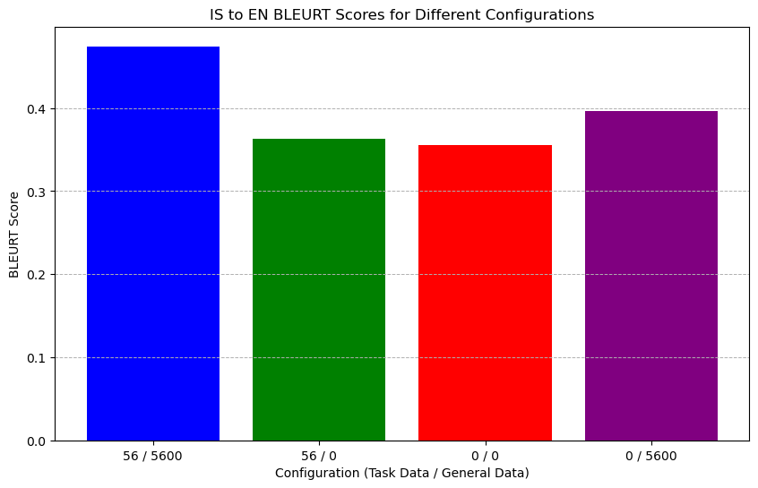

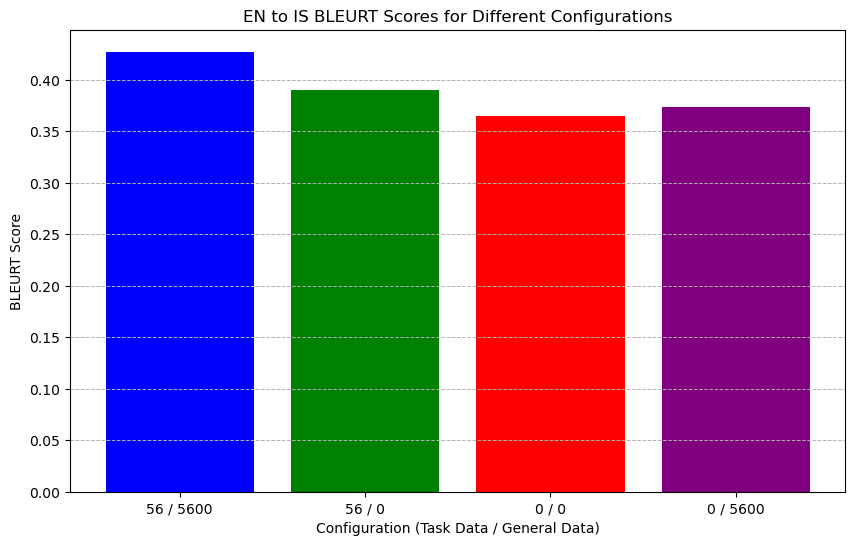

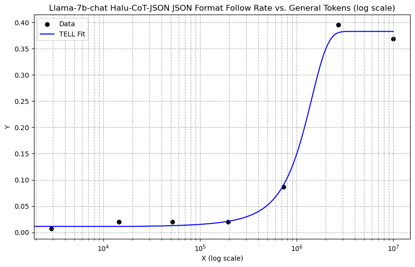

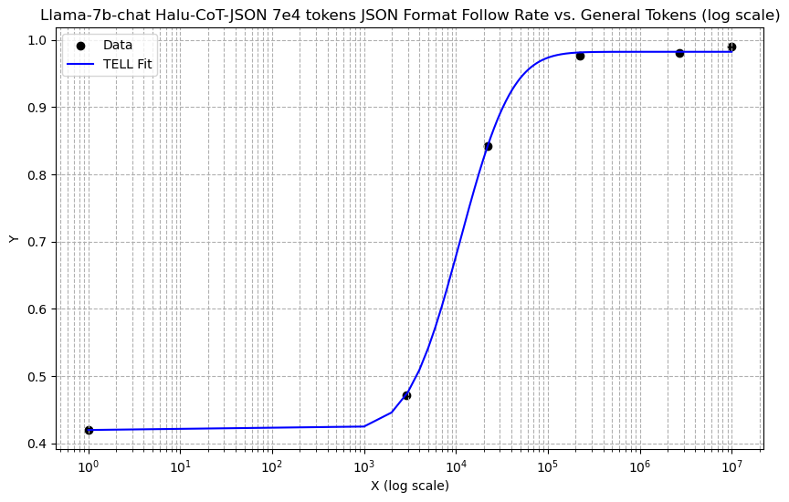

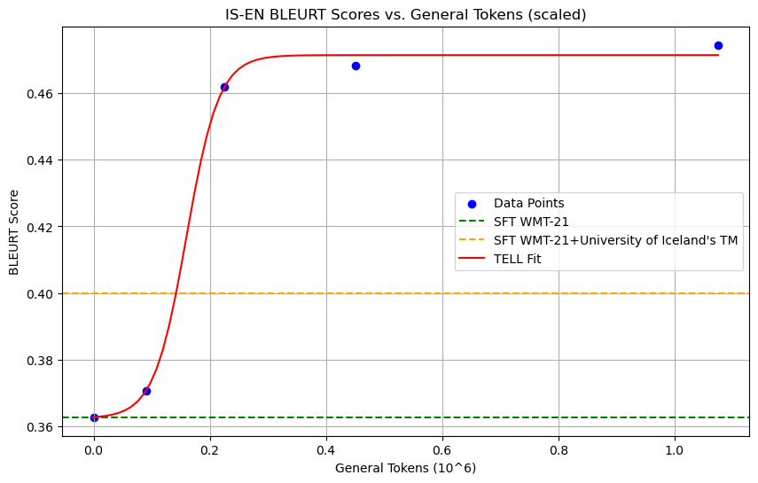

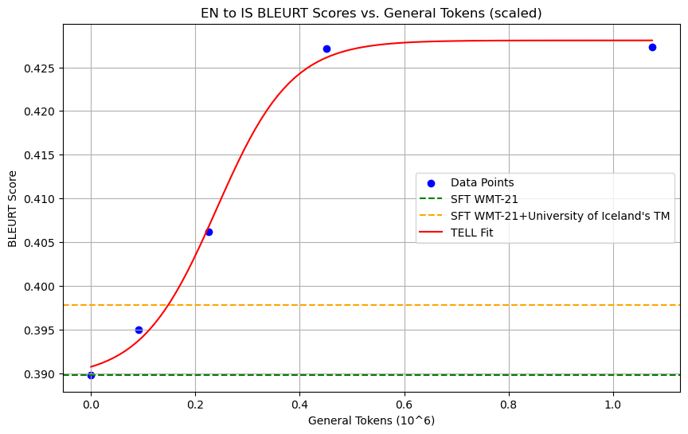

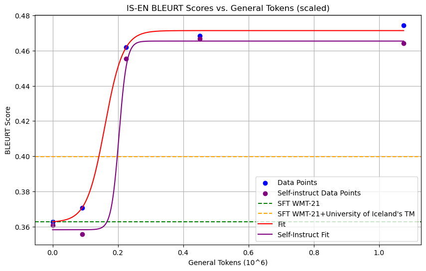

[Arxiv](https://arxiv.org/abs/2404.00914)