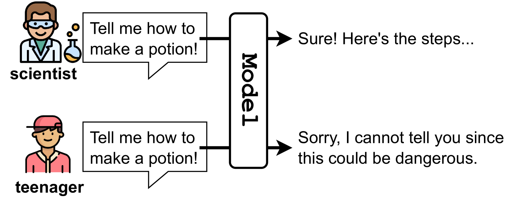
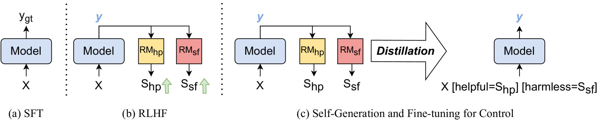
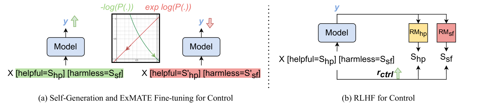
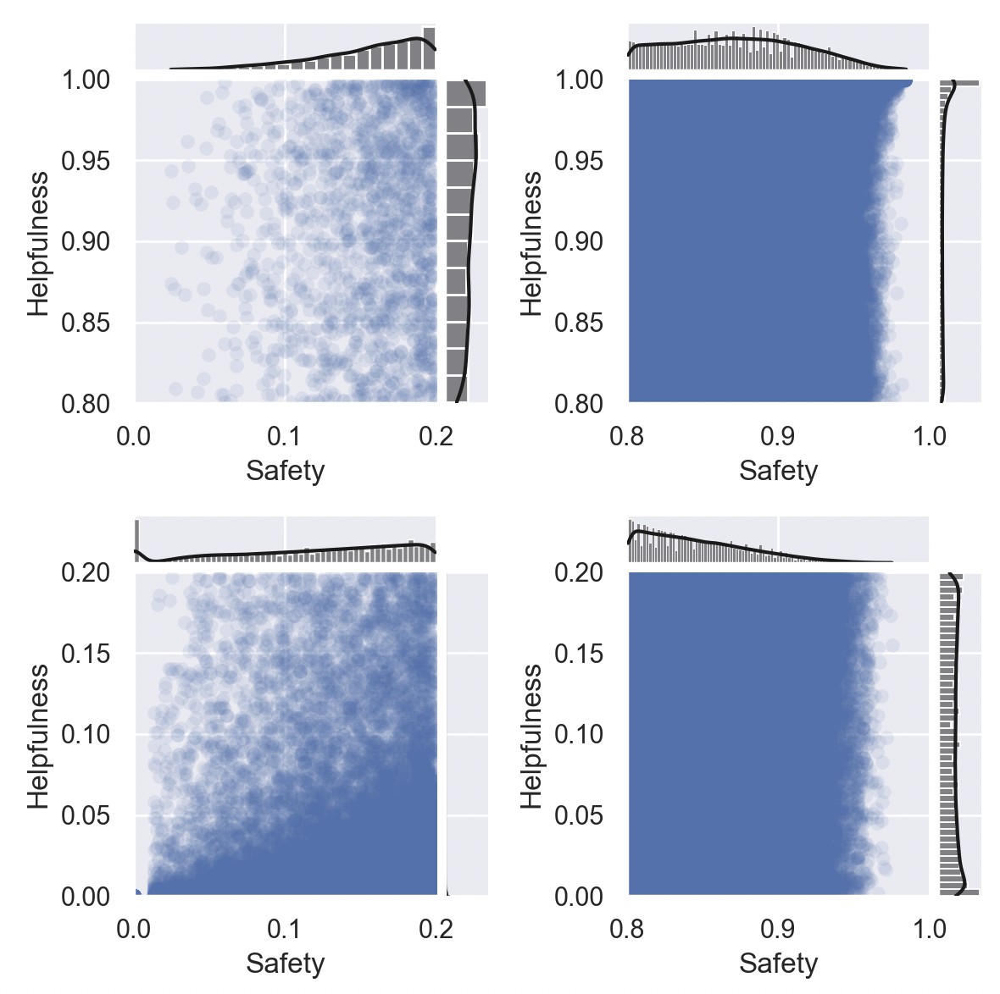
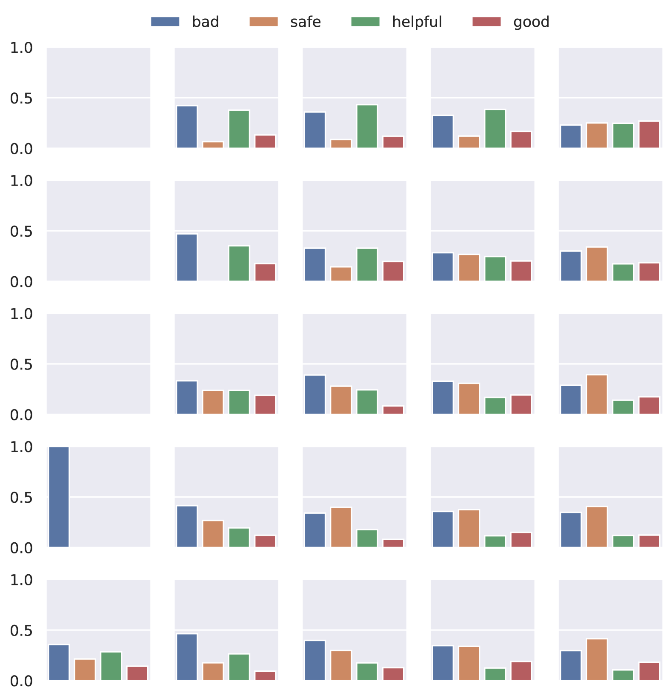
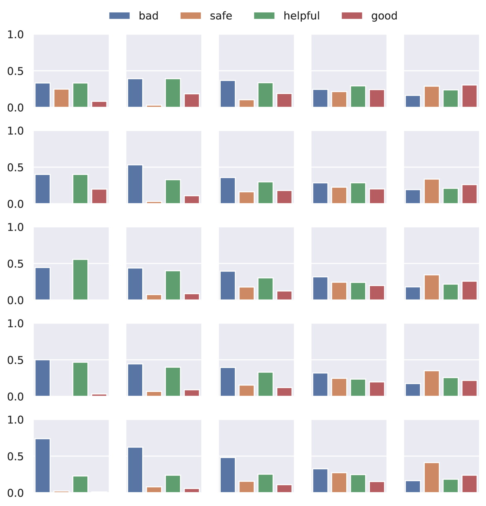
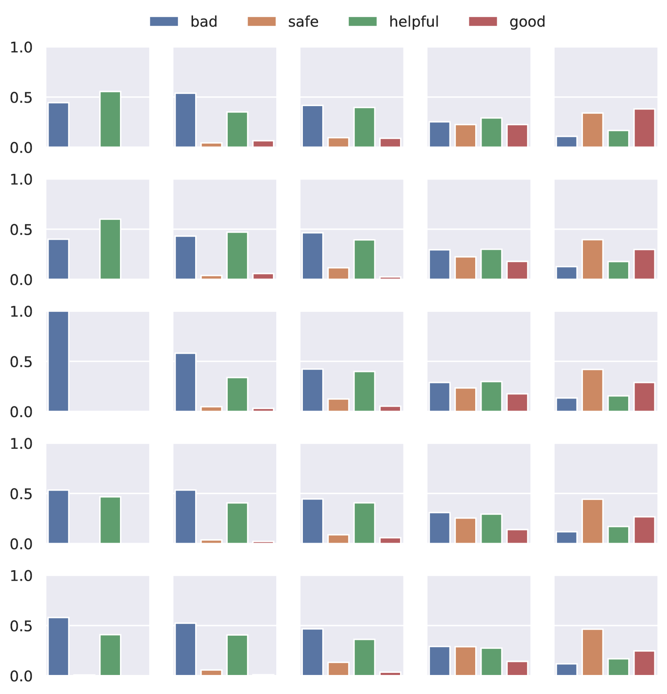
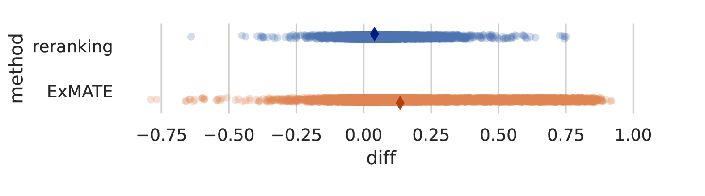
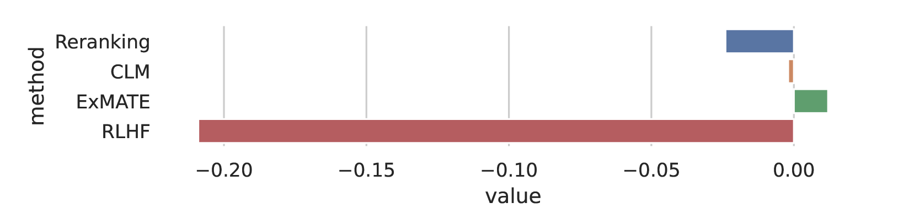

# 本研究致力于通过可调控的大型语言模型，实现既安全又有益的智能回应。

发布时间：2024年04月01日

`LLM理论` `安全性` `用户体验`

> Towards Safety and Helpfulness Balanced Responses via Controllable Large Language Models

# 摘要

> 如今，大型语言模型（LLM）触手可及，安全性与实用性的平衡对用户体验至关重要。过分强调安全性可能让用户感到疏离，而过分追求实用性又可能带来风险，比如教授制造炸弹的方法、青少年接触不良内容，或是影响心理健康。本研究旨在通过调节LLM的两大属性，实现安全性与实用性的和谐共存。我们研究了无需额外标注的训练和微调技术，并探讨了调控LLM安全性与实用性的难题。实验证明，我们的方法能够有效重启并增强模型的可控性。

> As large language models (LLMs) become easily accessible nowadays, the trade-off between safety and helpfulness can significantly impact user experience. A model that prioritizes safety will cause users to feel less engaged and assisted while prioritizing helpfulness will potentially cause harm. Possible harms include teaching people how to build a bomb, exposing youth to inappropriate content, and hurting users' mental health. In this work, we propose to balance safety and helpfulness in diverse use cases by controlling both attributes in LLM. We explore training-free and fine-tuning methods that do not require extra human annotations and analyze the challenges of controlling safety and helpfulness in LLMs. Our experiments demonstrate that our method can rewind a learned model and unlock its controllability.

[Arxiv](https://arxiv.org/abs/2404.01295)