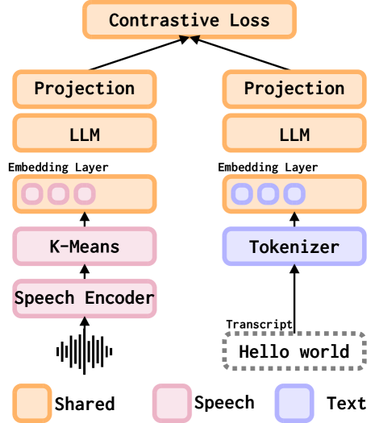
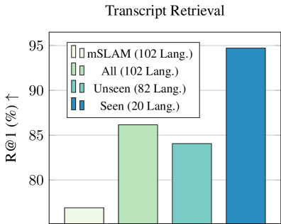
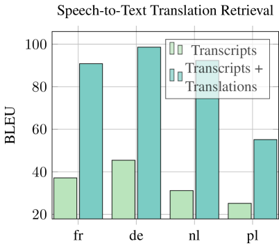

# 将大型语言模型打造成跨界的检索系统，实现跨模态与跨语言的无缝对接。

发布时间：2024年04月01日

`LLM应用` `多模态` `信息检索`

> Transforming LLMs into Cross-modal and Cross-lingual RetrievalSystems

# 摘要

> 大型语言模型（LLMs）训练所用的文本数据范围广泛，远超配有对应语音和文本资料的语言种类。双编码器（DE）检索系统通过将查询和文档映射到同一嵌入空间，已在信息检索和双语文本挖掘领域取得显著成效。为了实现多种语言中语音与文本的匹配，我们提出利用LLMs来初始化多模态DE检索系统。区别于传统方法，我们的系统在LLM预训练阶段无需语音资料，便能利用LLM对多语言文本的深入理解，实现在检索训练中未见语言的语音与文本匹配。我们的多模态LLM基础检索系统即便仅在21种语言上进行训练，也能实现对102种语言的语音与文本的匹配。相较于之前在全部102种语言上进行专门训练的系统，我们的系统表现更优，在这些语言的Recall@1指标上平均提升了10%。此外，我们的模型还能实现跨语言的语音与文本匹配，得益于现成的机器翻译资料，这一能力得到了进一步的加强。

> Large language models (LLMs) are trained on text-only data that go far beyond the languages with paired speech and text data. At the same time, Dual Encoder (DE) based retrieval systems project queries and documents into the same embedding space and have demonstrated their success in retrieval and bi-text mining. To match speech and text in many languages, we propose using LLMs to initialize multi-modal DE retrieval systems. Unlike traditional methods, our system doesn't require speech data during LLM pre-training and can exploit LLM's multilingual text understanding capabilities to match speech and text in languages unseen during retrieval training. Our multi-modal LLM-based retrieval system is capable of matching speech and text in 102 languages despite only training on 21 languages. Our system outperforms previous systems trained explicitly on all 102 languages. We achieve a 10% absolute improvement in Recall@1 averaged across these languages. Additionally, our model demonstrates cross-lingual speech and text matching, which is further enhanced by readily available machine translation data.

[Arxiv](https://arxiv.org/abs/2404.01616)