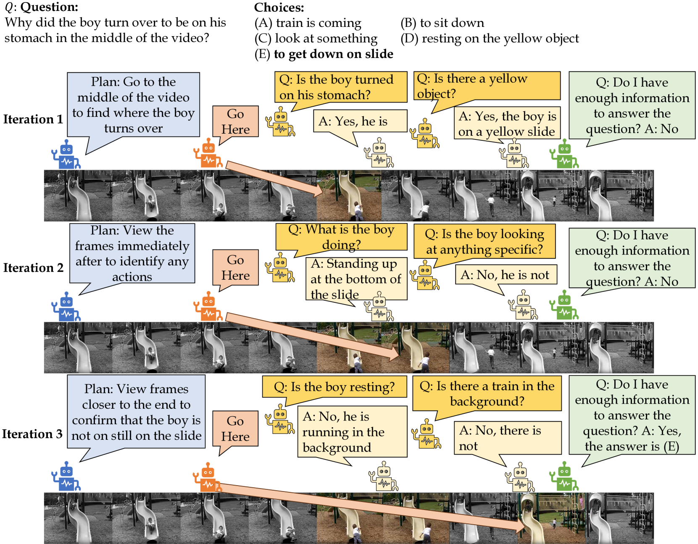
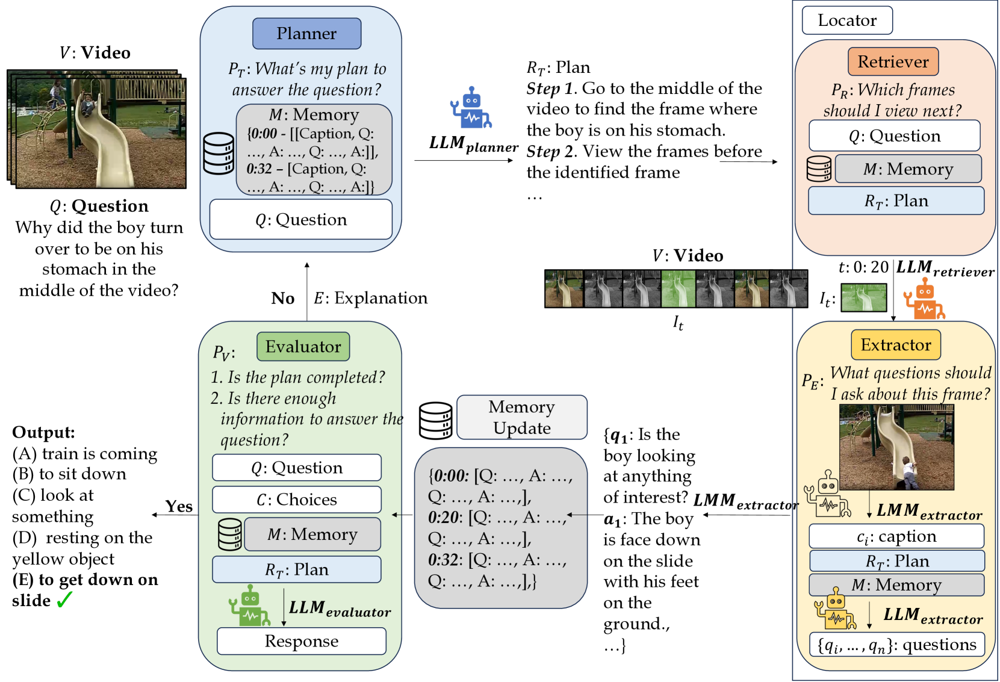

# TraveLER：面向视频问答任务的多语言模型代理框架

发布时间：2024年04月01日

`RAG` `视频处理` `问答系统`

> TraveLER: A Multi-LMM Agent Framework for Video Question-Answering

# 摘要

> 近期，大型多模态模型（LMMs）在视频问答领域取得了突破，它们采用逐帧方法，借助大规模图像预训练，实现了零样本学习。尽管这些基于图像的方法表现出色，但它们常忽略了关键时间戳的选取，并在发现时间戳错误时无法调整。它们也难以提取问题相关的细节，通常只提供帧的泛泛描述。为解决这些问题，我们构建了一个多LMM代理框架，它能够沿着视频进度迭代搜集关键帧信息，通过互动提问积累答案，直至信息充足。我们提出的TraveLER模型，能够规划“穿越”视频的路径，针对每一帧提出“定位”问题，保存关键信息，并评估是否足以作答。若信息不足，模型还能根据已有知识“重新规划”。经过大量实验验证，TraveLER在多个视频问答基准测试中，如NExT-QA、STAR和感知测试，均提升了性能，且无需针对特定数据集进行微调。

> Recently, Large Multimodal Models (LMMs) have made significant progress in video question-answering using a frame-wise approach by leveraging large-scale, image-based pretraining in a zero-shot manner. While image-based methods for videos have shown impressive performance, a current limitation is that they often overlook how key timestamps are selected and cannot adjust when incorrect timestamps are identified. Moreover, they are unable to extract details relevant to the question, instead providing general descriptions of the frame. To overcome this, we design a multi-LMM agent framework that travels along the video, iteratively collecting relevant information from keyframes through interactive question-asking until there is sufficient information to answer the question. Specifically, we propose TraveLER, a model that can create a plan to "Traverse" through the video, ask questions about individual frames to "Locate" and store key information, and then "Evaluate" if there is enough information to answer the question. Finally, if there is not enough information, our method is able to "Replan" based on its collected knowledge. Through extensive experiments, we find that the proposed TraveLER approach improves performance on several video question-answering benchmarks, such as NExT-QA, STAR, and Perception Test, without the need to fine-tune on specific datasets.

[Arxiv](https://arxiv.org/abs/2404.01476)