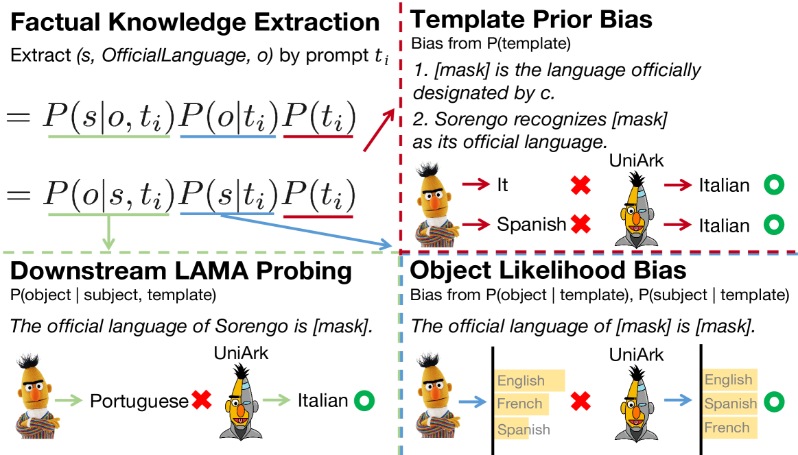
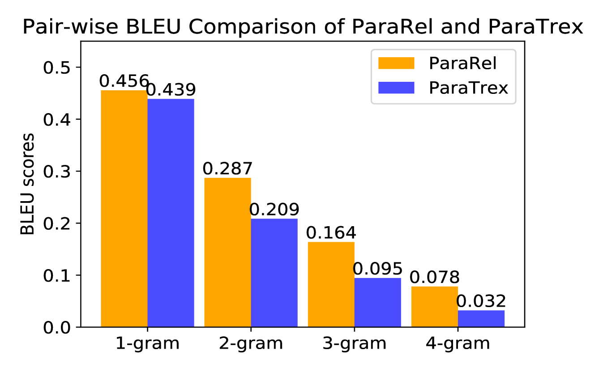
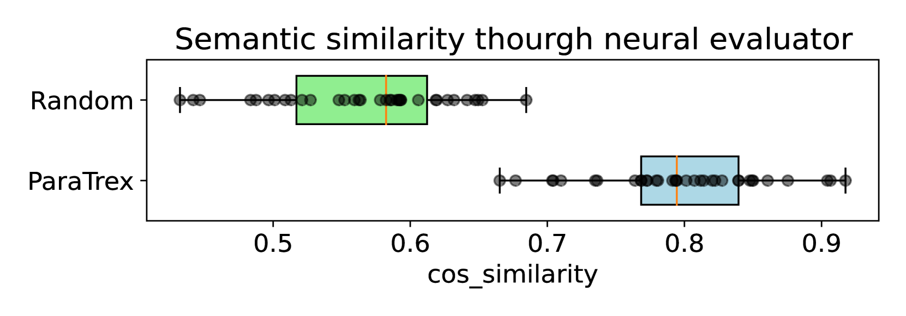
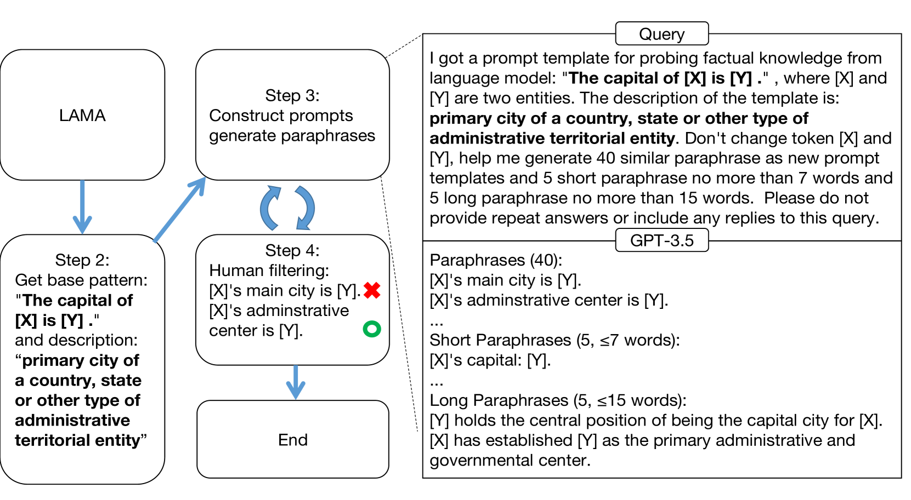
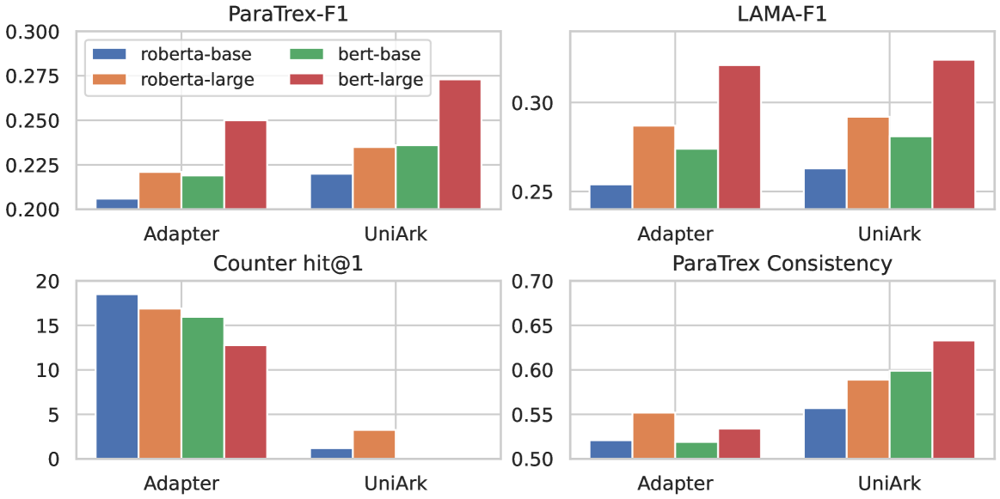

# UniArk 通过去偏技术，增强了事实知识提取的泛化与一致性，提升了整体性能。

发布时间：2024年04月01日

`LLM应用` `知识抽取` `跨领域泛化`

> UniArk: Improving Generalisation and Consistency for Factual Knowledge Extraction through Debiasing

# 摘要

> 近期研究深入探讨了语言模型作为知识库的潜力，以及在抽取事实信息时可能产生的严重偏差问题。本研究着眼于通过调整对未见提示的事实探测表现，并从概率角度揭示了预训练与下游调整目标在知识探测方面的内在错位。我们假设同步消除这些目标的偏差，可能是实现对未见提示泛化的关键。为此，我们设计了一个名为UniArk的适配器框架，它通过简洁的方法实现准确、稳定的事实知识抽取，且无需增加额外参数。大量实验验证了UniArk在提升模型跨领域泛化能力和应对多样化提示的一致性方面的显著效果。同时，我们还创建了ParaTrex数据集，这是一个大规模且多样化的工具，用于评估模型的不一致性和跨领域生成能力。ParaTrex还提供了一种构建释义数据集的新方法，利用大型语言模型作为参考。

> Several recent papers have investigated the potential of language models as knowledge bases as well as the existence of severe biases when extracting factual knowledge. In this work, we focus on the factual probing performance over unseen prompts from tuning, and using a probabilistic view we show the inherent misalignment between pre-training and downstream tuning objectives in language models for probing knowledge. We hypothesize that simultaneously debiasing these objectives can be the key to generalisation over unseen prompts. We propose an adapter-based framework, UniArk, for generalised and consistent factual knowledge extraction through simple methods without introducing extra parameters. Extensive experiments show that UniArk can significantly improve the model's out-of-domain generalisation as well as consistency under various prompts. Additionally, we construct ParaTrex, a large-scale and diverse dataset for measuring the inconsistency and out-of-domain generation of models. Further, ParaTrex offers a reference method for constructing paraphrased datasets using large language models.

[Arxiv](https://arxiv.org/abs/2404.01253)