# 探究大型语言模型处理时间数据时的多样化归纳偏好

发布时间：2024年04月01日

`LLM理论` `时间数据分析`

> Unveiling Divergent Inductive Biases of LLMs on Temporal Data

# 摘要

> 要洞悉自然语言中事件的纷繁细节，我们需要对时间变化的微妙之处有所领悟。尽管大型语言模型（LLMs）擅长从数据中识别模式和关系，但它们对时间变化的深层理解仍是一道难题。本研究深入探讨了LLMs在这方面的内在挑战，特别聚焦于评估GPT-3.5和GPT-4模型在时间数据分析上的表现。通过问答（QA）和文本蕴含（TE）两种不同的提示方式，我们对隐性和显性事件进行了深入分析。研究发现了一些显著趋势，显示了GPT-3.5和GPT-4在处理能力上的差异。有趣的是，模型对某些时间关系存在偏好，GPT-3.5在QA环节中更倾向于选择"AFTER"，无论是对隐性还是显性事件，而GPT-4则偏好"BEFORE"。此外，在TE环节中，GPT-3.5更倾向于判断为"TRUE"，而GPT-4则更倾向于"FALSE"，这一模式在处理隐性和显性事件时均表现一致。这种GPT-3.5和GPT-4在处理时间数据上的持续分歧，揭示了LLMs归纳偏差的复杂本质，表明这些模型的发展可能不仅会减少偏见，还可能带来新的复杂度。

> Unraveling the intricate details of events in natural language necessitates a subtle understanding of temporal dynamics. Despite the adeptness of Large Language Models (LLMs) in discerning patterns and relationships from data, their inherent comprehension of temporal dynamics remains a formidable challenge. This research meticulously explores these intrinsic challenges within LLMs, with a specific emphasis on evaluating the performance of GPT-3.5 and GPT-4 models in the analysis of temporal data. Employing two distinct prompt types, namely Question Answering (QA) format and Textual Entailment (TE) format, our analysis probes into both implicit and explicit events. The findings underscore noteworthy trends, revealing disparities in the performance of GPT-3.5 and GPT-4. Notably, biases toward specific temporal relationships come to light, with GPT-3.5 demonstrating a preference for "AFTER'' in the QA format for both implicit and explicit events, while GPT-4 leans towards "BEFORE''. Furthermore, a consistent pattern surfaces wherein GPT-3.5 tends towards "TRUE'', and GPT-4 exhibits a preference for "FALSE'' in the TE format for both implicit and explicit events. This persistent discrepancy between GPT-3.5 and GPT-4 in handling temporal data highlights the intricate nature of inductive bias in LLMs, suggesting that the evolution of these models may not merely mitigate bias but may introduce new layers of complexity.

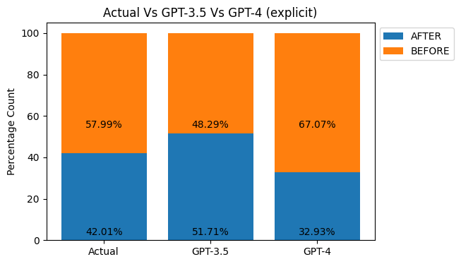

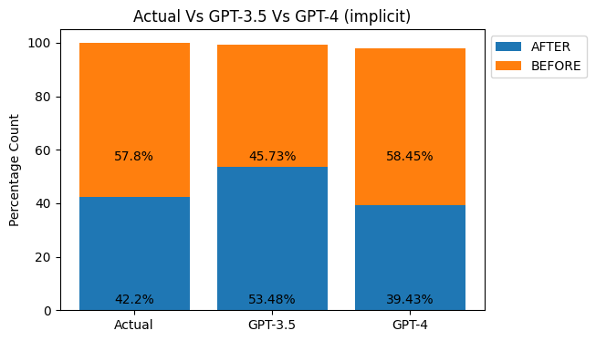

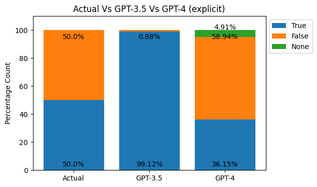

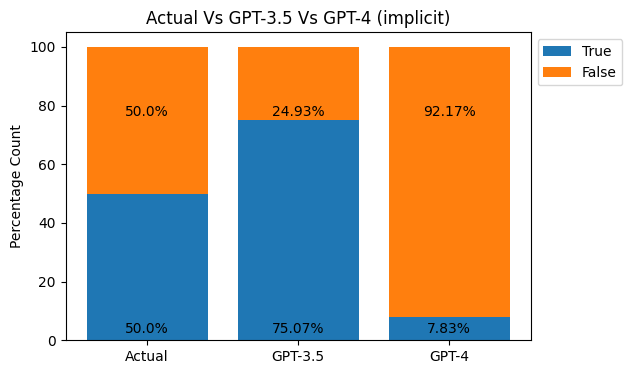

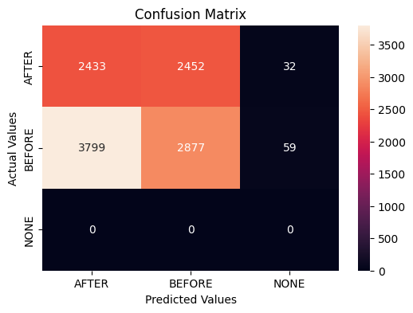

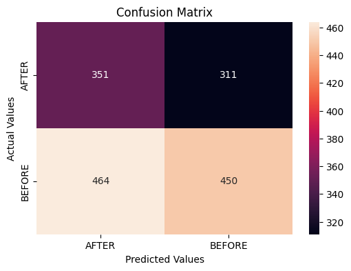

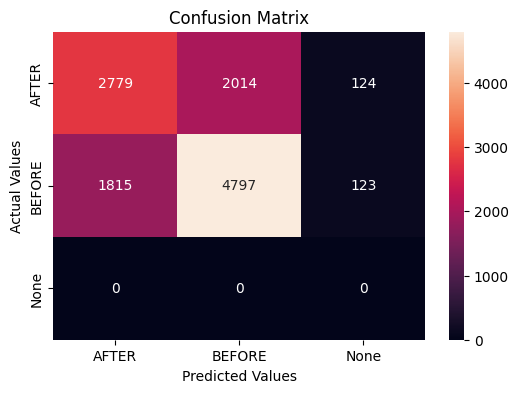

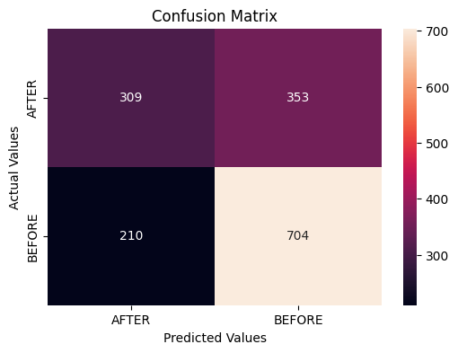

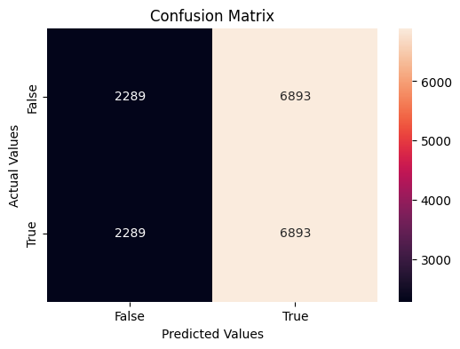

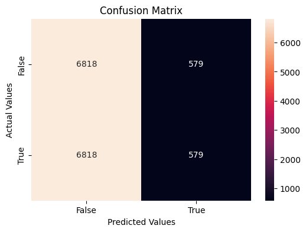

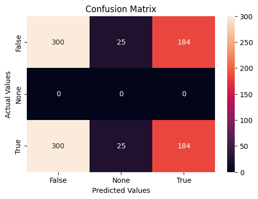

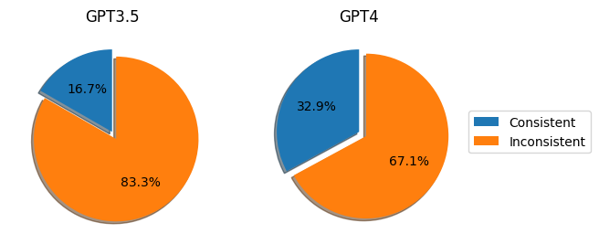

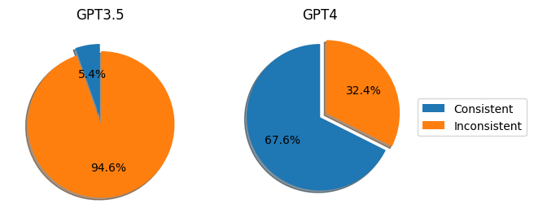

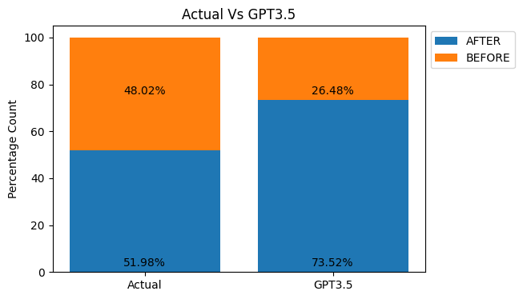

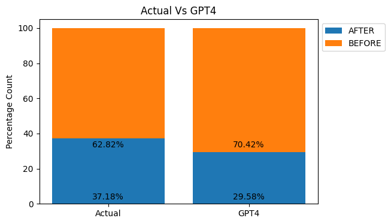

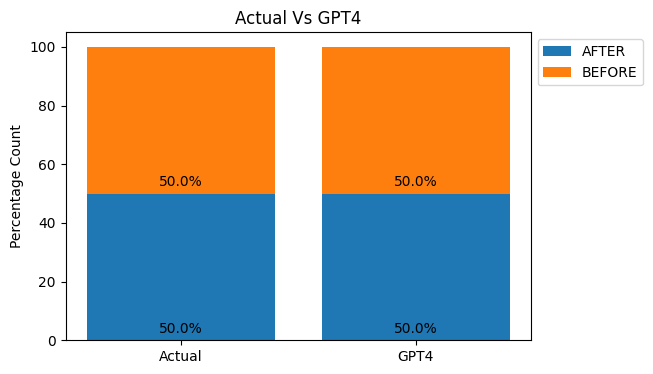

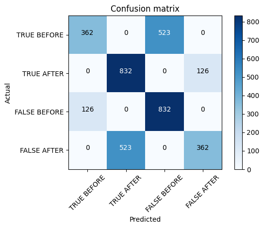

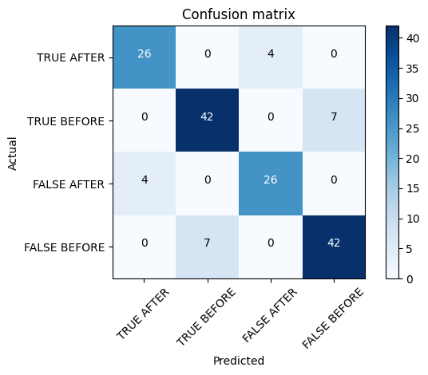

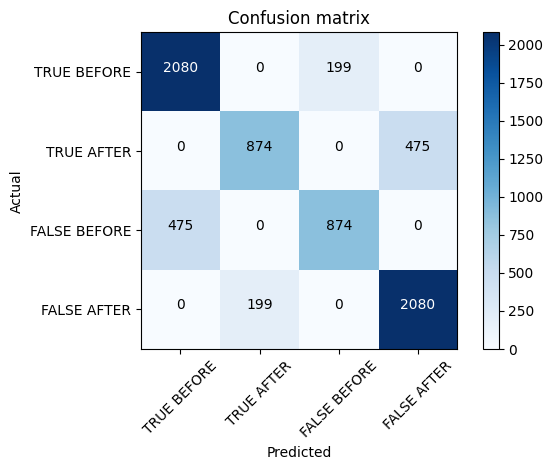

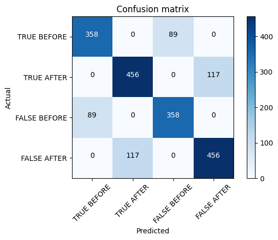

[Arxiv](https://arxiv.org/abs/2404.01453)