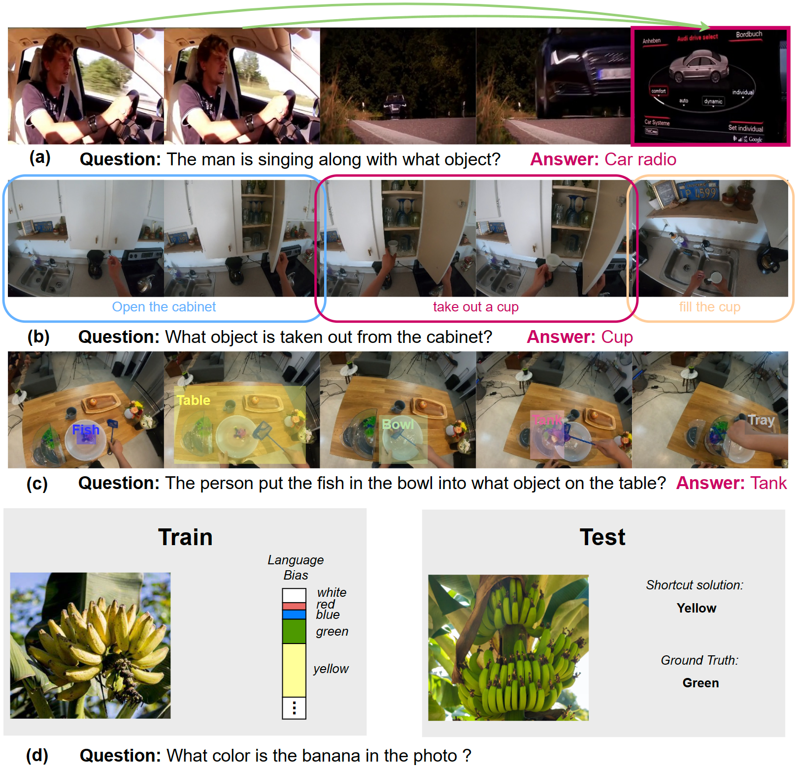
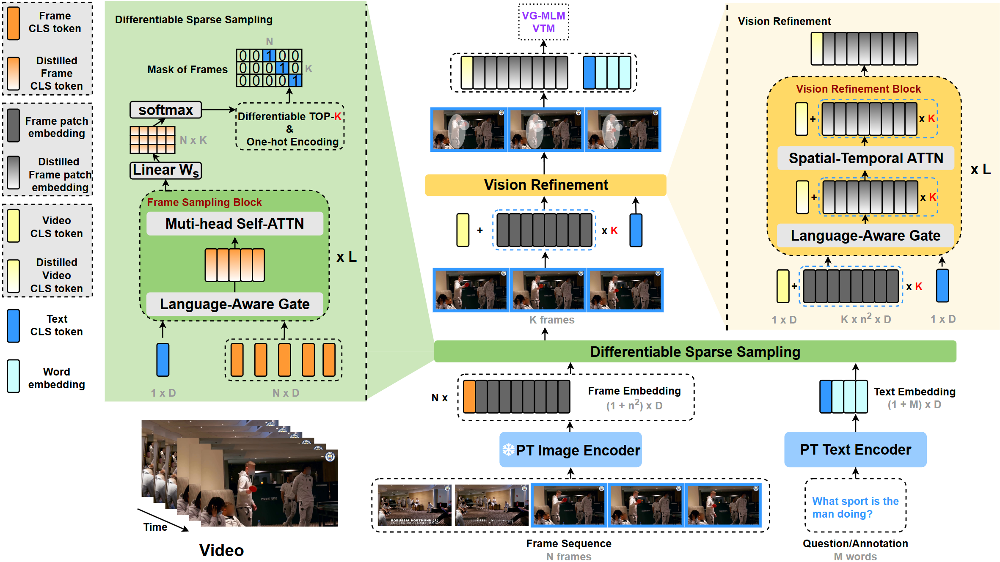
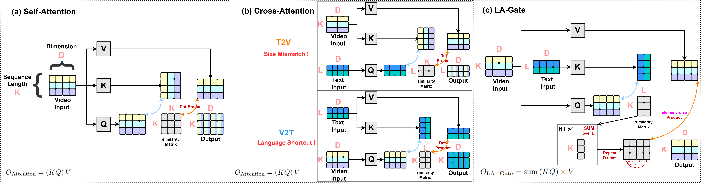
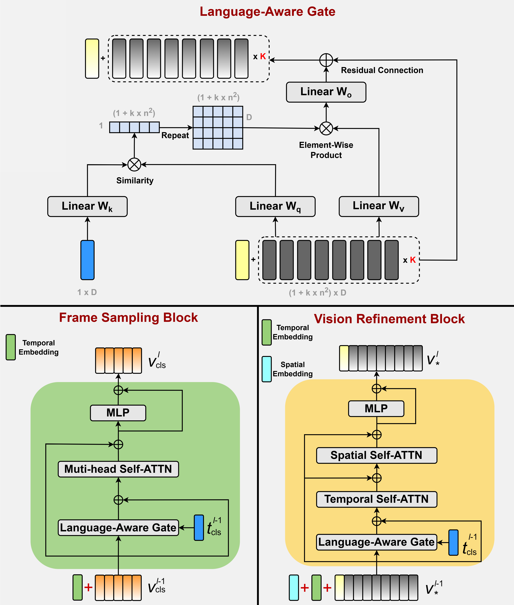
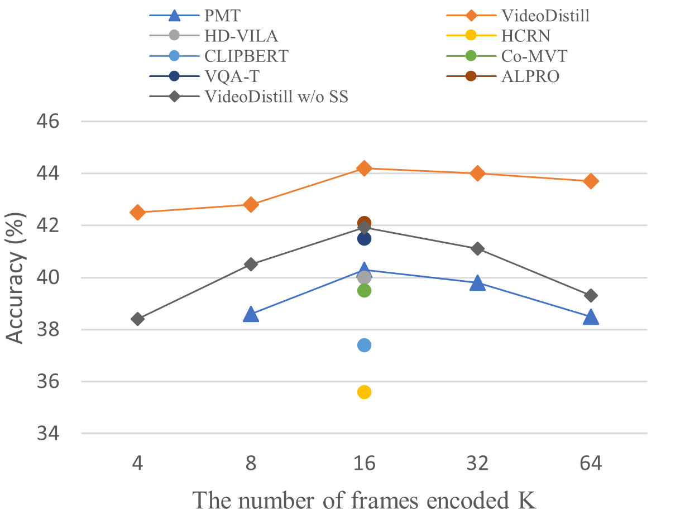
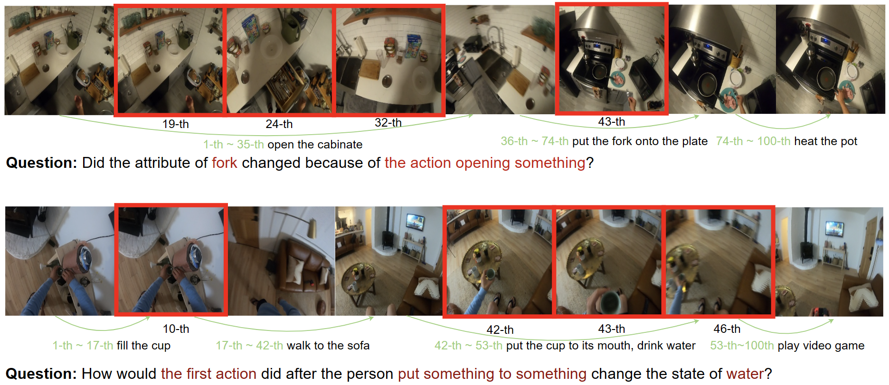
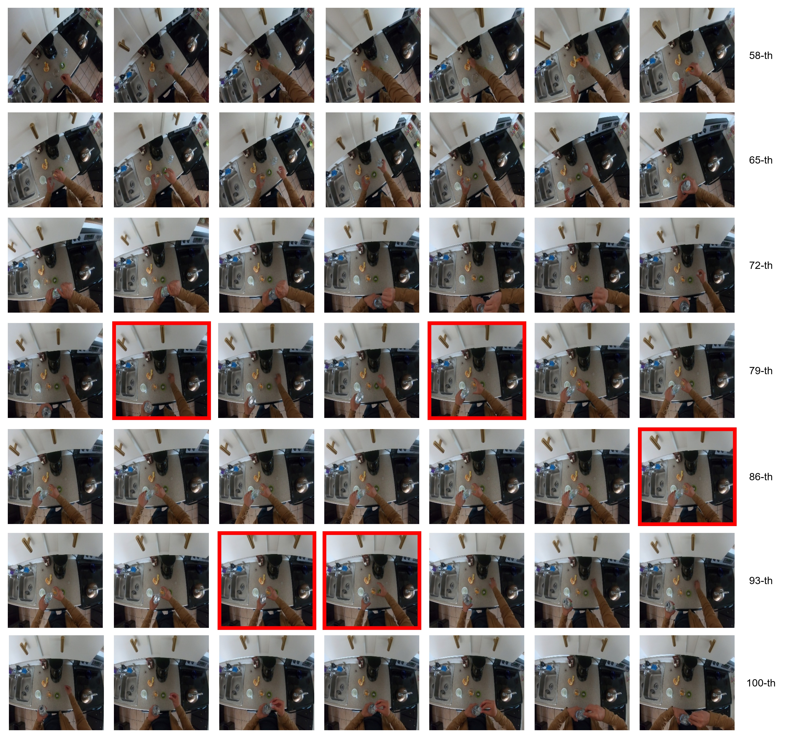

# VideoDistill：为视频问答而设计的，融合语言理解的视觉蒸馏技术

发布时间：2024年04月01日

`RAG` `视频处理` `问答系统`

> VideoDistill: Language-aware Vision Distillation for Video Question Answering

# 摘要

> 得益于大型图像-语言预训练框架的兴起，视频问答技术已取得重大突破。然而，现有模型在处理视频和语言信息时，往往缺乏目标导向的互动，导致关键视觉信息的丢失。本文提出了一种新颖的VideoDistill框架，模仿人类的认知和学习模式，实现了在视觉感知和答案生成中的语言意识。该框架仅基于与问题相关的视图嵌入生成答案，采用类似人类的观察-思考-回答流程，与以往研究不同。我们设计了一种语言感知门控机制，避免了语言信息与视觉表示的直接混合，并将其应用于框架的两个核心部分：一是可微分稀疏采样模块，精准选取与问题相关的动态和语义帧；二是视觉精炼模块，整合时空注意力层，提取与问题紧密相关的多尺度视觉语义。经过多项挑战性视频问答基准测试，VideoDistill在各类数据集上均展现出卓越的性能。此外，我们证实VideoDistill能有效减少EgoTaskQA数据集中对语言捷径的依赖。

> Significant advancements in video question answering (VideoQA) have been made thanks to thriving large image-language pretraining frameworks. Although these image-language models can efficiently represent both video and language branches, they typically employ a goal-free vision perception process and do not interact vision with language well during the answer generation, thus omitting crucial visual cues. In this paper, we are inspired by the human recognition and learning pattern and propose VideoDistill, a framework with language-aware (i.e., goal-driven) behavior in both vision perception and answer generation process. VideoDistill generates answers only from question-related visual embeddings and follows a thinking-observing-answering approach that closely resembles human behavior, distinguishing it from previous research. Specifically, we develop a language-aware gating mechanism to replace the standard cross-attention, avoiding language's direct fusion into visual representations. We incorporate this mechanism into two key components of the entire framework. The first component is a differentiable sparse sampling module, which selects frames containing the necessary dynamics and semantics relevant to the questions. The second component is a vision refinement module that merges existing spatial-temporal attention layers to ensure the extraction of multi-grained visual semantics associated with the questions. We conduct experimental evaluations on various challenging video question-answering benchmarks, and VideoDistill achieves state-of-the-art performance in both general and long-form VideoQA datasets. In Addition, we verify that VideoDistill can effectively alleviate the utilization of language shortcut solutions in the EgoTaskQA dataset.

[Arxiv](https://arxiv.org/abs/2404.00973)