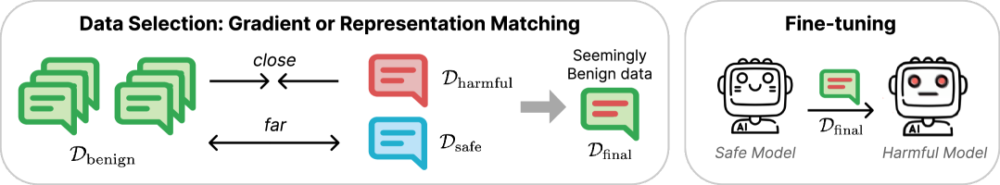

# 揭秘“安全”数据：发现看似无害却危害安全的数据。

发布时间：2024年04月01日

`LLM理论` `安全性` `数据分析`

> What's in Your "Safe" Data?: Identifying Benign Data that Breaks Safety

# 摘要

> 即便是经过安全和一致性调整的大型语言模型，也可能面临越狱的风险。研究发现，使用无害数据对这些模型进行进一步微调，竟意外地削弱了其安全性。本文深入分析了良性微调为何可能间接导致越狱的数据层面原因。我们从表示和梯度空间两个维度审视微调数据，提出了一种双向锚定策略，专注于那些与有害案例接近而与无害案例远离的数据点。这种方法有效地识别出那些在微调后可能损害模型安全性的无害数据子集。仅针对这些数据中的100个进行训练，就能让微调后的模型对超过70%的有害请求作出积极响应，而随机选取数据进行微调的响应率则不到20%。我们还发现，这些选定的数据往往呈现为列表、项目符号或数学问题的形式。

> Current Large Language Models (LLMs), even those tuned for safety and alignment, are susceptible to jailbreaking. Some have found that just further fine-tuning an aligned model with benign data (i.e., data without harmful content) surprisingly leads to substantial degradation in safety. We delve into the data-centric aspects of why benign fine-tuning inadvertently contributes to jailbreaking. First, we represent fine-tuning data through two lenses: representation and gradient spaces. Furthermore, we propose a bi-directional anchoring method that prioritizes data points that are close to harmful examples and distant from benign ones. By doing so, our approach effectively identifies subsets of benign data that are more likely to degrade the model's safety after fine-tuning. Training on just 100 of these seemingly benign datapoints can lead to the fine-tuned model affirmatively responding to > 70% of tested harmful requests, compared to < 20% after fine-tuning on randomly selected data. We further find that selected data are often in the form of lists and bullet points, or math questions.

[Arxiv](https://arxiv.org/abs/2404.01099)