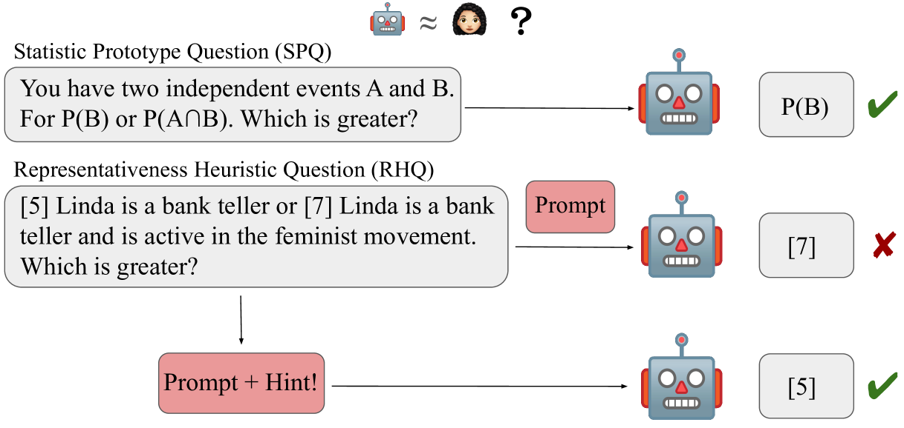
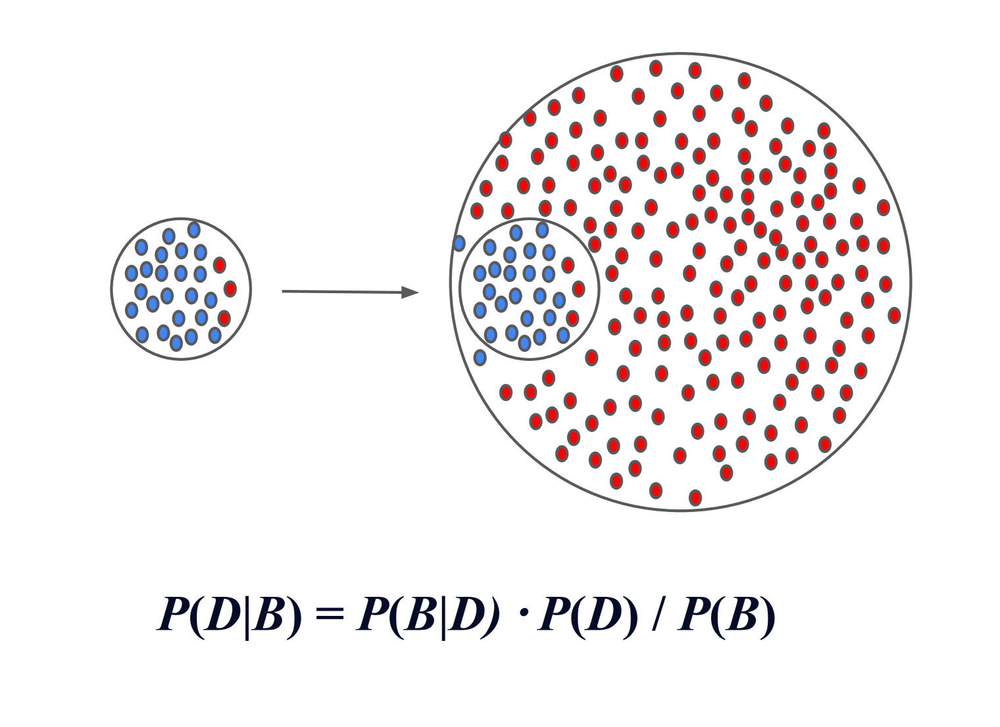
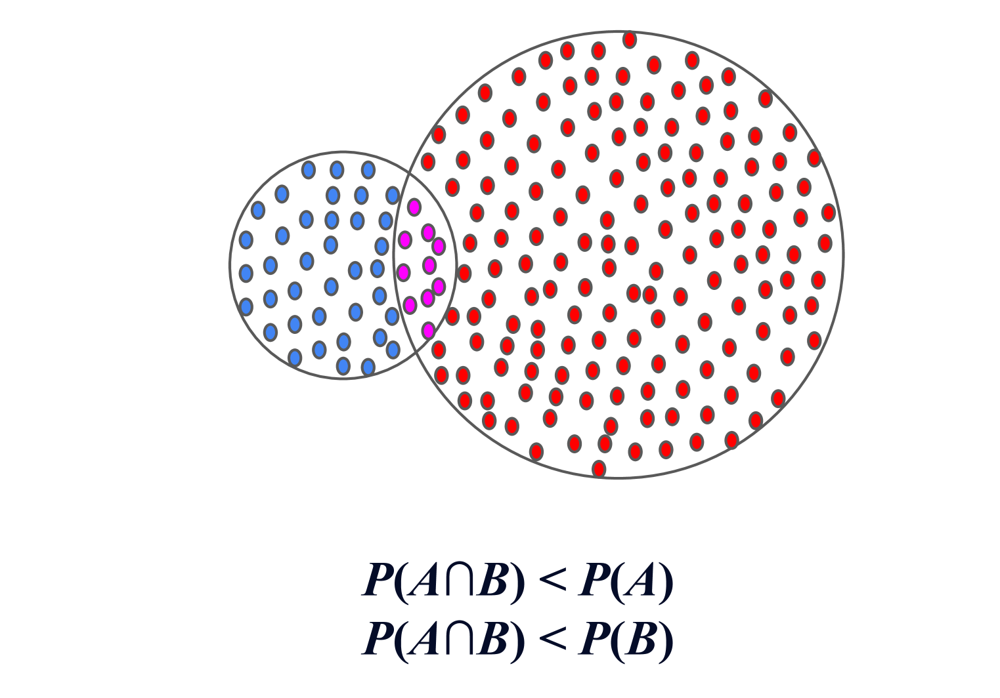
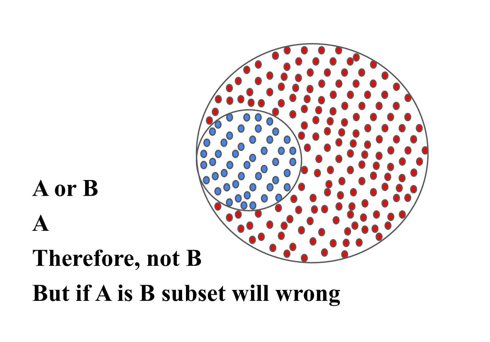
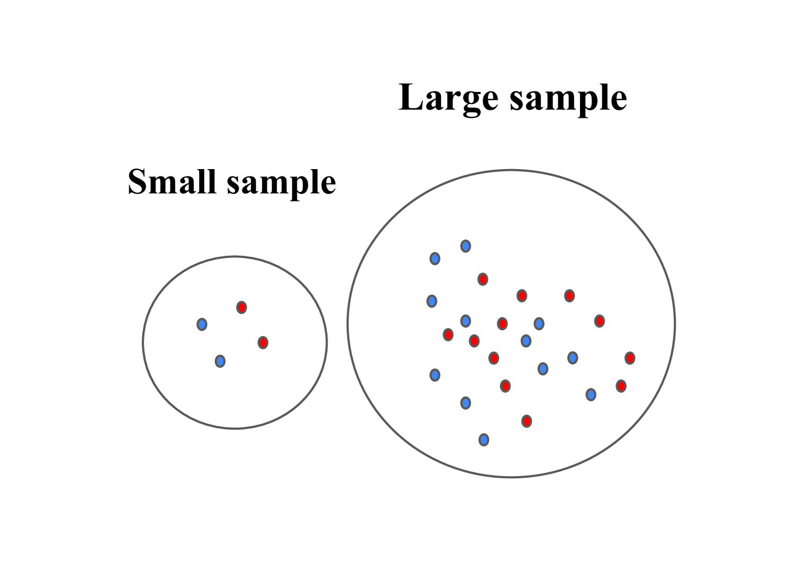
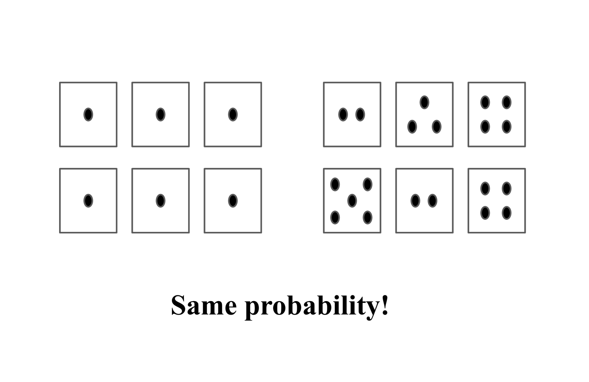
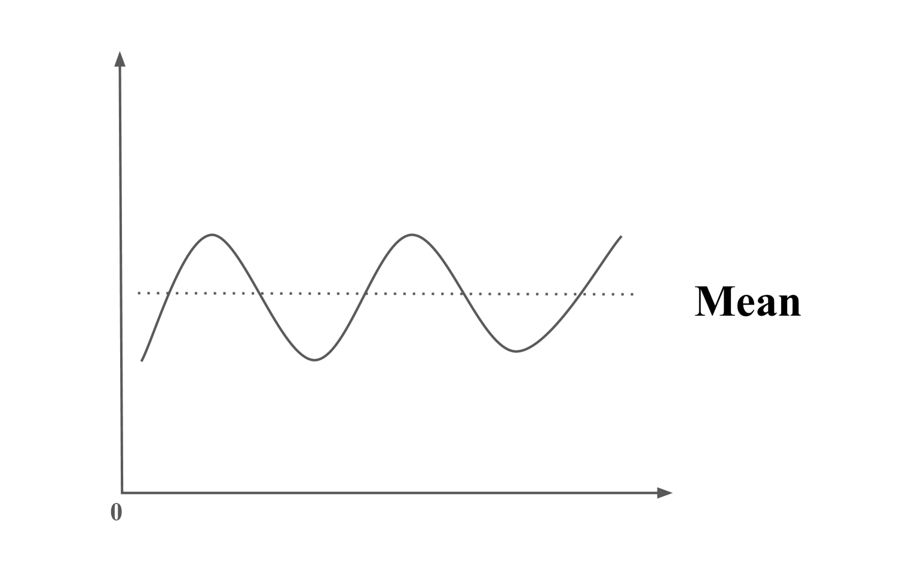
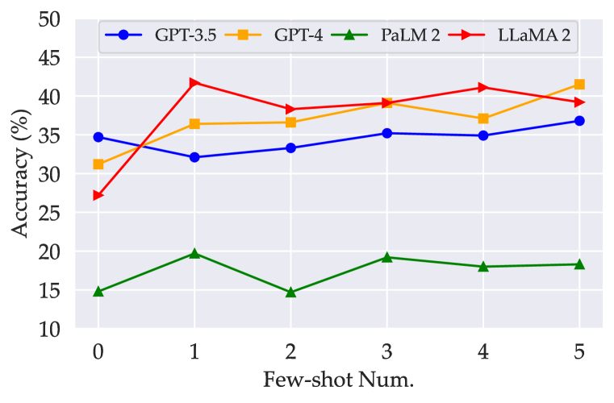
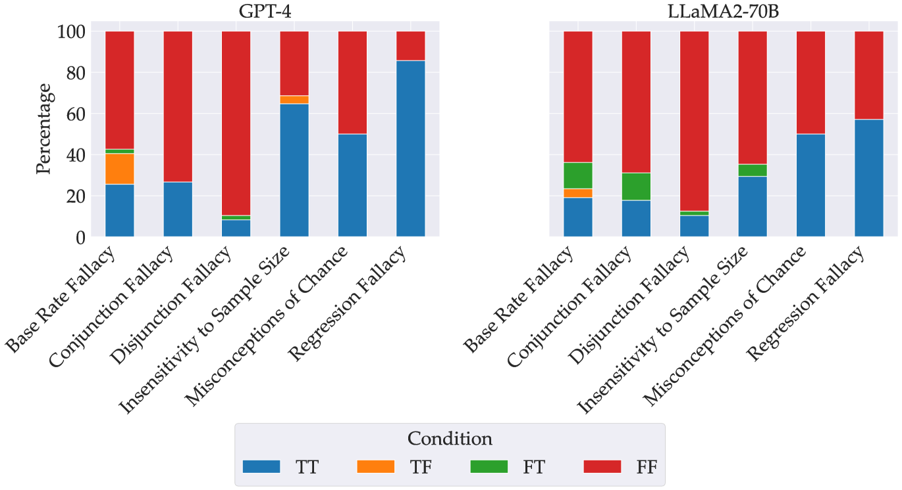

# 琳达能否勇敢地面对大型语言模型？探究LLMs中的代表性启发式原理。

发布时间：2024年04月01日

`LLM应用` `心理学` `人工智能`

> Will the Real Linda Please Stand up...to Large Language Models? Examining the Representativeness Heuristic in LLMs

# 摘要

> 大型语言模型（LLMs）在理解和生成类人文本方面表现出色，但可能因此带有训练数据中的偏见。特别是，LLMs容易落入代表性启发式这一人类认知常见误区。心理学中的这一概念，指的是人们根据事件与典型案例的相似度来判断可能性，而非依据更全面的统计证据。本研究探讨了代表性启发式对LLM推理能力的影响。我们开发了REHEAT数据集，涵盖六种代表性启发式问题类型。实验发现，四种LLM均显示出偏见。我们还发现，模型的推理过程常误基于刻板印象，而非问题本质。有趣的是，当在提示中加入提示，提醒模型运用其知识时，性能得到提升。这突显了代表性启发式与传统偏见的不同，即便LLMs掌握了正确知识，也可能陷入认知误区。这强调了未来研究需关注模型推理和决策中的代表性启发式问题，并寻求解决方案。

> Although large language models (LLMs) have demonstrated remarkable proficiency in understanding text and generating human-like text, they may exhibit biases acquired from training data in doing so. Specifically, LLMs may be susceptible to a common cognitive trap in human decision-making called the representativeness heuristic. This is a concept in psychology that refers to judging the likelihood of an event based on how closely it resembles a well-known prototype or typical example versus considering broader facts or statistical evidence. This work investigates the impact of the representativeness heuristic on LLM reasoning. We created REHEAT (Representativeness Heuristic AI Testing), a dataset containing a series of problems spanning six common types of representativeness heuristics. Experiments reveal that four LLMs applied to REHEAT all exhibited representativeness heuristic biases. We further identify that the model's reasoning steps are often incorrectly based on a stereotype rather than the problem's description. Interestingly, the performance improves when adding a hint in the prompt to remind the model of using its knowledge. This suggests the uniqueness of the representativeness heuristic compared to traditional biases. It can occur even when LLMs possess the correct knowledge while failing in a cognitive trap. This highlights the importance of future research focusing on the representativeness heuristic in model reasoning and decision-making and on developing solutions to address it.

[Arxiv](https://arxiv.org/abs/2404.01461)