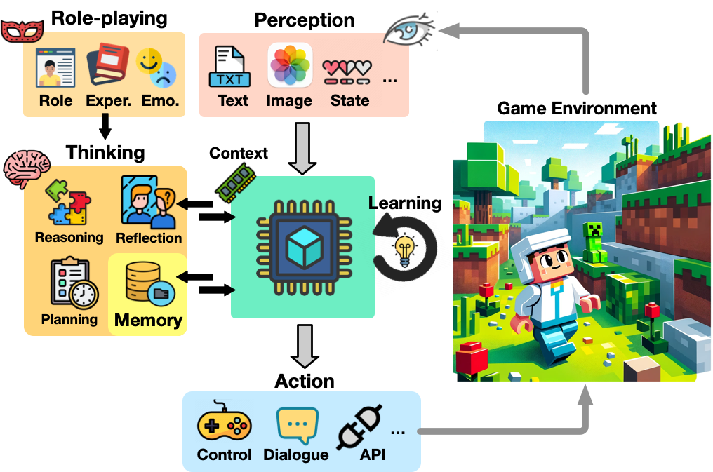
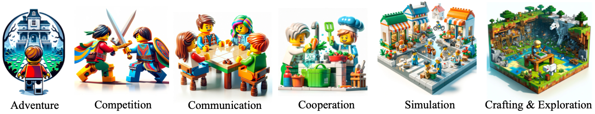

# 本文综述了基于大型语言模型的游戏代理的研究现状。

发布时间：2024年04月02日

`Agent` `人工智能`

> A Survey on Large Language Model-Based Game Agents

# 摘要

> 推动人工通用智能（AGI）的发展，游戏代理的进化至关重要。大型语言模型（LLM）及其多模态版本（MLLM）为我们提供了一个独特的机遇，使得游戏代理能在复杂的电脑游戏世界中展现出近乎人类的决策能力。本文全面审视了基于 LLM 的游戏代理，首先概述了其核心概念架构，包括感知、记忆、思考、角色扮演、行动和学习六大关键功能。接着，我们回顾了现有文献中关于这些游戏代理的研究，探讨了它们在冒险、沟通、竞争、合作、模拟及探索等六种游戏类型中的方法论和适应性。最后，我们展望了这一新兴研究领域的未来趋势。相关论文的精选清单已整理并可在 https://github.com/git-disl/awesome-LLM-game-agent-papers 查看。

> The development of game agents holds a critical role in advancing towards Artificial General Intelligence (AGI). The progress of LLMs and their multimodal counterparts (MLLMs) offers an unprecedented opportunity to evolve and empower game agents with human-like decision-making capabilities in complex computer game environments. This paper provides a comprehensive overview of LLM-based game agents from a holistic viewpoint. First, we introduce the conceptual architecture of LLM-based game agents, centered around six essential functional components: perception, memory, thinking, role-playing, action, and learning. Second, we survey existing representative LLM-based game agents documented in the literature with respect to methodologies and adaptation agility across six genres of games, including adventure, communication, competition, cooperation, simulation, and crafting & exploration games. Finally, we present an outlook of future research and development directions in this burgeoning field. A curated list of relevant papers is maintained and made accessible at: https://github.com/git-disl/awesome-LLM-game-agent-papers.

[Arxiv](https://arxiv.org/abs/2404.02039)