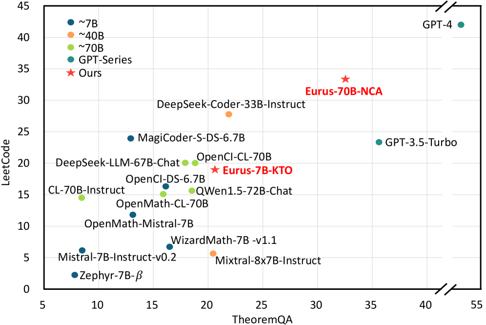
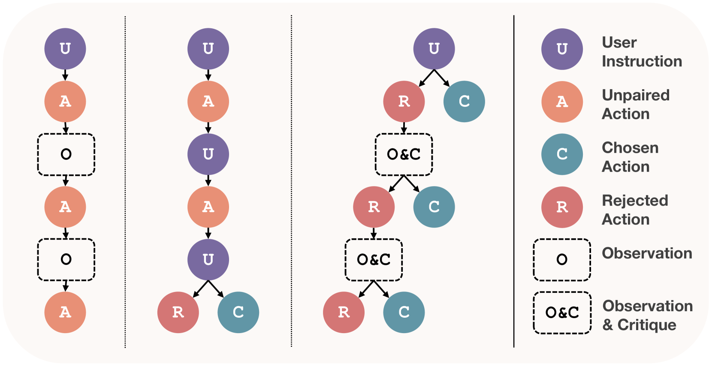
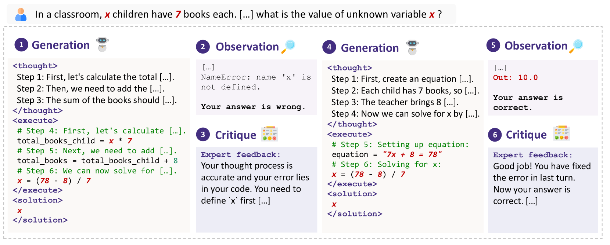
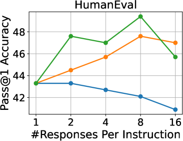
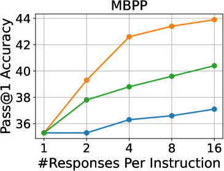
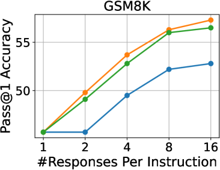
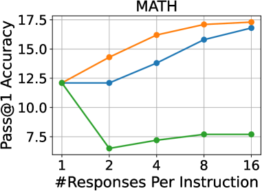
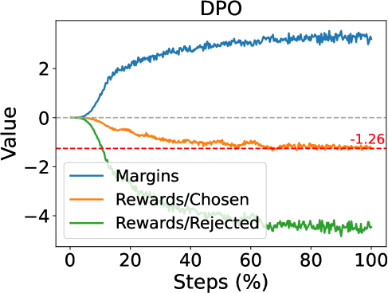
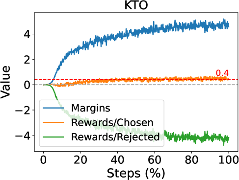
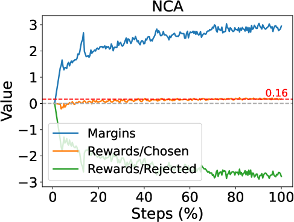

# 借助偏好树，我们能够增强大型语言模型的推理能力，使其在处理各种问题时表现得更加全面。

发布时间：2024年04月02日

`LLM应用`

> Advancing LLM Reasoning Generalists with Preference Trees

# 摘要

> 我们自豪地介绍Eurus——一系列专为推理而优化的大型语言模型（LLMs）。这些模型在经过Mistral-7B和CodeLlama-70B的精细调校后，在一系列涵盖数学、代码生成和逻辑推理的基准测试中，取得了领先于同类开源模型的卓越成果。Eurus-70B在跨越五个任务的12项全面基准测试中战胜了GPT-3.5 Turbo，并在LeetCode和TheoremQA这两个高难度基准测试中分别达到了33.3%的准确率和32.6%，大幅超越了现有开源模型，领先幅度超过13.3%。Eurus之所以表现出色，主要得益于我们全新打造的UltraInteract——一个专为复杂推理任务量身定做的大规模、高品质对齐数据集。UltraInteract不仅适用于监督式微调，还能用于偏好学习。每个指令都配备一个偏好树，内含多样化策略的推理链、与环境的多轮互动轨迹以及成对数据，以促进偏好学习。借助UltraInteract，我们深入挖掘了推理任务的偏好学习潜力。我们的研究发现，一些在常规对话中表现出色的偏好学习算法，在推理任务上可能并不那么适用。由此，我们提出了一种创新的奖励建模目标，结合UltraInteract，打造出了一个强大的奖励模型。

> We introduce Eurus, a suite of large language models (LLMs) optimized for reasoning. Finetuned from Mistral-7B and CodeLlama-70B, Eurus models achieve state-of-the-art results among open-source models on a diverse set of benchmarks covering mathematics, code generation, and logical reasoning problems. Notably, Eurus-70B beats GPT-3.5 Turbo in reasoning through a comprehensive benchmarking across 12 tests covering five tasks, and achieves a 33.3% pass@1 accuracy on LeetCode and 32.6% on TheoremQA, two challenging benchmarks, substantially outperforming existing open-source models by margins more than 13.3%. The strong performance of Eurus can be primarily attributed to UltraInteract, our newly-curated large-scale, high-quality alignment dataset specifically designed for complex reasoning tasks. UltraInteract can be used in both supervised fine-tuning and preference learning. For each instruction, it includes a preference tree consisting of (1) reasoning chains with diverse planning strategies in a unified format, (2) multi-turn interaction trajectories with the environment and the critique, and (3) pairwise data to facilitate preference learning. UltraInteract allows us to conduct an in-depth exploration of preference learning for reasoning tasks. Our investigation reveals that some well-established preference learning algorithms may be less suitable for reasoning tasks compared to their effectiveness in general conversations. Inspired by this, we derive a novel reward modeling objective which, together with UltraInteract, leads to a strong reward model.

[Arxiv](https://arxiv.org/abs/2404.02078)