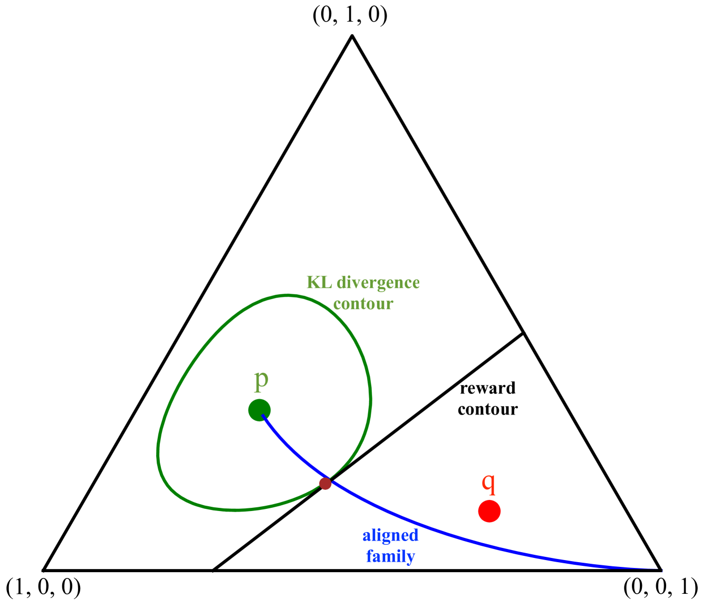

# 探讨语言模型对齐的极限行为

发布时间：2024年04月02日

`LLM理论` `信息论`

> Asymptotics of Language Model Alignment

# 摘要

> 设 $p$ 为生成性语言模型，$r$ 为回报模型，反映生成内容的偏好程度。语言模型对齐旨在将 $p$ 调整为新分布 $φ$，以提高预期回报，同时保持 $φ$ 与 $p$ 的接近。KL 约束的强化学习（RL）是一种流行方法，通过相对熵约束 $KL(φ_Δ|| p) \leq Δ$，找到最大化 $E_{φ_Δ} r(y)$ 的分布 $φ_Δ$。还有最佳 $N$ 选一法，即从 $p$ 中抽取 $N$ 个样本，挑选最佳回报者。本文给出了最优 KL 约束 RL 解决方案的精确描述。我们发现，任何在 K L 散度和回报间取得平衡的对齐策略，都必然接近最优 KL 约束 RL 解决方案。为深入分析，我们假设语言模型无记忆，回报模型线性，虽然这些假设简化了现实复杂性，但有助于精确描述最佳 $N$ 选一和 KL 约束 RL 方法的信息论行为。我们证实，最优 KL 约束 RL 解决方案的回报遵循大偏差原理，详细刻画了其速率函数，并指出回报的缩放累积量增长由 Renyi 交叉熵决定。最终，我们证明了最佳 $N$ 选一与 KL 约束 RL 解决方案在渐近意义上等价，两者的预期回报和 K L 散度均趋于一致。

> Let $p$ denote a generative language model. Let $r$ denote a reward model that returns a scalar that captures the degree at which a draw from $p$ is preferred. The goal of language model alignment is to alter $p$ to a new distribution $φ$ that results in a higher expected reward while keeping $φ$ close to $p.$ A popular alignment method is the KL-constrained reinforcement learning (RL), which chooses a distribution $φ_Δ$ that maximizes $E_{φ_Δ} r(y)$ subject to a relative entropy constraint $KL(φ_Δ|| p) \leq Δ.$ Another simple alignment method is best-of-$N$, where $N$ samples are drawn from $p$ and one with highest reward is selected. In this paper, we offer a closed-form characterization of the optimal KL-constrained RL solution. We demonstrate that any alignment method that achieves a comparable trade-off between KL divergence and reward must approximate the optimal KL-constrained RL solution in terms of relative entropy. To further analyze the properties of alignment methods, we introduce two simplifying assumptions: we let the language model be memoryless, and the reward model be linear. Although these assumptions may not reflect complex real-world scenarios, they enable a precise characterization of the asymptotic behavior of both the best-of-$N$ alignment, and the KL-constrained RL method, in terms of information-theoretic quantities. We prove that the reward of the optimal KL-constrained RL solution satisfies a large deviation principle, and we fully characterize its rate function. We also show that the rate of growth of the scaled cumulants of the reward is characterized by a proper Renyi cross entropy. Finally, we show that best-of-$N$ is asymptotically equivalent to KL-constrained RL solution by proving that their expected rewards are asymptotically equal, and concluding that the two distributions must be close in KL divergence.

[Arxiv](https://arxiv.org/abs/2404.01730)