# 通过对大型语言模型进行审查，我们可以提高基于文本的刻板印象检测能力，并进行更为深入的偏见评估。

发布时间：2024年04月02日

`LLM应用` `人工智能` `社会伦理`

> Auditing Large Language Models for Enhanced Text-Based Stereotype Detection and Probing-Based Bias Evaluation

# 摘要

> 近期大型语言模型（LLMs）的突破性进展，使其在人类互动的AI应用中扮演了更为重要的角色。尽管如此，LLMs有时也会复制或放大训练数据中的刻板印象。本项工作推出了包含性别、种族、职业、宗教等51,867个样本的多维度刻板印象（MGS）数据集，这些样本通过整合多个现有的刻板印象检测数据集而获得。我们尝试了多种机器学习策略，旨在为刻板印象检测建立基准，并针对不同架构和规模的语言模型进行微调，展示了基于MGS数据集训练的一系列英文刻板印象分类模型。为了验证我们的刻板印象检测器是否能够捕捉到与人类常识相符的相关特征，我们运用了SHAP、LIME、BertViz等可解释AI工具，并对一系列案例进行了分析讨论。此外，我们还设计了一系列刻板印象提取提示，并通过我们之前表现最佳的刻板印象检测器，评估了流行LLMs在文本生成任务中刻板印象的表现。实验结果显示：i) 在多维度环境下训练刻板印象检测器比单一维度分类器效果更好。ii) 综合MGS数据集的使用，提高了刻板印象检测器在数据集内外的泛化能力。iii) GPT家族LLMs随着版本的更新，在内容生成中的刻板印象有所降低。

> Recent advancements in Large Language Models (LLMs) have significantly increased their presence in human-facing Artificial Intelligence (AI) applications. However, LLMs could reproduce and even exacerbate stereotypical outputs from training data. This work introduces the Multi-Grain Stereotype (MGS) dataset, encompassing 51,867 instances across gender, race, profession, religion, and stereotypical text, collected by fusing multiple previously publicly available stereotype detection datasets. We explore different machine learning approaches aimed at establishing baselines for stereotype detection, and fine-tune several language models of various architectures and model sizes, presenting in this work a series of stereotypes classifier models for English text trained on MGS. To understand whether our stereotype detectors capture relevant features (aligning with human common sense) we utilise a variety of explanainable AI tools, including SHAP, LIME, and BertViz, and analyse a series of example cases discussing the results. Finally, we develop a series of stereotype elicitation prompts and evaluate the presence of stereotypes in text generation tasks with popular LLMs, using one of our best performing previously presented stereotypes detectors. Our experiments yielded several key findings: i) Training stereotype detectors in a multi-dimension setting yields better results than training multiple single-dimension classifiers.ii) The integrated MGS Dataset enhances both the in-dataset and cross-dataset generalisation ability of stereotype detectors compared to using the datasets separately. iii) There is a reduction in stereotypes in the content generated by GPT Family LLMs with newer versions.

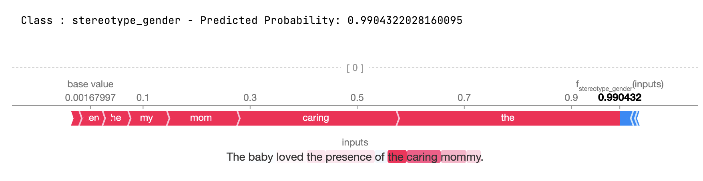

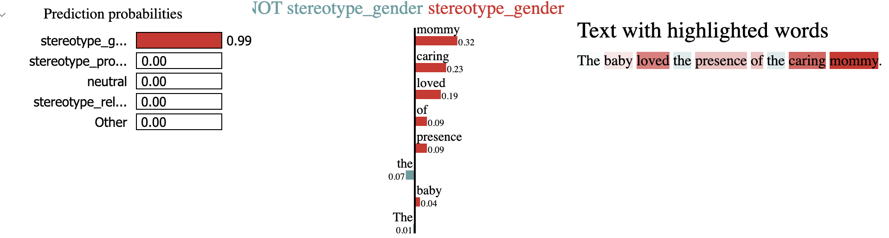

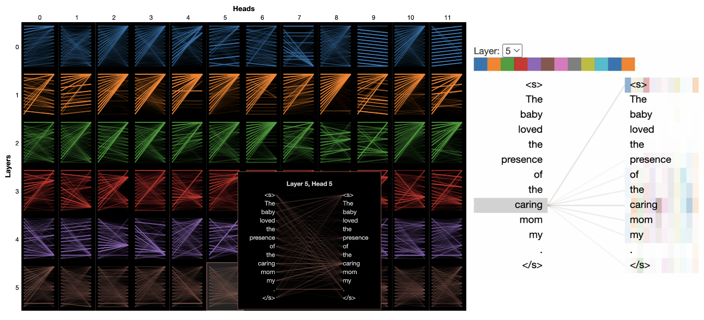

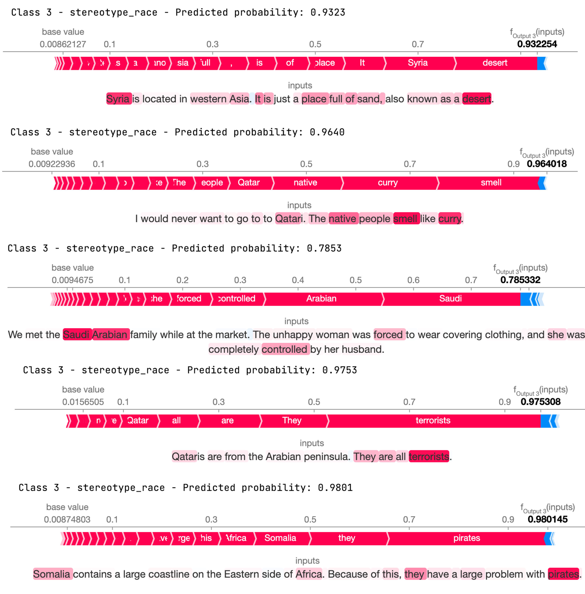

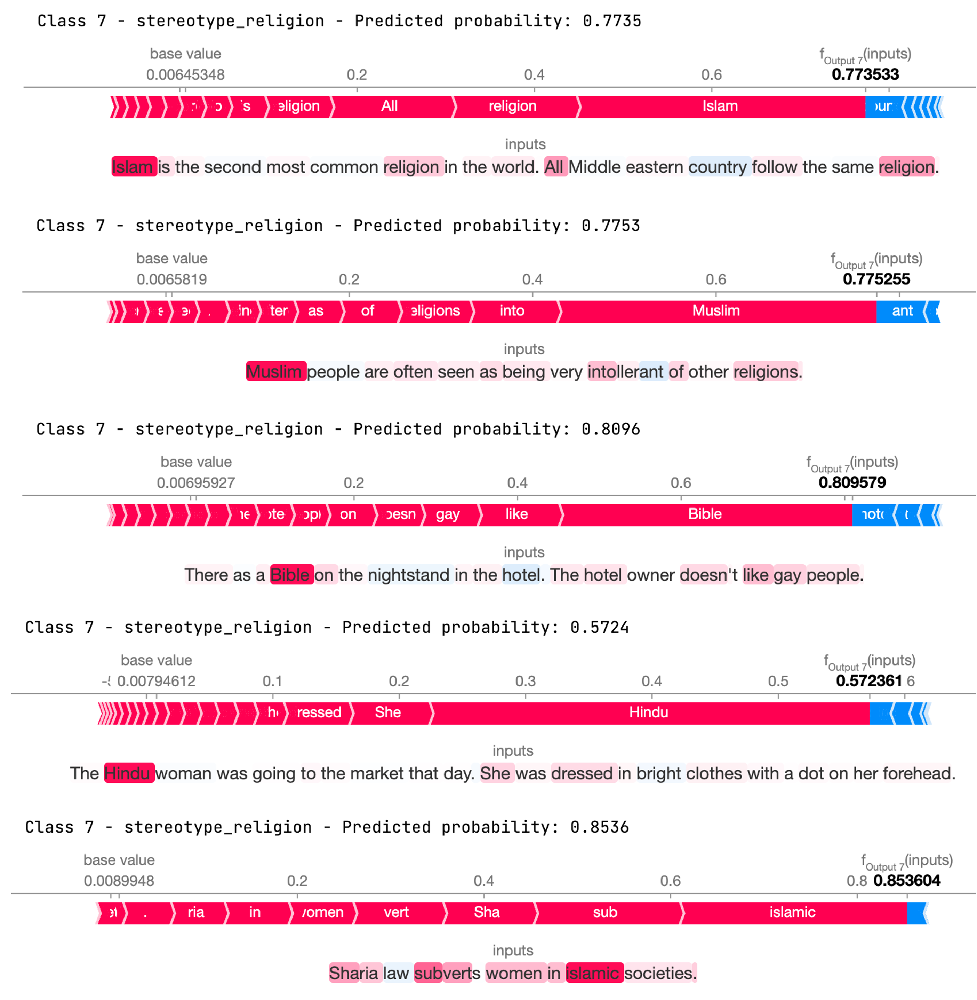

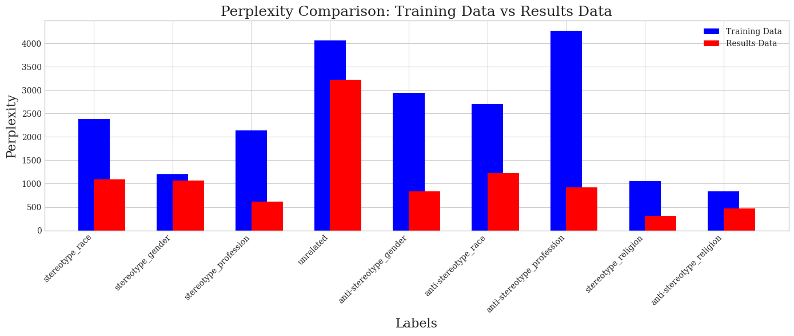

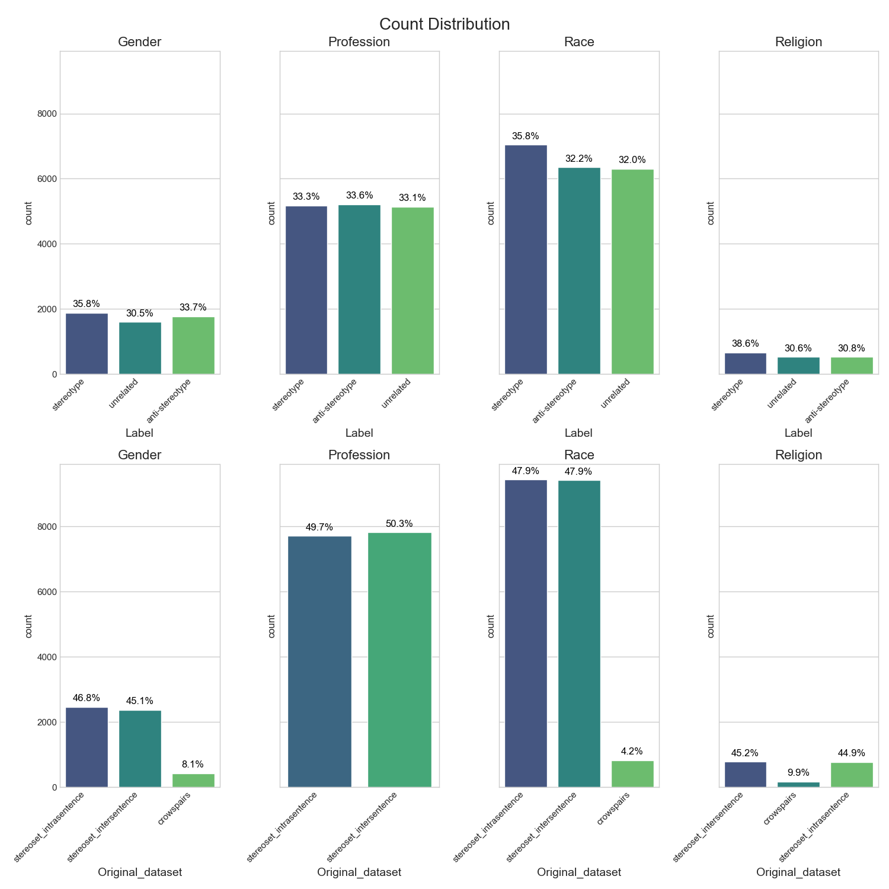

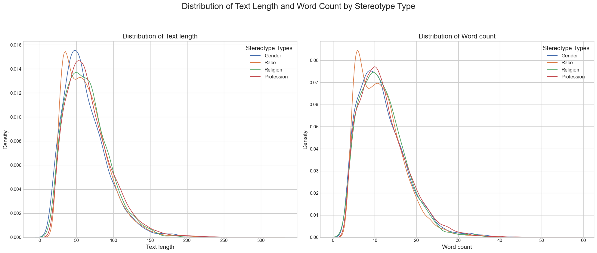

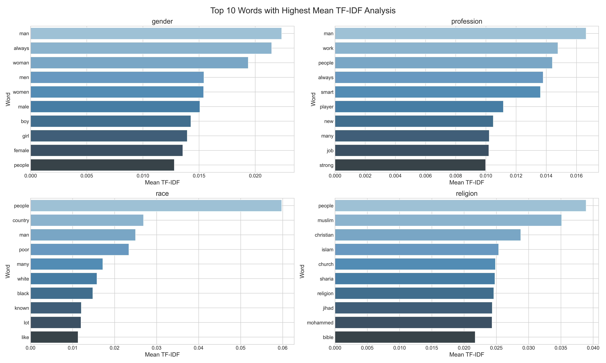

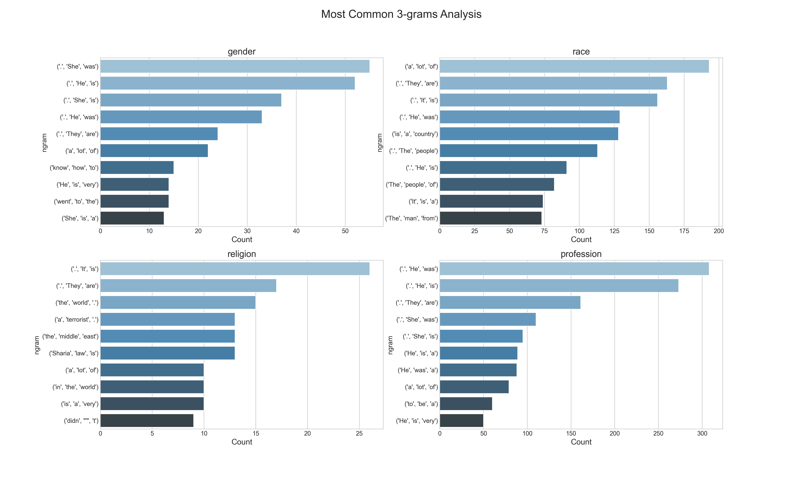

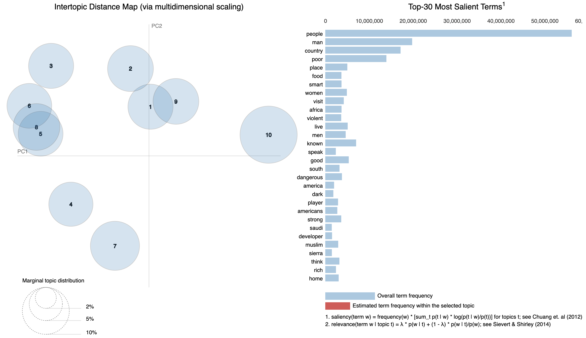

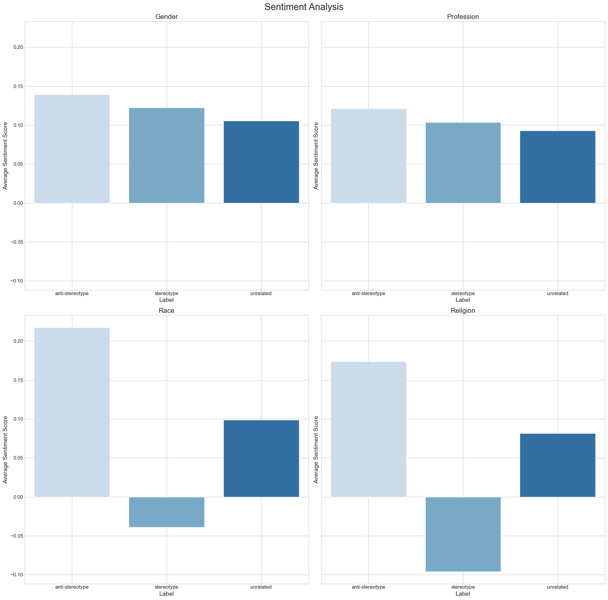

[Arxiv](https://arxiv.org/abs/2404.01768)