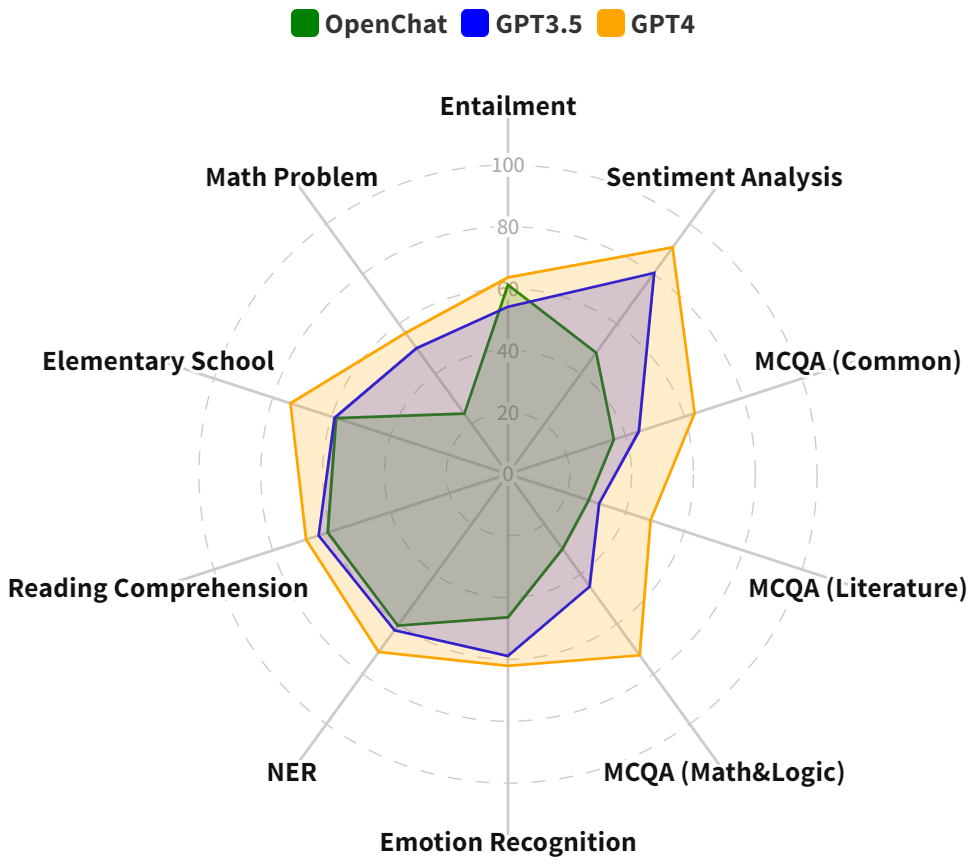

# 探索波斯语大型语言模型：以ChatGPT为焦点的初步研究

发布时间：2024年04月02日

`LLM应用` `语言处理`

> Benchmarking Large Language Models for Persian: A Preliminary Study Focusing on ChatGPT

# 摘要

> 本研究深入分析了大型语言模型（LLMs）在波斯语领域的应用效果。尽管ChatGPT等LLMs在英语上取得了显著成就，但对于资源匮乏的语言，其性能仍有待验证。我们首次对LLMs在多种波斯语言任务上的表现进行了全面基准测试，重点关注GPT-3.5-turbo，并结合GPT-4和OpenChat-3.5进行了更综合的评估。测试任务覆盖了传统、推理和知识三大类别。为了进行深入的比较，我们将LLMs与针对特定任务微调的现有模型进行了对比。考虑到波斯语推理任务数据集的稀缺，我们创新性地推出了两个新基准测试：一个以小学数学问题为基础，另一个源自7年级和10年级的入学考试。研究发现，尽管LLMs，尤其是GPT-4，在需要推理和广泛知识理解的任务上表现优异，但在特定任务上，它们往往不如经过专门微调的小型预训练模型。同时，我们还发现，在将测试集翻译成英语后输入GPT-3.5，可以提升模型性能。这一发现揭示了提升波斯语LLMs性能的巨大潜力，特别是考虑到波斯语独有的字母表和书写风格，这一点尤为重要。

> This paper explores the efficacy of large language models (LLMs) for Persian. While ChatGPT and consequent LLMs have shown remarkable performance in English, their efficiency for more low-resource languages remains an open question. We present the first comprehensive benchmarking study of LLMs across diverse Persian language tasks. Our primary focus is on GPT-3.5-turbo, but we also include GPT-4 and OpenChat-3.5 to provide a more holistic evaluation. Our assessment encompasses a diverse set of tasks categorized into classic, reasoning, and knowledge-based domains. To enable a thorough comparison, we evaluate LLMs against existing task-specific fine-tuned models. Given the limited availability of Persian datasets for reasoning tasks, we introduce two new benchmarks: one based on elementary school math questions and another derived from the entrance exams for 7th and 10th grades. Our findings reveal that while LLMs, especially GPT-4, excel in tasks requiring reasoning abilities and a broad understanding of general knowledge, they often lag behind smaller pre-trained models fine-tuned specifically for particular tasks. Additionally, we observe improved performance when test sets are translated to English before inputting them into GPT-3.5. These results highlight the significant potential for enhancing LLM performance in the Persian language. This is particularly noteworthy due to the unique attributes of Persian, including its distinct alphabet and writing styles.

[Arxiv](https://arxiv.org/abs/2404.02403)