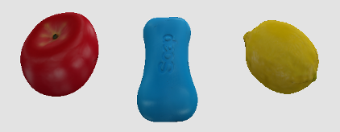
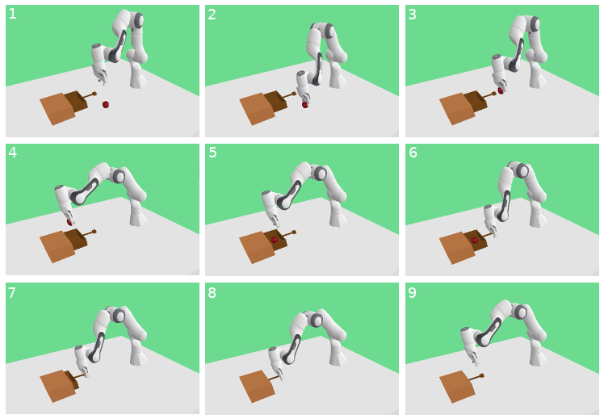
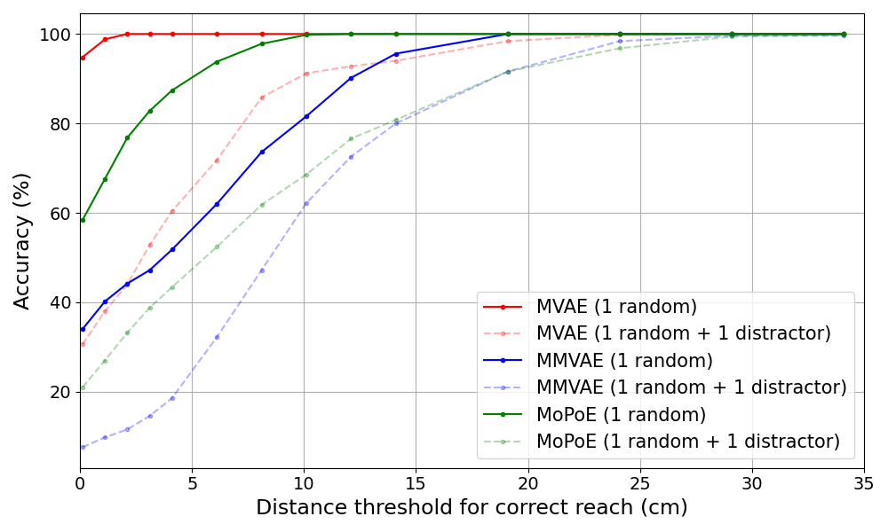

# 多模态变分自编码器（VAEs）在机器人操控任务中架起了语言、视觉与动作之间的桥梁。尽管如此，我们对于这些多模态VAEs在现实操作中的表现及其成效仍知之甚少。

发布时间：2024年04月02日

`Agent` `机器人` `多模态学习`

> Bridging Language, Vision and Action: Multimodal VAEs in Robotic Manipulation Tasks

# 摘要

> 本研究着眼于机器人操控领域内无需监督的视觉-语言-动作关联问题。近期，众多研究提出利用预训练的大型语言和视觉模型来应对这一挑战，但这些方法往往计算成本高昂，且对输出结果的精细调整要求严格。相比之下，多模态变分自编码器（VAEs）作为一种轻量级选择，能够提取数据的潜在特征并融合为统一表示，这一点在最先进的图像-图像或图像-文本模型中已得到验证。我们探讨了多模态VAEs在模拟环境中无监督机器人操控任务中的应用可能性及效果。根据实验成果，我们提出了一种模型不变的训练方法，能显著提升模拟器中模型的性能，增幅达55%。同时，我们对任务中可能出现的问题进行了系统性评估，包括物体或机器人位置的变化、干扰物数量以及任务长度等。这项研究进一步阐明了利用当前多模态VAEs进行基于视觉和语言的机器人运动轨迹无监督学习的潜在优势与局限。

> In this work, we focus on unsupervised vision-language-action mapping in the area of robotic manipulation. Recently, multiple approaches employing pre-trained large language and vision models have been proposed for this task. However, they are computationally demanding and require careful fine-tuning of the produced outputs. A more lightweight alternative would be the implementation of multimodal Variational Autoencoders (VAEs) which can extract the latent features of the data and integrate them into a joint representation, as has been demonstrated mostly on image-image or image-text data for the state-of-the-art models. Here we explore whether and how can multimodal VAEs be employed in unsupervised robotic manipulation tasks in a simulated environment. Based on the obtained results, we propose a model-invariant training alternative that improves the models' performance in a simulator by up to 55%. Moreover, we systematically evaluate the challenges raised by the individual tasks such as object or robot position variability, number of distractors or the task length. Our work thus also sheds light on the potential benefits and limitations of using the current multimodal VAEs for unsupervised learning of robotic motion trajectories based on vision and language.

[Arxiv](https://arxiv.org/abs/2404.01932)