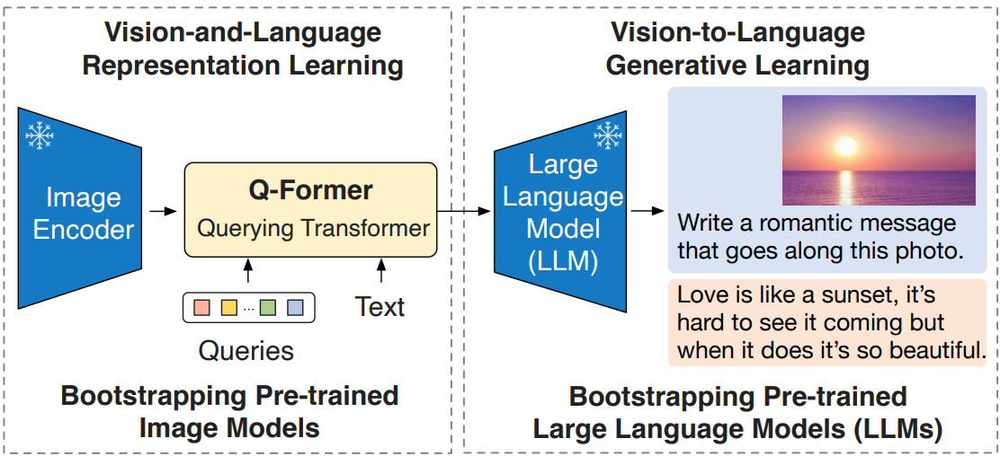
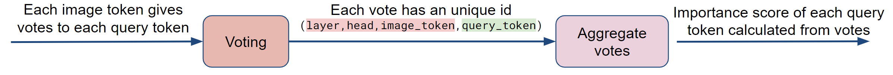
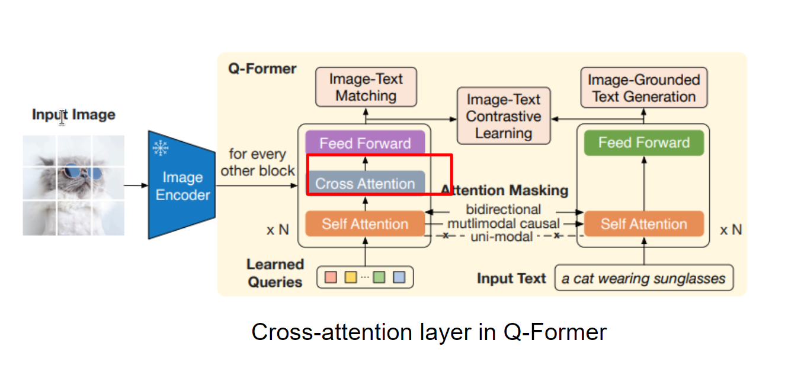
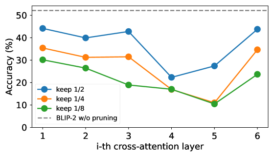

# CATP 技术通过跨注意力机制对令牌进行剪枝，实现了在多模态模型推理中保持准确度的同时，提高了效率。

发布时间：2024年04月02日

`RAG` `多模态` `模型修剪`

> CATP: Cross-Attention Token Pruning for Accuracy Preserved Multimodal Model Inference

# 摘要

> 随着大型多模态模型兴趣的增加，我们提出了一种名为交叉注意力令牌修剪（CATP）的高精度修剪技术。该技术通过BLIP-2等多模态模型中的交叉注意力层，筛选出关键信息以确定令牌的重要性。CATP通过在不同模型头和层次之间实施精细的投票机制，实现了与现有方法相比高达12.1倍的准确率提升，有效平衡了计算效率与模型精度之间的关系。

> In response to the rising interest in large multimodal models, we introduce Cross-Attention Token Pruning (CATP), a precision-focused token pruning method. Our approach leverages cross-attention layers in multimodal models, exemplified by BLIP-2, to extract valuable information for token importance determination. CATP employs a refined voting strategy across model heads and layers. In evaluations, CATP achieves up to 12.1X higher accuracy compared to existing token pruning methods, addressing the trade-off between computational efficiency and model precision.

[Arxiv](https://arxiv.org/abs/2404.08567)