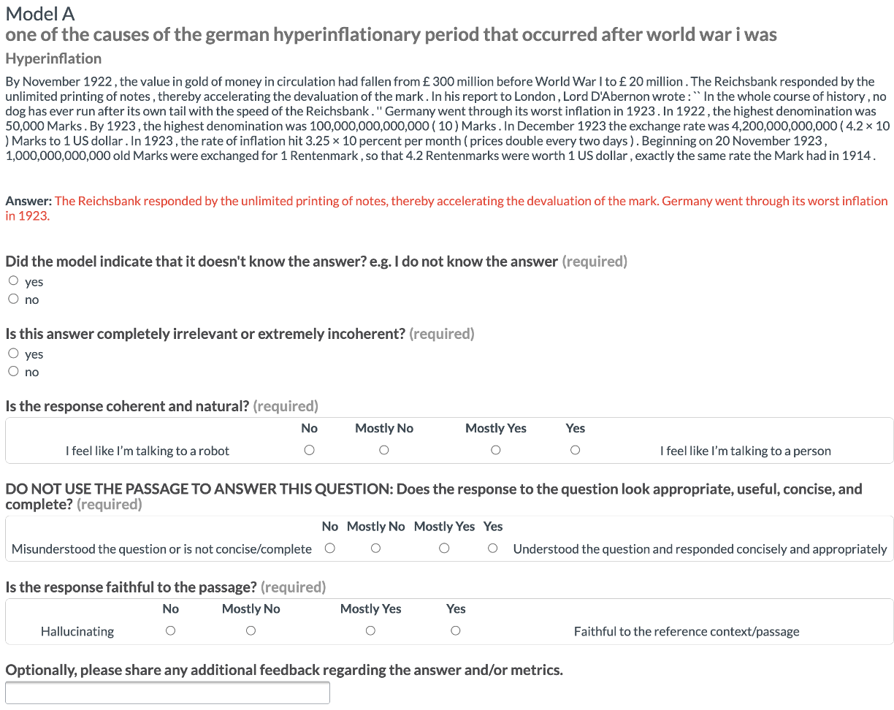
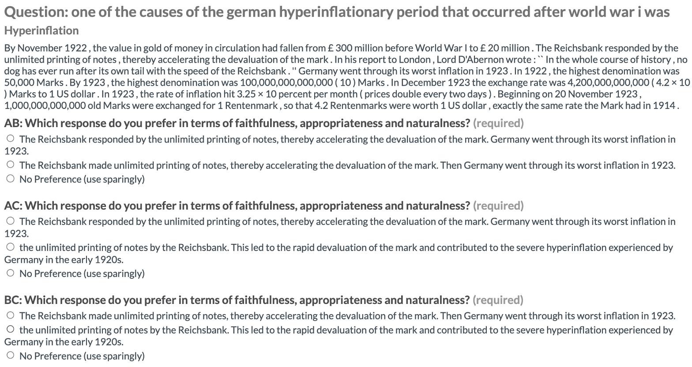

# CLAPNQ：针对RAG系统，从自然语言问题中提取段落，打造连贯且详尽的长篇幅回答。

发布时间：2024年04月02日

`RAG` `问答系统` `数据集`

> CLAPNQ: Cohesive Long-form Answers from Passages in Natural Questions for RAG systems

# 摘要

> 检索增强生成（RAG）技术在大型语言模型应用中备受青睐。理想的RAG系统应提供准确的答案，这些答案需基于段落的实质内容，而非凭空捏造。尽管搭建完善的RAG系统需要付出大量努力，但进行性能基准测试同样至关重要。我们推出了ClapNQ——一个针对完整RAG流程的长篇幅问答基准数据集。ClapNQ汇集了自然问题（NQ）中的精选金标准段落和长篇答案，同时提供了执行检索、生成或完整RAG流程所需的语料库。这些答案简明扼要，仅为原文的三分之一，且内容连贯，涵盖了多个非连续的文段。RAG模型需适应这些特点，方能在ClapNQ中表现卓越。我们还展示了ClapNQ的基线实验与分析，揭示了在提升有根据的RAG性能方面仍存在巨大的提升空间。CLAPNQ现已在 https://github.com/primeqa/clapnq 上公开发布。

> Retrieval Augmented Generation (RAG) has become a popular application for large language models. It is preferable that successful RAG systems provide accurate answers that are supported by being grounded in a passage without any hallucinations. While considerable work is required for building a full RAG pipeline, being able to benchmark performance is also necessary. We present ClapNQ, a benchmark Long-form Question Answering dataset for the full RAG pipeline. ClapNQ includes long answers with grounded gold passages from Natural Questions (NQ) and a corpus to perform either retrieval, generation, or the full RAG pipeline. The ClapNQ answers are concise, 3x smaller than the full passage, and cohesive, with multiple pieces of the passage that are not contiguous. RAG models must adapt to these properties to be successful at ClapNQ. We present baseline experiments and analysis for ClapNQ that highlight areas where there is still significant room for improvement in grounded RAG. CLAPNQ is publicly available at https://github.com/primeqa/clapnq

[Arxiv](https://arxiv.org/abs/2404.02103)