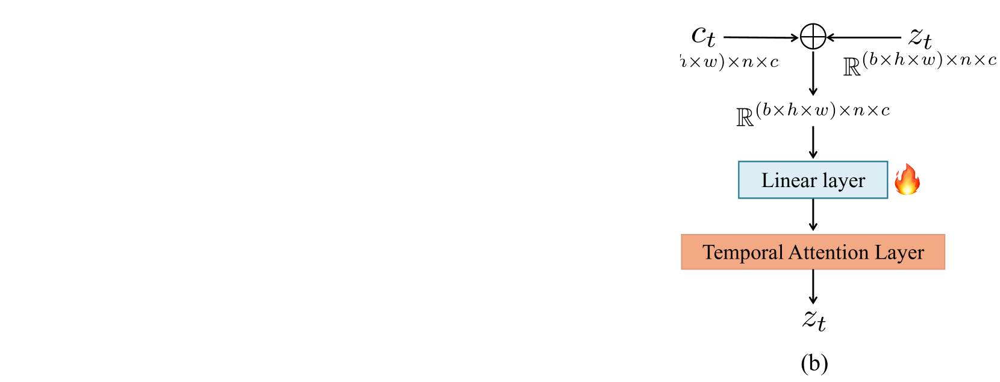
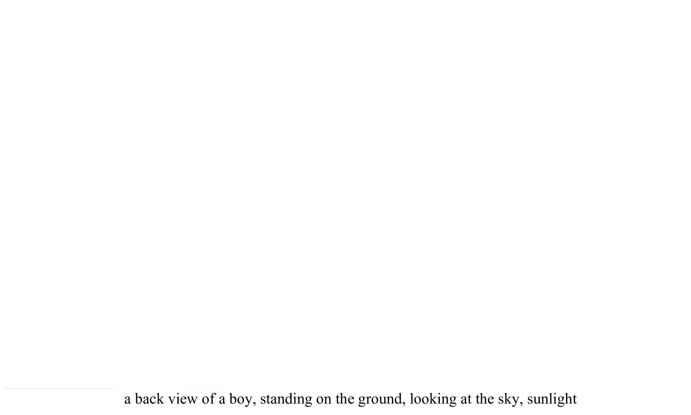

# CameraCtrl：实现文本输入到视频输出的相机操控功能

发布时间：2024年04月02日

`RAG` `视频制作` `人工智能`

> CameraCtrl: Enabling Camera Control for Text-to-Video Generation

# 摘要

> 在视频创作过程中，控制力是关键，它让用户能够打造心中所想的内容。但现有技术往往忽视了精确操控摄像机姿态的重要性，这种姿态是电影表达深层叙事的关键手法。为此，我们推出了CameraCtrl，这一工具能够为文本转视频（T2V）模型提供精确的摄像机控制。通过精细设定摄像机路径参数，我们开发了一个即插即用模块，专门针对T2V模型进行训练，而不干扰其他功能。我们还深入研究了不同数据集的效果，发现多样化的摄像机运用和相似的视觉风格能显著提升视频的可控性和泛化性。实验显示，CameraCtrl在精准控制摄像机方面表现出色，能够根据不同场景进行调整，这在从文本和摄像机姿态输入中创造出生动、个性化的视频叙事方面，迈出了重要一步。项目详情可访问：https://hehao13.github.io/projects-CameraCtrl/。

> Controllability plays a crucial role in video generation since it allows users to create desired content. However, existing models largely overlooked the precise control of camera pose that serves as a cinematic language to express deeper narrative nuances. To alleviate this issue, we introduce CameraCtrl, enabling accurate camera pose control for text-to-video(T2V) models. After precisely parameterizing the camera trajectory, a plug-and-play camera module is then trained on a T2V model, leaving others untouched. Additionally, a comprehensive study on the effect of various datasets is also conducted, suggesting that videos with diverse camera distribution and similar appearances indeed enhance controllability and generalization. Experimental results demonstrate the effectiveness of CameraCtrl in achieving precise and domain-adaptive camera control, marking a step forward in the pursuit of dynamic and customized video storytelling from textual and camera pose inputs. Our project website is at: https://hehao13.github.io/projects-CameraCtrl/.

[Arxiv](https://arxiv.org/abs/2404.02101)