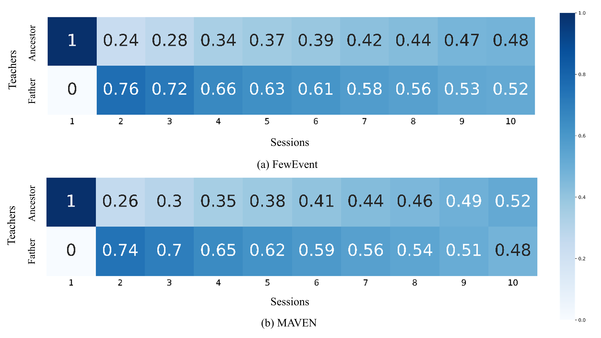

# 在少样本学习环境下，我们提出了一种新颖的事件检测方法，即类增量策略。该方法通过逐步引入新的类别信息，有效地提升了模型在面对类别不断变化的事件中的检测性能。

发布时间：2024年04月02日

`RAG` `信息提取` `知识图谱`

> Class-Incremental Few-Shot Event Detection

# 摘要

> 事件检测作为信息提取和构建知识图谱的基础工作，面临着不断涌现的新事件类别的挑战。这些新类别往往只有少量标记样本，因为为大量未标记样本打标签既费时又费力。针对这一问题，本研究提出了一项创新任务——类增量少样本事件检测。该任务需解决两大难题：旧知识遗忘和新类别过拟合。为此，我们设计了一种新颖的知识蒸馏与提示学习方法，名为Prompt-KD。它通过基于注意力的多教师知识蒸馏框架来应对旧知识的遗忘，其中基础类别上预训练的模型在所有学习环节中重复使用，并通过适应性调整生成当前学生模型。同时，为了应对少样本学习挑战和减轻新类别过拟合问题，Prompt-KD引入了提示学习机制。在FewEvent和MAVEN两个标准数据集上的广泛实验验证了Prompt-KD的优异性能。

> Event detection is one of the fundamental tasks in information extraction and knowledge graph. However, a realistic event detection system often needs to deal with new event classes constantly. These new classes usually have only a few labeled instances as it is time-consuming and labor-intensive to annotate a large number of unlabeled instances. Therefore, this paper proposes a new task, called class-incremental few-shot event detection. Nevertheless, this task faces two problems, i.e., old knowledge forgetting and new class overfitting. To solve these problems, this paper further presents a novel knowledge distillation and prompt learning based method, called Prompt-KD. Specifically, to handle the forgetting problem about old knowledge, Prompt-KD develops an attention based multi-teacher knowledge distillation framework, where the ancestor teacher model pre-trained on base classes is reused in all learning sessions, and the father teacher model derives the current student model via adaptation. On the other hand, in order to cope with the few-shot learning scenario and alleviate the corresponding new class overfitting problem, Prompt-KD is also equipped with a prompt learning mechanism. Extensive experiments on two benchmark datasets, i.e., FewEvent and MAVEN, demonstrate the superior performance of Prompt-KD.

[Arxiv](https://arxiv.org/abs/2404.01767)