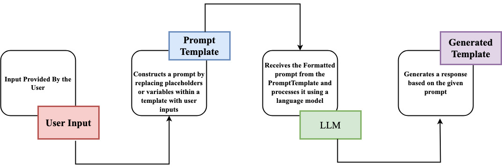
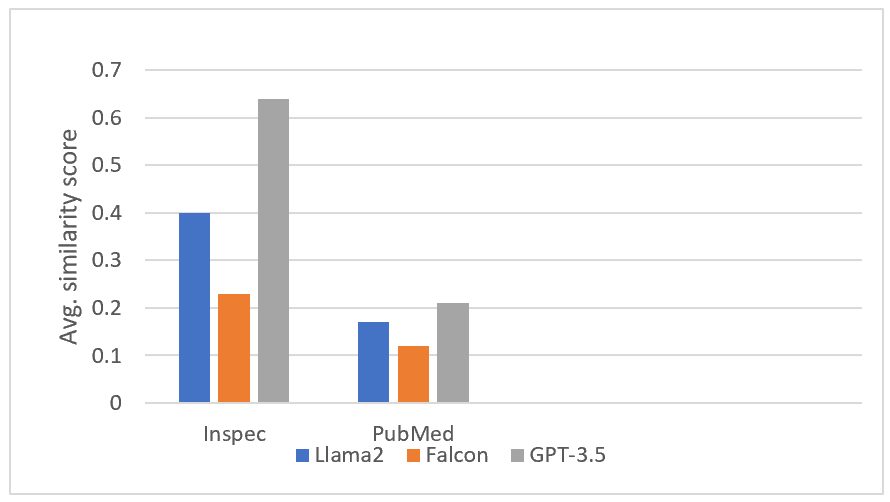
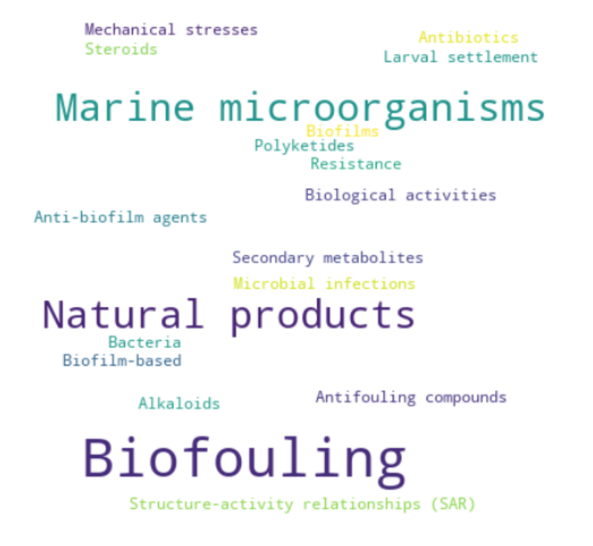

# 本研究通过大型语言模型，对领域驱动的术语提取进行了比较分析。

发布时间：2024年04月02日

`LLM应用` `信息检索`

> Comparative Study of Domain Driven Terms Extraction Using Large Language Models

# 摘要

> 关键词是连接人类对文本数据的理解和机器处理的桥梁，对于丰富数据内涵起着核心作用，因为它们奠定了深入洞察和详尽审视数据基础的注释工作。在自然语言处理中，以关键词/领域为导向的术语提取至关重要，它促进了信息检索、文档摘要和内容分类等功能。本篇综述重点关注关键词提取的方法，并特别强调了三种大型语言模型（LLMs）——Llama2-7B、GPT-3.5和Falcon-7B的应用。通过一个定制的Python工具包，我们简化了与这些LLMs的交互和关键词提取流程。利用Inspec和PubMed数据集，我们对这些模型的表现进行了评估，采用Jaccard相似性指数作为评价标准，GPT-3.5在Inspec和PubMed上的得分分别为0.64和0.21，Llama2-7B分别为0.40和0.17，Falcon-7B分别为0.23和0.12。本文突出了在LLMs中进行有效的提示设计对于提升关键词提取效率的重要性，并探讨了LLMs中的幻觉现象对评估结果的影响。同时，文章也指出了在利用LLMs进行关键词提取过程中所面临的挑战，如模型复杂度、资源消耗和优化技术等问题。

> Keywords play a crucial role in bridging the gap between human understanding and machine processing of textual data. They are essential to data enrichment because they form the basis for detailed annotations that provide a more insightful and in-depth view of the underlying data. Keyword/domain driven term extraction is a pivotal task in natural language processing, facilitating information retrieval, document summarization, and content categorization. This review focuses on keyword extraction methods, emphasizing the use of three major Large Language Models(LLMs): Llama2-7B, GPT-3.5, and Falcon-7B. We employed a custom Python package to interface with these LLMs, simplifying keyword extraction. Our study, utilizing the Inspec and PubMed datasets, evaluates the performance of these models. The Jaccard similarity index was used for assessment, yielding scores of 0.64 (Inspec) and 0.21 (PubMed) for GPT-3.5, 0.40 and 0.17 for Llama2-7B, and 0.23 and 0.12 for Falcon-7B. This paper underlines the role of prompt engineering in LLMs for better keyword extraction and discusses the impact of hallucination in LLMs on result evaluation. It also sheds light on the challenges in using LLMs for keyword extraction, including model complexity, resource demands, and optimization techniques.

[Arxiv](https://arxiv.org/abs/2404.02330)