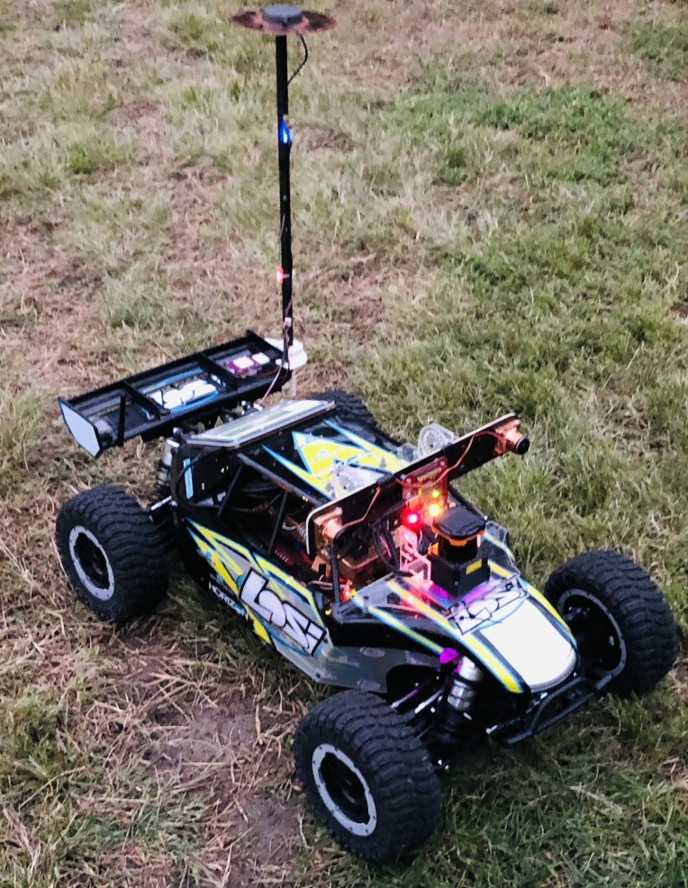
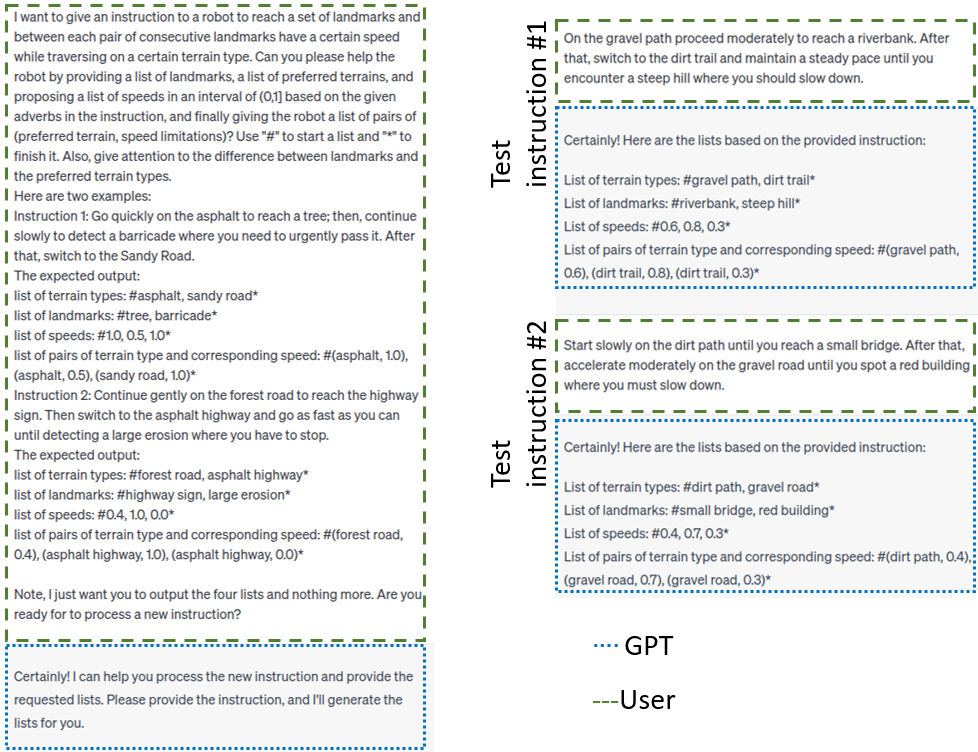
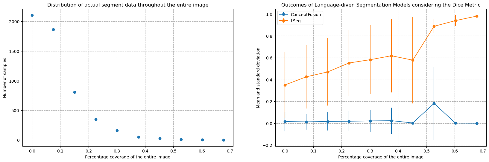
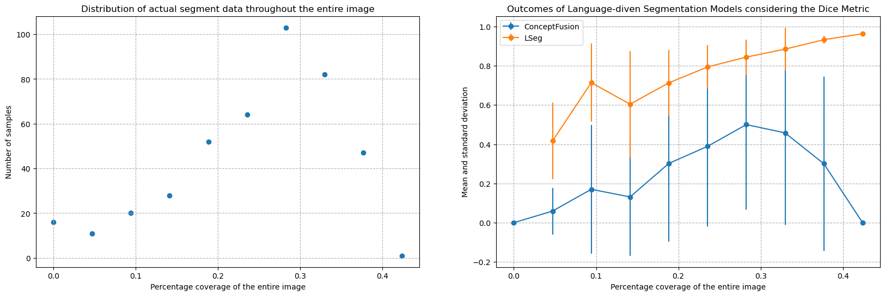
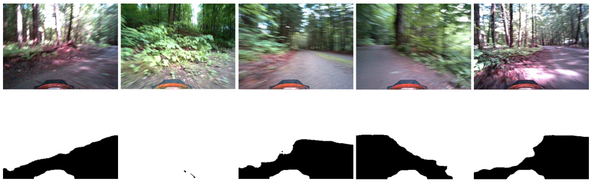
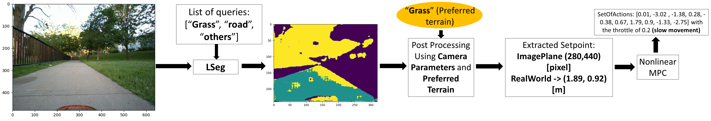
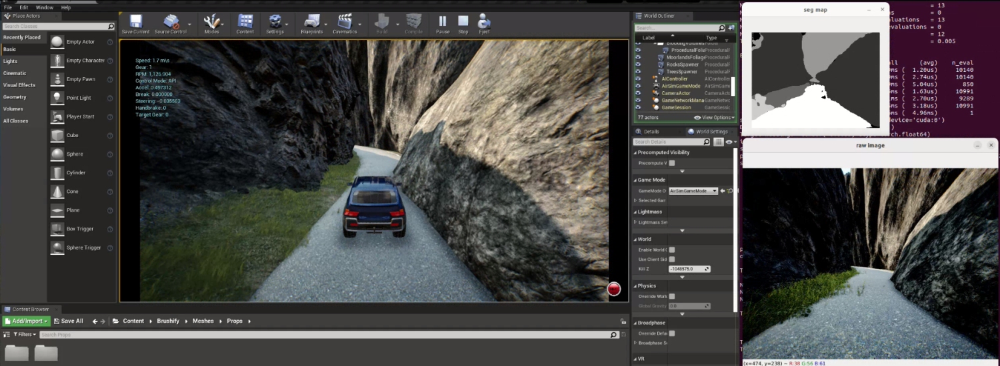
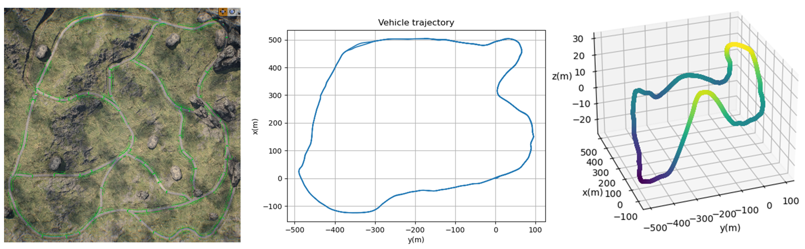
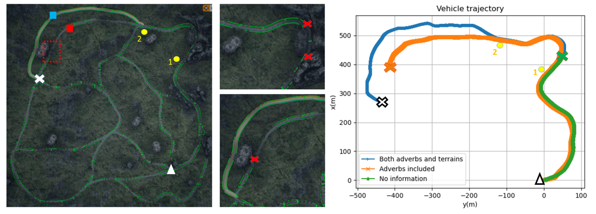

# 借助副词的威力，通过大型语言模型和语音指令实现机器人在理想地形上的精准导航。

发布时间：2024年04月02日

`LLM应用` `无人驾驶` `机器人技术`

> Constrained Robotic Navigation on Preferred Terrains Using LLMs and Speech Instruction: Exploiting the Power of Adverbs

# 摘要

> 本文研究了如何运用大型语言模型实现无需地图的越野导航，借助生成性AI技术，降低了对传统数据搜集和标注的依赖。我们设计了一种机制：机器人将口头指令通过Whisper转换为文字，接着大型语言模型（LLM）从中提取关键地标、适宜地形和重要副词，并转化为控制导航的速度设定。语言驱动的语义分割模型能够根据文本生成图像中地标和地形类型的掩码。借助相机参数，将二维图像点映射到车辆运动平面，MPC控制器便能指引车辆前往目标地形。这一方法提升了对多变环境的适应力，并简化了在复杂和困难地形中使用高级指令进行导航的过程。

> This paper explores leveraging large language models for map-free off-road navigation using generative AI, reducing the need for traditional data collection and annotation. We propose a method where a robot receives verbal instructions, converted to text through Whisper, and a large language model (LLM) model extracts landmarks, preferred terrains, and crucial adverbs translated into speed settings for constrained navigation. A language-driven semantic segmentation model generates text-based masks for identifying landmarks and terrain types in images. By translating 2D image points to the vehicle's motion plane using camera parameters, an MPC controller can guides the vehicle towards the desired terrain. This approach enhances adaptation to diverse environments and facilitates the use of high-level instructions for navigating complex and challenging terrains.

[Arxiv](https://arxiv.org/abs/2404.02294)