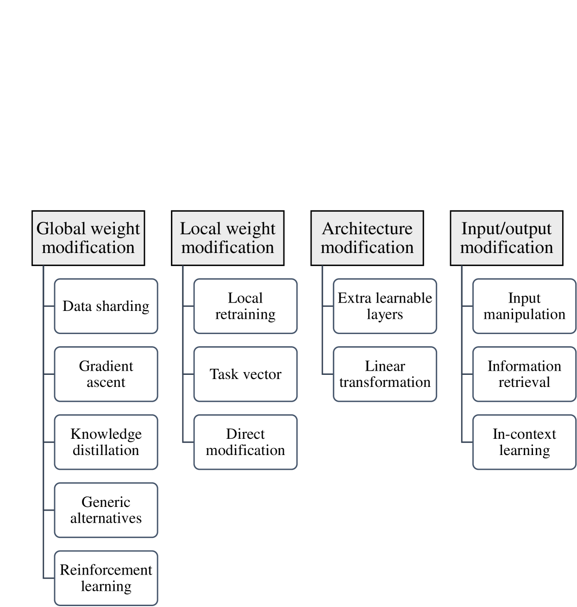

# 大型语言模型中的数字遗忘：对遗忘方法的综述。

发布时间：2024年04月02日

`LLM理论` `隐私保护` `模型优化`

> Digital Forgetting in Large Language Models: A Survey of Unlearning Methods

# 摘要

> 数字遗忘旨在从存在问题的模型中提炼出一个新的、无瑕疵的模型。其背后的推动力涉及保护隐私、维护版权、消除歧视及避免产生不良内容。有效的数字遗忘需确保新模型彻底摒弃不良知识或行为，同时保持原有模型在正当任务上的性能，并具备扩展性——即遗忘过程应比全新训练更高效。本文主要探讨大型语言模型中的数字遗忘问题。首先，我们将介绍LLMs的基础知识，包括它们的构成、类型及训练流程。接着，阐述数字遗忘的目的、种类和理想特质。进一步，我们将探讨LLMs数字遗忘的各种方法，特别是目前领先的非学习方法。此外，对LLMs的机器非学习方法进行分类，并评估比较现行策略。同时，详细介绍用于评估遗忘效果、保留能力和运行效率的数据集、模型和评价指标。文章还讨论了该领域的挑战，并在最后给出了总结性的观点。

> The objective of digital forgetting is, given a model with undesirable knowledge or behavior, obtain a new model where the detected issues are no longer present. The motivations for forgetting include privacy protection, copyright protection, elimination of biases and discrimination, and prevention of harmful content generation. Effective digital forgetting has to be effective (meaning how well the new model has forgotten the undesired knowledge/behavior), retain the performance of the original model on the desirable tasks, and be scalable (in particular forgetting has to be more efficient than retraining from scratch on just the tasks/data to be retained). This survey focuses on forgetting in large language models (LLMs). We first provide background on LLMs, including their components, the types of LLMs, and their usual training pipeline. Second, we describe the motivations, types, and desired properties of digital forgetting. Third, we introduce the approaches to digital forgetting in LLMs, among which unlearning methodologies stand out as the state of the art. Fourth, we provide a detailed taxonomy of machine unlearning methods for LLMs, and we survey and compare current approaches. Fifth, we detail datasets, models and metrics used for the evaluation of forgetting, retaining and runtime. Sixth, we discuss challenges in the area. Finally, we provide some concluding remarks.

[Arxiv](https://arxiv.org/abs/2404.02062)