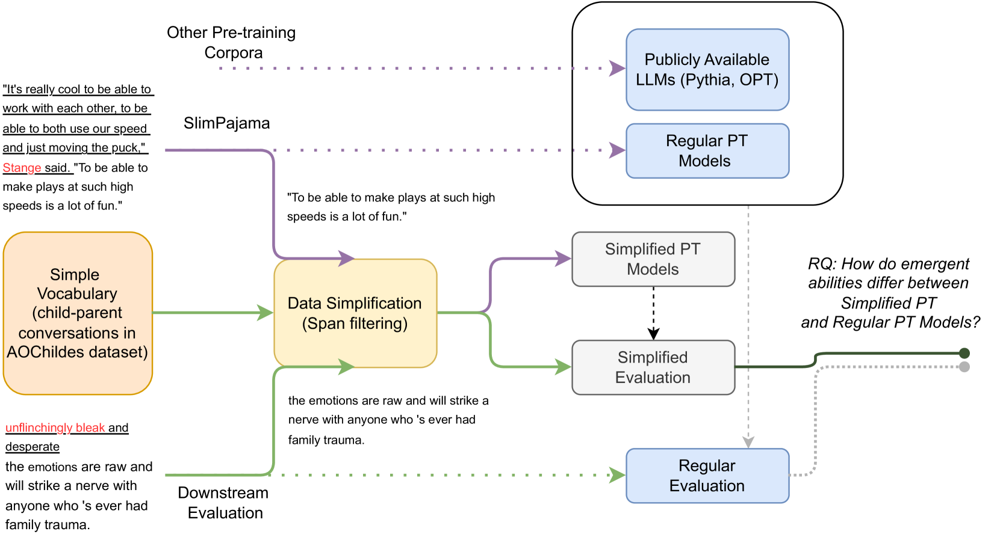
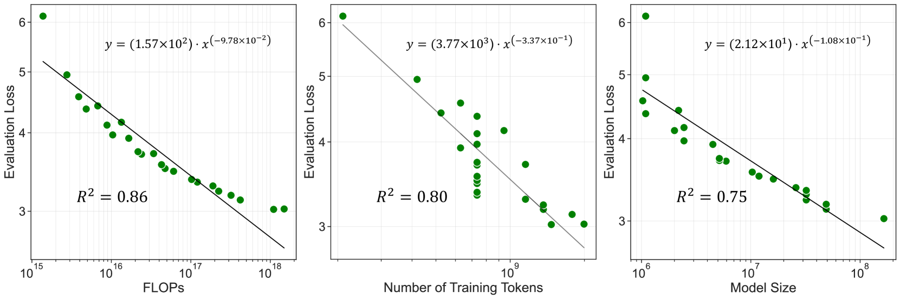
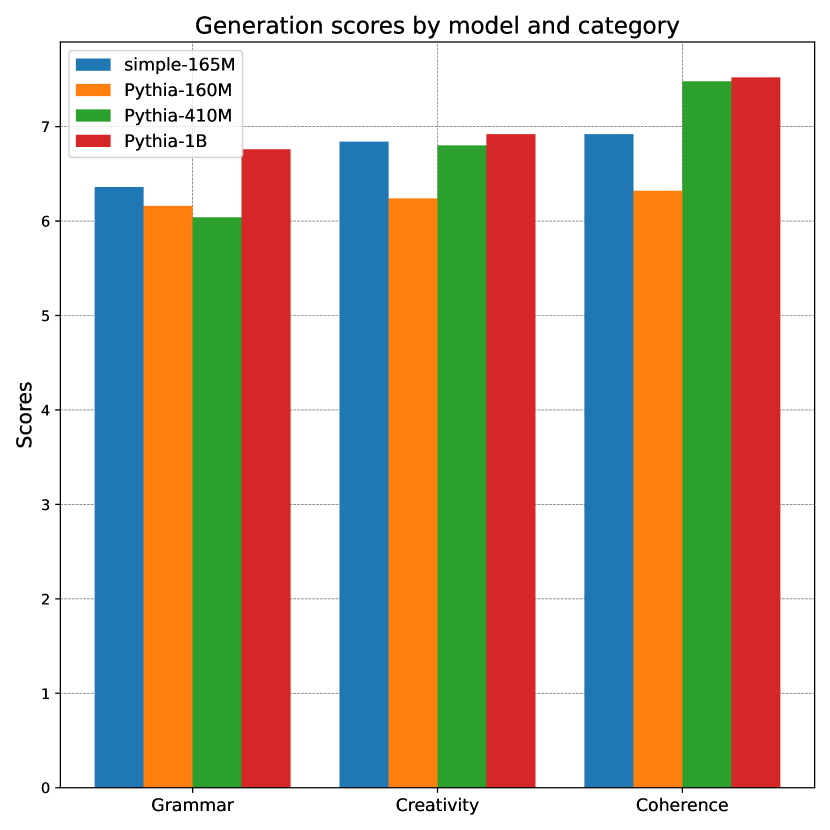
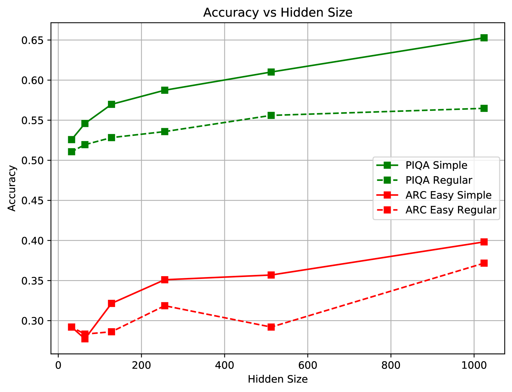
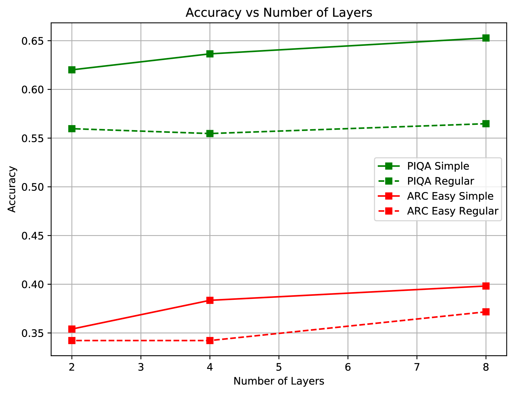

# 在简化版的生成型语言模型中，涌现出了一些新的能力。

发布时间：2024年04月02日

`LLM理论` `语言模型` `上下文学习
注：虽然论文提到了因果语言模型` `但上下文学习（ICL）是其核心概念` `因此将其作为主要标签。`

> Emergent Abilities in Reduced-Scale Generative Language Models

# 摘要

> 大型语言模型无需特定任务微调便能应对新挑战，这种能力称为上下文学习（ICL），通常见于参数众多的大型模型。研究探讨了这种能力是否仅与模型规模有关，或者在小规模模型中通过简化数据训练也能实现。为此，我们对预训练数据进行简化，训练了36个参数从100万到1.65亿的因果语言模型。结果表明，这些模型在简化语言的任务中展现出更强的零次学习能力，其性能可与规模大六倍的模型相媲美。这说明即使模型规模有限，通过缩小语言复杂度也能激发其零次学习潜力。另外，我们还发现这些小模型在简化数据上预训练后，评估损失与计算量、数据集规模和模型大小这三个缩放因子之间呈现出幂律关系。

> Large language models can solve new tasks without task-specific fine-tuning. This ability, also known as in-context learning (ICL), is considered an emergent ability and is primarily seen in large language models with billions of parameters. This study investigates if such emergent properties are strictly tied to model size or can be demonstrated by smaller models trained on reduced-scale data. To explore this, we simplify pre-training data and pre-train 36 causal language models with parameters varying from 1 million to 165 million parameters. We show that models trained on this simplified pre-training data demonstrate enhanced zero-shot capabilities across various tasks in simplified language, achieving performance comparable to that of pre-trained models six times larger on unrestricted language. This suggests that downscaling the language allows zero-shot learning capabilities to emerge in models with limited size. Additionally, we find that these smaller models pre-trained on simplified data demonstrate a power law relationship between the evaluation loss and the three scaling factors: compute, dataset size, and model size.

[Arxiv](https://arxiv.org/abs/2404.02204)