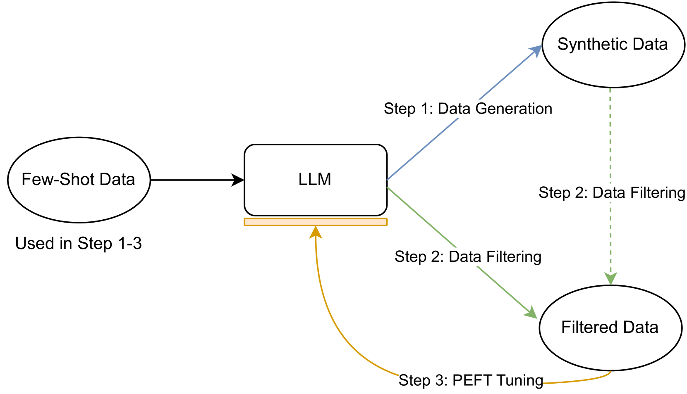
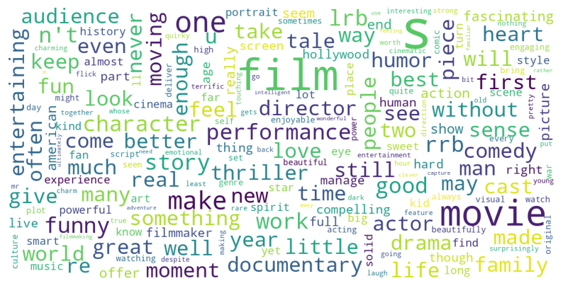
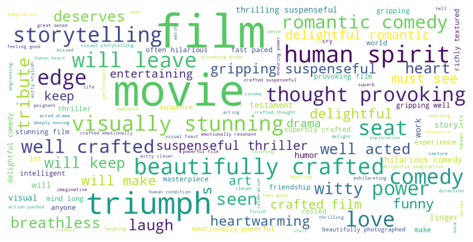
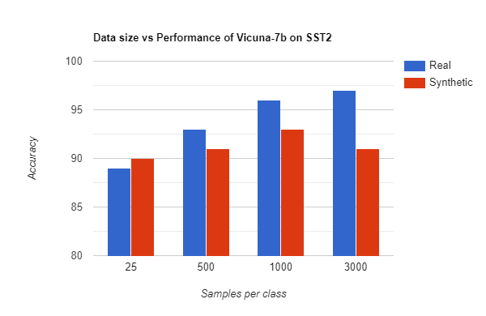
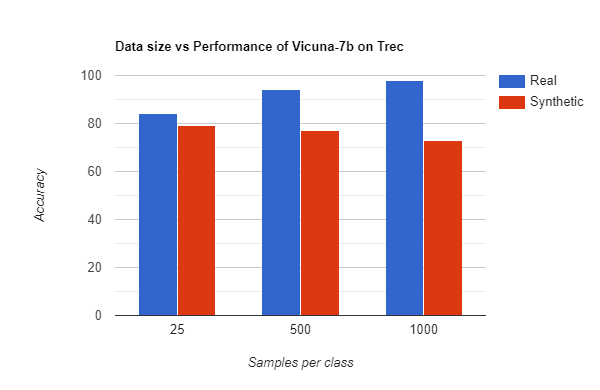

# 通过 PEFT 和合成数据提升低资源大型语言模型的分类表现。

发布时间：2024年04月02日

`LLM应用` `文本分类` `资源优化`

> Enhancing Low-Resource LLMs Classification with PEFT and Synthetic Data

# 摘要

> 大型语言模型（LLMs）在零样本或少样本情境下进行文本分类任务时，展现出不俗的表现。相比之下，上下文学习（ICL）往往能带来更高的准确率，尽管这会牺牲一定的效率，因为它需要更长的输入提示。本文提出了一种新策略，旨在让LLMs在保持与ICL相当或更优的准确率的同时，达到与零样本分类器相媲美的效率。这一方法特别适用于资源有限的情况，也就是每个类别仅有极少数样本可供使用。通过结合单个LLM和少量真实数据，我们通过生成、筛选和参数高效微调等一系列步骤，打造出了一个既稳健又高效的分类器。实验数据显示，该方法在众多文本分类数据集上均取得了可圈可点的成绩。

> Large Language Models (LLMs) operating in 0-shot or few-shot settings achieve competitive results in Text Classification tasks. In-Context Learning (ICL) typically achieves better accuracy than the 0-shot setting, but it pays in terms of efficiency, due to the longer input prompt. In this paper, we propose a strategy to make LLMs as efficient as 0-shot text classifiers, while getting comparable or better accuracy than ICL. Our solution targets the low resource setting, i.e., when only 4 examples per class are available. Using a single LLM and few-shot real data we perform a sequence of generation, filtering and Parameter-Efficient Fine-Tuning steps to create a robust and efficient classifier. Experimental results show that our approach leads to competitive results on multiple text classification datasets.

[Arxiv](https://arxiv.org/abs/2404.02422)