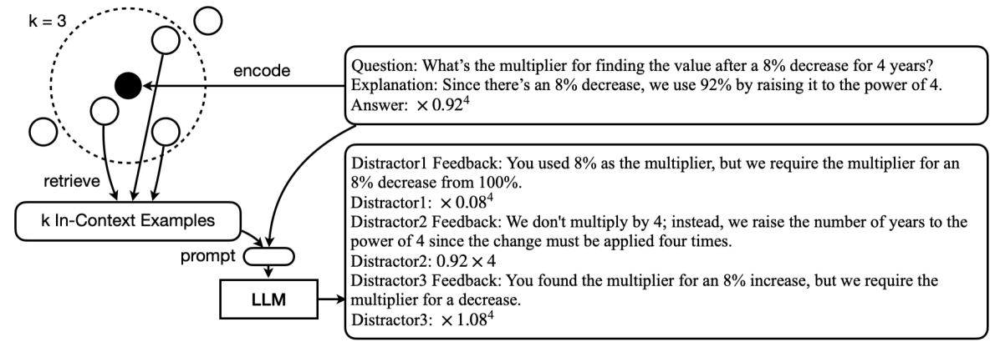

# 本研究利用大型语言模型，探索自动生成数学多项选择题干扰项的方法。

发布时间：2024年04月02日

`LLM应用` `自动化试题生成`

> Exploring Automated Distractor Generation for Math Multiple-choice Questions via Large Language Models

# 摘要

> 多项选择题（MCQs）几乎在所有教育层次中都随处可见，它们易于操作、评分，是评估和练习中的可靠选择。MCQs的关键要素之一是干扰项，即那些旨在捕捉学生常见误区的错误选项。然而，设计出高质量的干扰项对教师和教育内容创作者来说，至今仍是一项耗时耗力的工作，难以大规模推广。本研究聚焦于数学MCQ中自动生成干扰项的挑战，并尝试了从依赖上下文学习到精细调整等多种基于大型语言模型（LLM）的方法。通过在真实数学MCQ数据集上的广泛测试，我们发现尽管LLMs能够创造出一些数学上合理的干扰项，但在预测学生的真实常见错误或误解方面，它们的表现并不尽如人意。

> Multiple-choice questions (MCQs) are ubiquitous in almost all levels of education since they are easy to administer, grade, and are a reliable format in assessments and practices. One of the most important aspects of MCQs is the distractors, i.e., incorrect options that are designed to target common errors or misconceptions among real students. To date, the task of crafting high-quality distractors largely remains a labor and time-intensive process for teachers and learning content designers, which has limited scalability. In this work, we study the task of automated distractor generation in the domain of math MCQs and explore a wide variety of large language model (LLM)-based approaches, from in-context learning to fine-tuning. We conduct extensive experiments using a real-world math MCQ dataset and find that although LLMs can generate some mathematically valid distractors, they are less adept at anticipating common errors or misconceptions among real students.

[Arxiv](https://arxiv.org/abs/2404.02124)