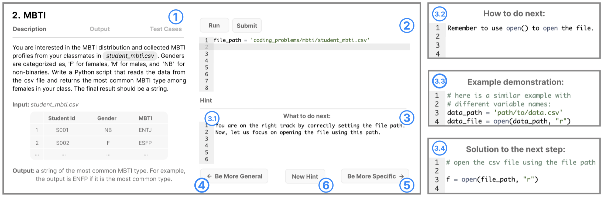
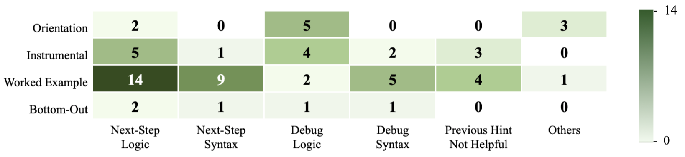

# 研究多层次 GPT 编程提示对新手的助力与挫败感。

发布时间：2024年04月02日

`LLM应用` `编程教育`

> Exploring How Multiple Levels of GPT-Generated Programming Hints Support or Disappoint Novices

# 摘要

> 最新研究发现，大型语言模型（LLM）已成功融入多种教育场景，例如提供个性化的编程提示，帮助学生在解题过程中取得进展。然而，目前大多数基于LLM的提示工具仅提供单一类型的提示。为了深入了解不同层次的提示如何促进学生的学习和问题解决，我们邀请了12名编程新手参与了一项实验性研究，使用LLM提示工厂这一系统，它能够根据问题的不同，提供从泛泛的自然语言指导到具体的代码帮助，共四种不同形式和细节层次的提示。研究结果显示，单纯的高级自然语言提示在解决具体步骤或语法问题时，可能无效甚至产生误导。而结合具体的代码示例和行内注释等低级提示，则能更有效地辅助学生学习。这一发现为未来定制化教育辅助工具的研究提供了新思路，即从内容、形式和细节层面出发，精准地满足学生的学习需求。

> Recent studies have integrated large language models (LLMs) into diverse educational contexts, including providing adaptive programming hints, a type of feedback focuses on helping students move forward during problem-solving. However, most existing LLM-based hint systems are limited to one single hint type. To investigate whether and how different levels of hints can support students' problem-solving and learning, we conducted a think-aloud study with 12 novices using the LLM Hint Factory, a system providing four levels of hints from general natural language guidance to concrete code assistance, varying in format and granularity. We discovered that high-level natural language hints alone can be helpless or even misleading, especially when addressing next-step or syntax-related help requests. Adding lower-level hints, like code examples with in-line comments, can better support students. The findings open up future work on customizing help responses from content, format, and granularity levels to accurately identify and meet students' learning needs.

[Arxiv](https://arxiv.org/abs/2404.02213)