# FLawN-T5：探究法律推理中高效指令调整数据组合的实证分析

发布时间：2024年04月02日

`LLM应用` `数据集`

> FLawN-T5: An Empirical Examination of Effective Instruction-Tuning Data Mixtures for Legal Reasoning

# 摘要

> 指令调整对于让语言模型直接与用户互动至关重要。但目前大多数开放的大型语言模型仍难以胜任法律领域的任务，且缺乏大规模的法律指令数据集，这极大地束缚了相关研究的进展。本研究汇集并创建了LawInstruct，一个包含17个法域、24种语言、共1200万例的大型法律指令数据集。我们发现，针对性的领域预训练和指令调整显著提升了LegalBench的性能，例如使Flan-T5 XL模型的得分提高了8分，增幅达16%。尽管如此，这种提升效果并非在所有任务、训练设置、模型规模等方面都能实现。LawInstruct的推出，旨在助力法律领域模型的发展，使其在信息处理和决策制定上更为精准高效。

> Instruction tuning is an important step in making language models useful for direct user interaction. However, many legal tasks remain out of reach for most open LLMs and there do not yet exist any large scale instruction datasets for the domain. This critically limits research in this application area. In this work, we curate LawInstruct, a large legal instruction dataset, covering 17 jurisdictions, 24 languages and a total of 12M examples. We present evidence that domain-specific pretraining and instruction tuning improve performance on LegalBench, including improving Flan-T5 XL by 8 points or 16\% over the baseline. However, the effect does not generalize across all tasks, training regimes, model sizes, and other factors. LawInstruct is a resource for accelerating the development of models with stronger information processing and decision making capabilities in the legal domain.

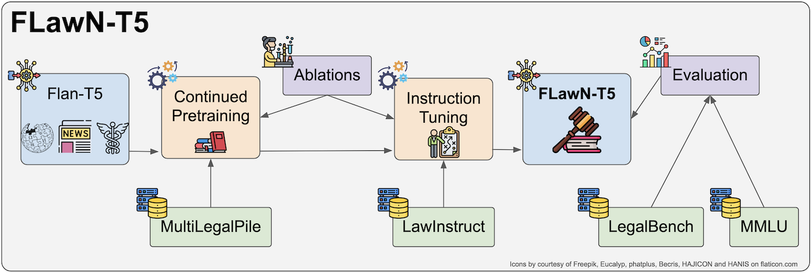

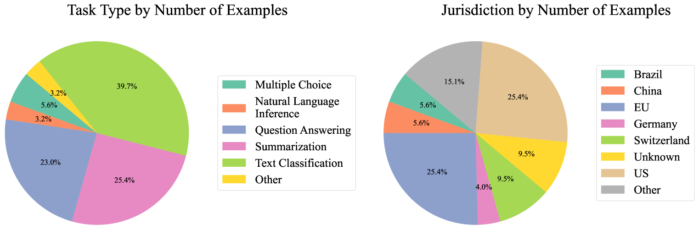

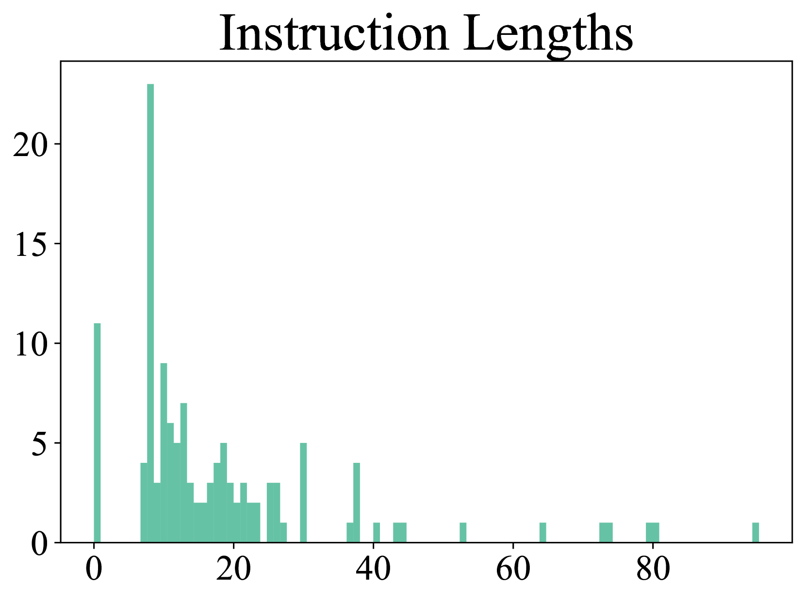

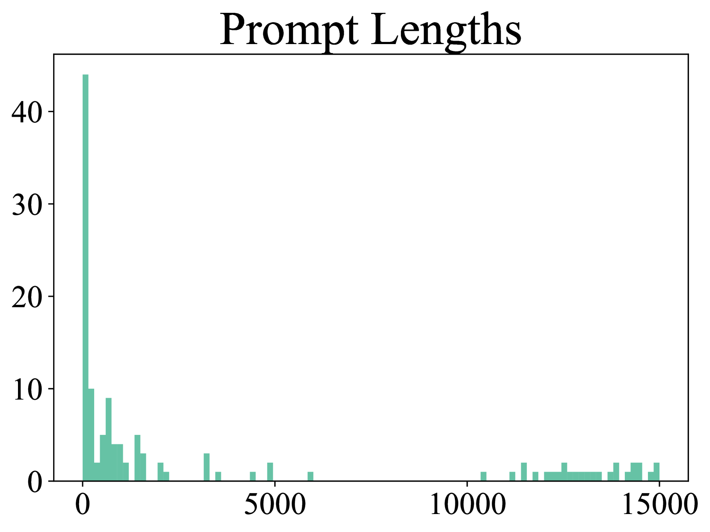

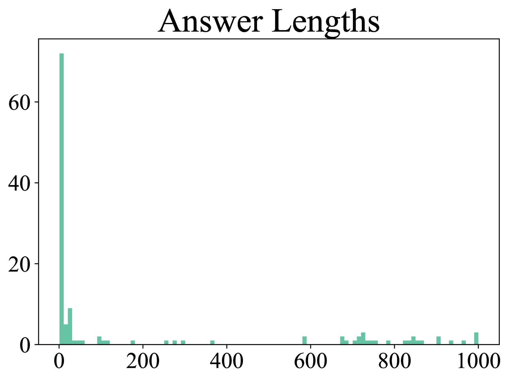

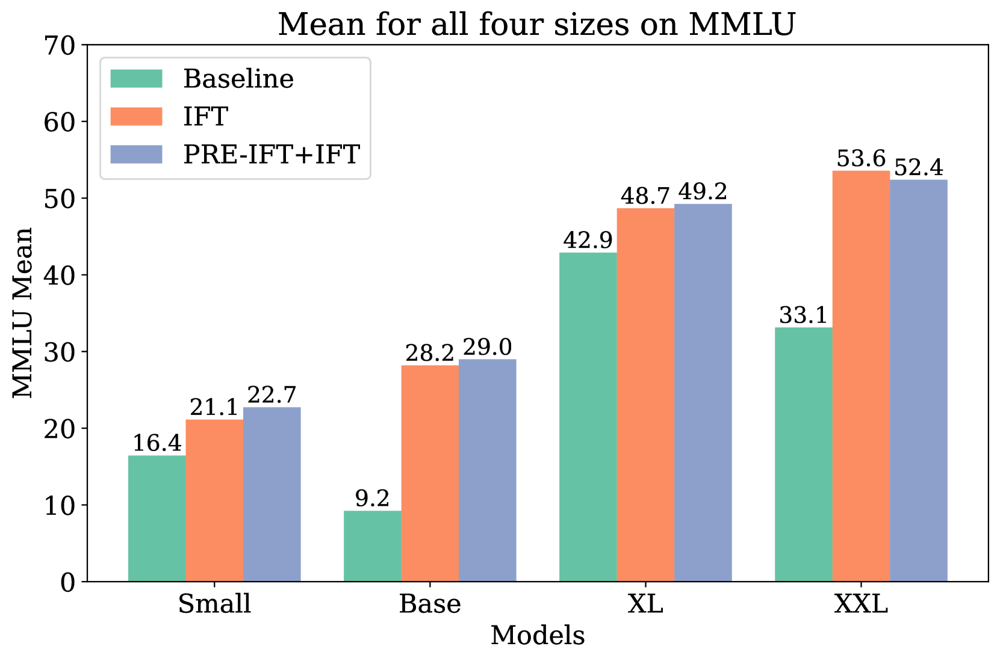

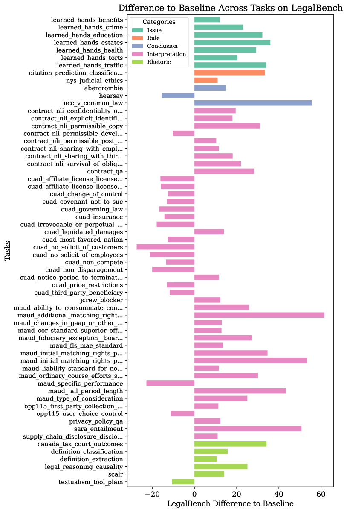

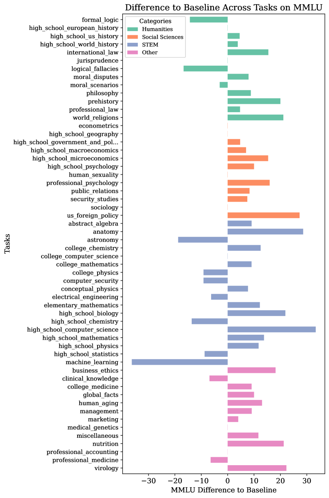

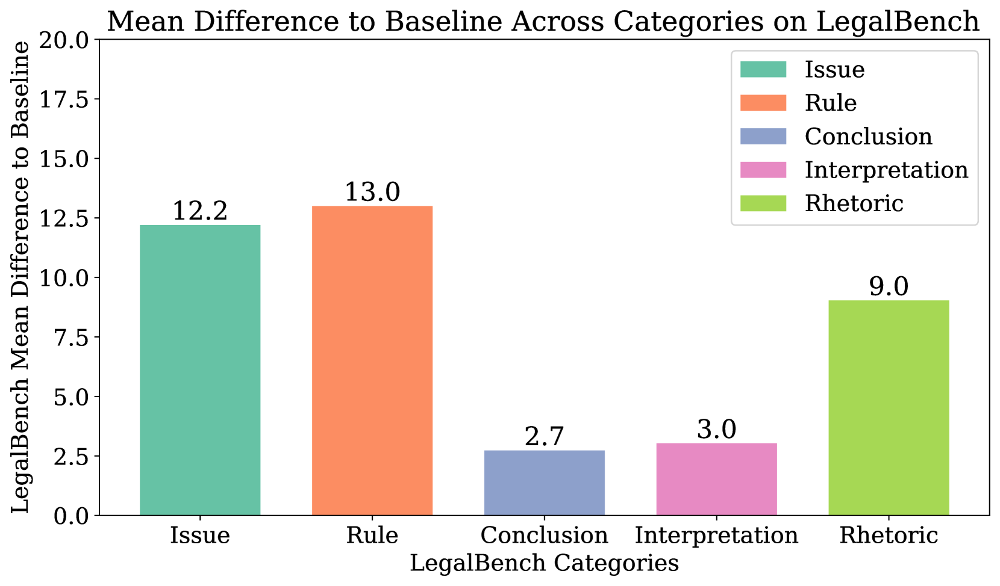

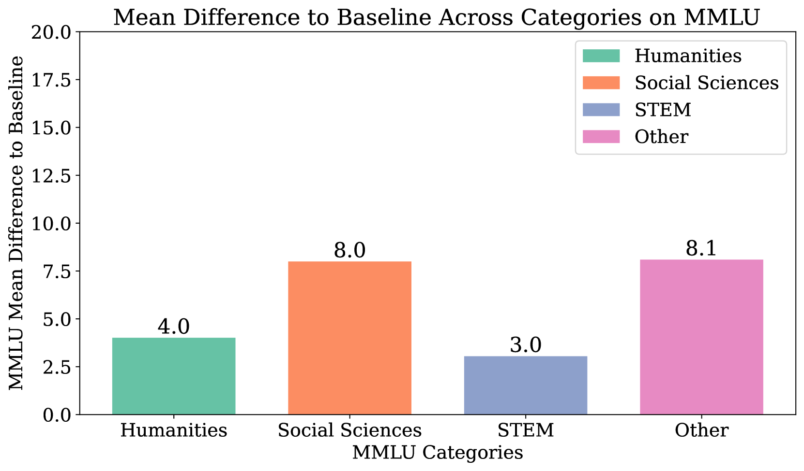

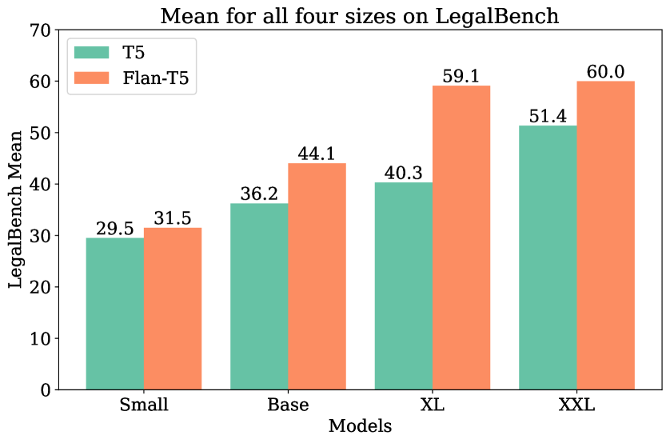

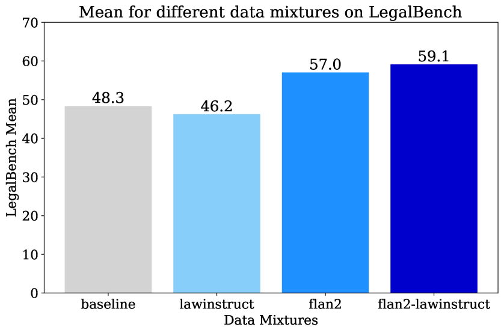

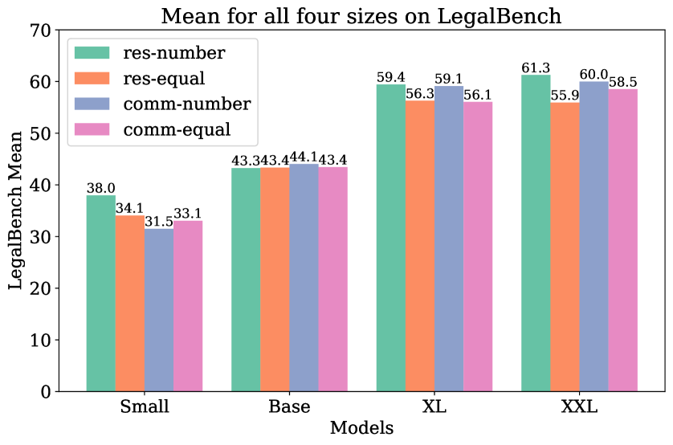

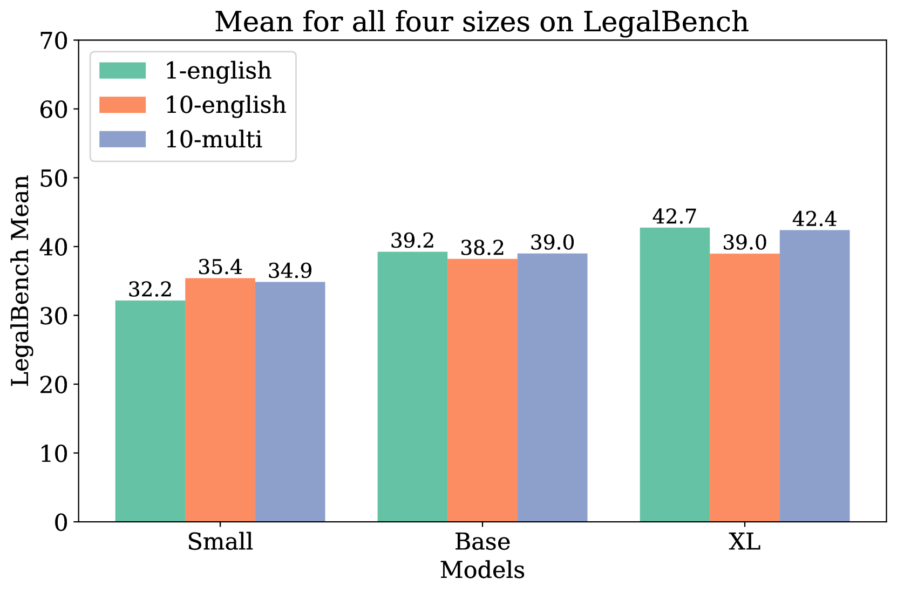

[Arxiv](https://arxiv.org/abs/2404.02127)