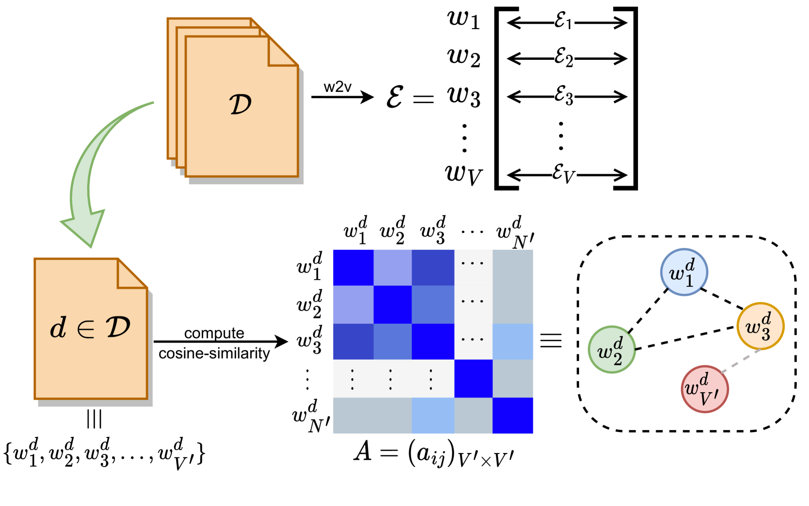
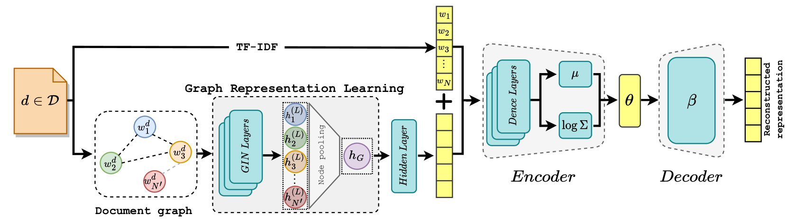
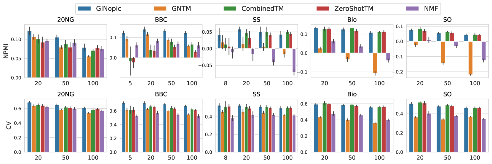
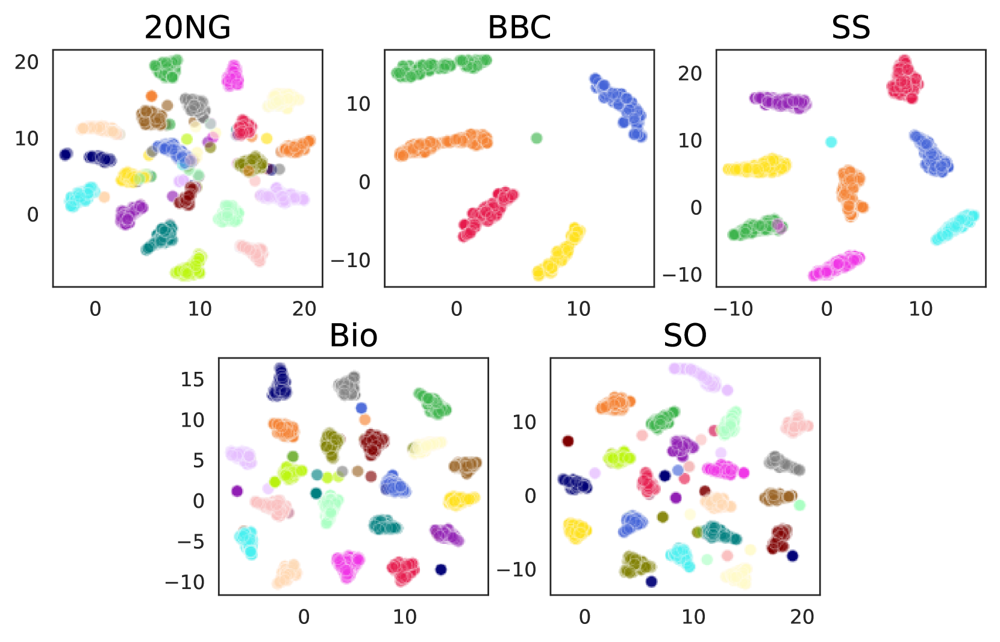
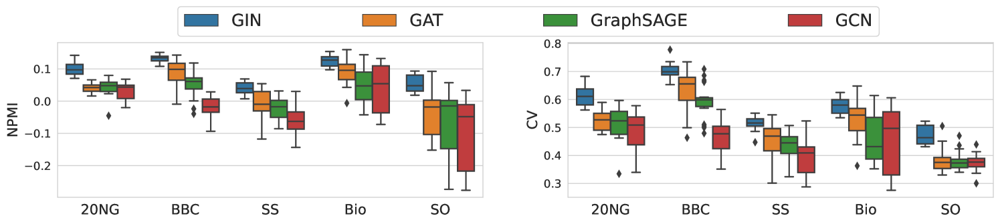
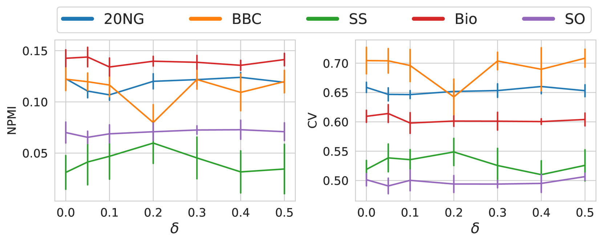

# GINopic：借助图同构网络进行主题挖掘与分析

发布时间：2024年04月02日

`LLM应用` `文本挖掘` `主题建模`

> GINopic: Topic Modeling with Graph Isomorphism Network

# 摘要

> 主题建模，作为深入挖掘海量文档集的利器，常被广泛应用。近期研究尝试融合预训练的上下文化语言模型，例如BERT，以丰富主题建模的内涵。但这些研究往往忽略了词与词之间相互关联所蕴含的信息价值。本研究提出了GINopic，一种基于图同构网络的新框架，用以捕捉词间关联。通过一系列定量与定性的内在评估，以及在多个基准数据集上的外在评估，我们验证了GINopic相较于传统主题模型的优越性，并突显了其在推动主题建模发展上的巨大潜力。

> Topic modeling is a widely used approach for analyzing and exploring large document collections. Recent research efforts have incorporated pre-trained contextualized language models, such as BERT embeddings, into topic modeling. However, they often neglect the intrinsic informational value conveyed by mutual dependencies between words. In this study, we introduce GINopic, a topic modeling framework based on graph isomorphism networks to capture the correlation between words. By conducting intrinsic (quantitative as well as qualitative) and extrinsic evaluations on diverse benchmark datasets, we demonstrate the effectiveness of GINopic compared to existing topic models and highlight its potential for advancing topic modeling.

[Arxiv](https://arxiv.org/abs/2404.02115)