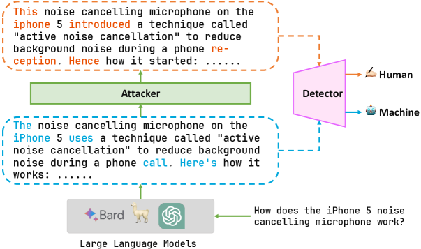
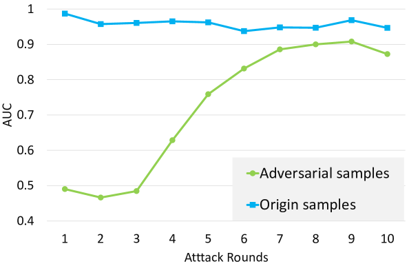

# 机器内容拟人化：通过对抗性策略规避AI文本识别技术。

发布时间：2024年04月02日

`LLM应用` `信息安全` `文本检测`

> Humanizing Machine-Generated Content: Evading AI-Text Detection through Adversarial Attack

# 摘要

> 随着大型语言模型技术的不断进步，辨别机器生成的文本变得越来越困难，尤其是在虚假信息传播、知识产权保护和防止学术抄袭等恶意场景中。尽管现有的文本检测器在面对未知数据时表现出了一定的潜力，但最新研究显示，面对改述等对抗性手段时，这些检测器的弱点暴露无遗。本文提出了一个针对更广泛对抗性攻击的框架，通过在机器文本中进行微妙的修改来规避检测。我们分别从白盒和黑盒两种攻击情境出发，利用动态对抗性学习来测试现有检测模型对这些攻击的抵抗力。实验结果令人震惊：现有的文本检测模型在短短10秒内就可能被攻破，将机器生成的文本错误地判定为人类创作。我们进一步探讨了通过反复的对抗性训练来增强模型鲁棒性的可能性。虽然在模型鲁棒性方面取得了一定进步，但在实际应用中仍面临诸多挑战。这些发现为未来AI文本检测器的发展指明了方向，突出了开发更精确、更稳固检测手段的必要性。

> With the development of large language models (LLMs), detecting whether text is generated by a machine becomes increasingly challenging in the face of malicious use cases like the spread of false information, protection of intellectual property, and prevention of academic plagiarism. While well-trained text detectors have demonstrated promising performance on unseen test data, recent research suggests that these detectors have vulnerabilities when dealing with adversarial attacks such as paraphrasing. In this paper, we propose a framework for a broader class of adversarial attacks, designed to perform minor perturbations in machine-generated content to evade detection. We consider two attack settings: white-box and black-box, and employ adversarial learning in dynamic scenarios to assess the potential enhancement of the current detection model's robustness against such attacks. The empirical results reveal that the current detection models can be compromised in as little as 10 seconds, leading to the misclassification of machine-generated text as human-written content. Furthermore, we explore the prospect of improving the model's robustness over iterative adversarial learning. Although some improvements in model robustness are observed, practical applications still face significant challenges. These findings shed light on the future development of AI-text detectors, emphasizing the need for more accurate and robust detection methods.

[Arxiv](https://arxiv.org/abs/2404.01907)