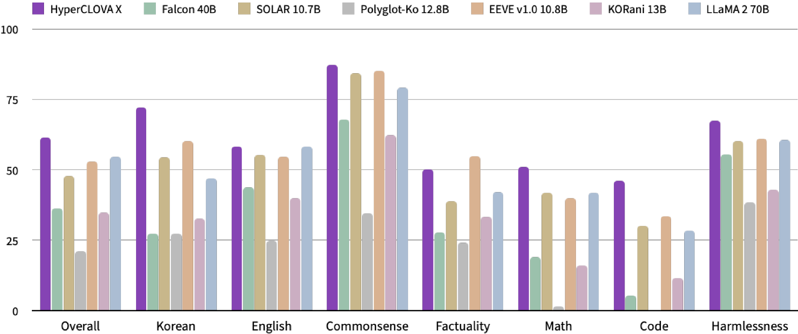

# 《超能CLOVA X》技术研究报告

发布时间：2024年04月02日

`LLM应用` `语言处理` `人工智能`

> HyperCLOVA X Technical Report

# 摘要

> 我们自豪地推出HyperCLOVA X，这是一款针对韩语和文化量身定制的大型语言模型系列，同时在英语沟通、数学计算和编程编码方面也表现出色。该模型经过韩英双语及编程代码数据的均衡训练，并利用高品质人工标注数据集进行指令微调，整个过程严格遵守安全准则，确保AI的负责任使用。在包括推理、知识、常识、事实性、编程、数学、聊天、遵循指令和安全性在内的多项基准测试中，HyperCLOVA X均展现出卓越的表现，尤其在韩语方面，凭借对语言和文化细节的深刻洞察力。深入分析其内在的双语特性及其向多语种的扩展，突显了该模型在跨语言能力上的精湛技艺和对未特定语言的强大适应力，这不仅体现在多种语言对的机器翻译上，也展现在跨语言推理任务中。我们坚信，HyperCLOVA X将为各地区和国家在构建自主大型语言模型的道路上提供宝贵的指导和支持。

> We introduce HyperCLOVA X, a family of large language models (LLMs) tailored to the Korean language and culture, along with competitive capabilities in English, math, and coding. HyperCLOVA X was trained on a balanced mix of Korean, English, and code data, followed by instruction-tuning with high-quality human-annotated datasets while abiding by strict safety guidelines reflecting our commitment to responsible AI. The model is evaluated across various benchmarks, including comprehensive reasoning, knowledge, commonsense, factuality, coding, math, chatting, instruction-following, and harmlessness, in both Korean and English. HyperCLOVA X exhibits strong reasoning capabilities in Korean backed by a deep understanding of the language and cultural nuances. Further analysis of the inherent bilingual nature and its extension to multilingualism highlights the model's cross-lingual proficiency and strong generalization ability to untargeted languages, including machine translation between several language pairs and cross-lingual inference tasks. We believe that HyperCLOVA X can provide helpful guidance for regions or countries in developing their sovereign LLMs.

[Arxiv](https://arxiv.org/abs/2404.01954)