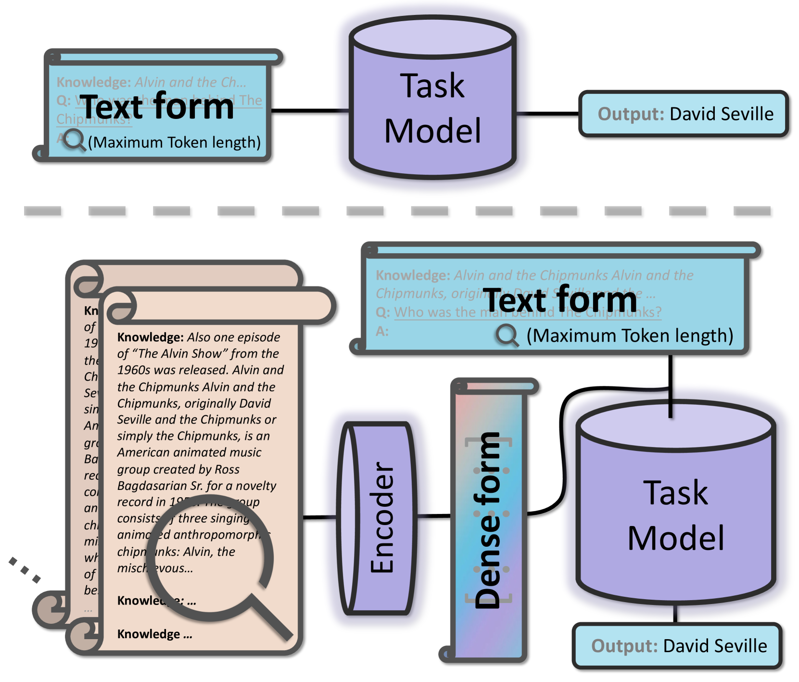
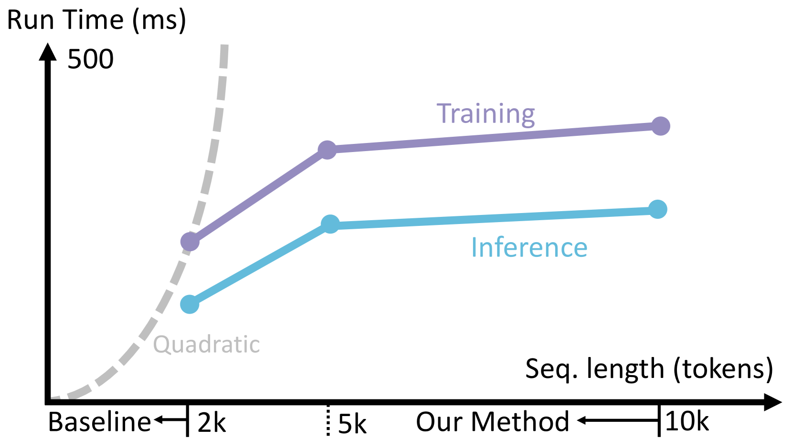
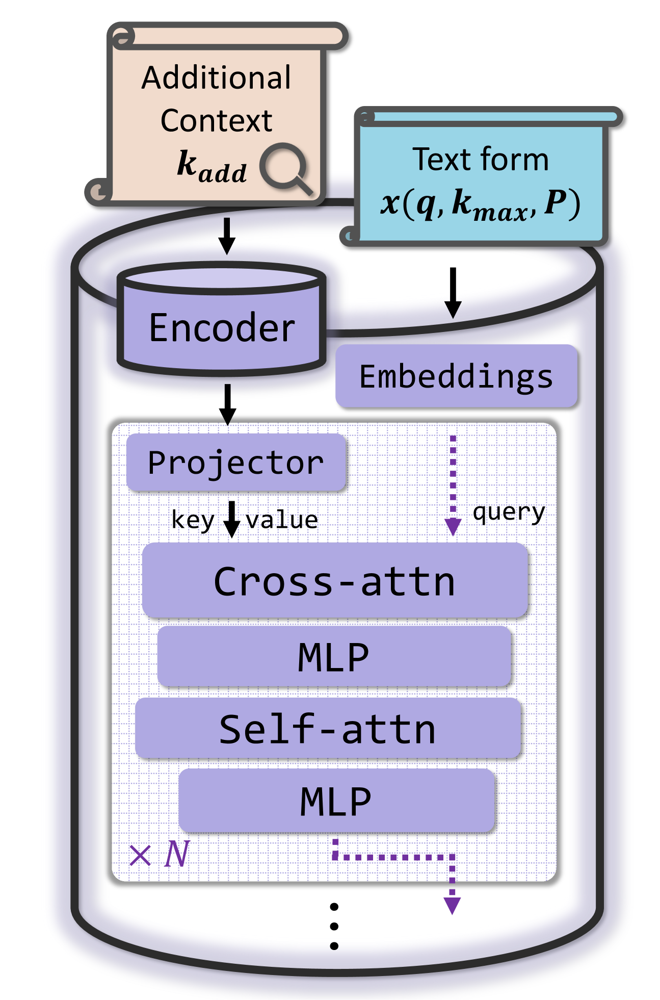

# 利用向量化上下文技术，我们旨在提升开放领域问答系统中的检索增强功能。

发布时间：2024年04月02日

`LLM应用` `开放领域问答`

> Improving Retrieval Augmented Open-Domain Question-Answering with Vectorized Contexts

# 摘要

> 在大型语言模型盛行的今天，运用检索增强生成等技巧能更有效地应对开放领域问答的挑战。然而，受限于模型规模和计算资源，上下文的长度常常受限，使得模型在处理超长上下文时面临难题。本文提出了一种简洁高效的方法，以在开放领域问答任务中处理更长的上下文。该方法采用轻量级编码器语言模型对上下文进行有效编码，并通过交叉注意力与原始输入相结合。利用此方法，原始语言模型能够处理比以往长得多的上下文，计算资源消耗却与基线持平。实验结果显示，经过精细调整后，无论是在两个内部数据集、四个外部数据集，还是在两个上下文学习环境中，性能均得到显著提升。

> In the era of large language models, applying techniques such as Retrieval Augmented Generation can better address Open-Domain Question-Answering problems. Due to constraints including model sizes and computing resources, the length of context is often limited, and it becomes challenging to empower the model to cover overlong contexts while answering questions from open domains. This paper proposes a general and convenient method to covering longer contexts in Open-Domain Question-Answering tasks. It leverages a small encoder language model that effectively encodes contexts, and the encoding applies cross-attention with origin inputs. With our method, the origin language models can cover several times longer contexts while keeping the computing requirements close to the baseline. Our experiments demonstrate that after fine-tuning, there is improved performance across two held-in datasets, four held-out datasets, and also in two In Context Learning settings.

[Arxiv](https://arxiv.org/abs/2404.02022)