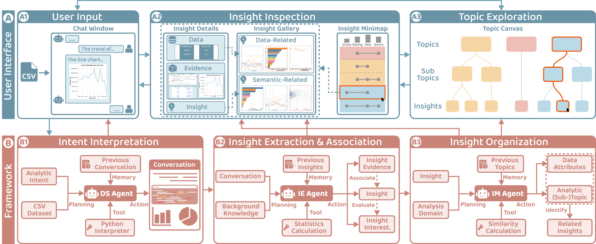
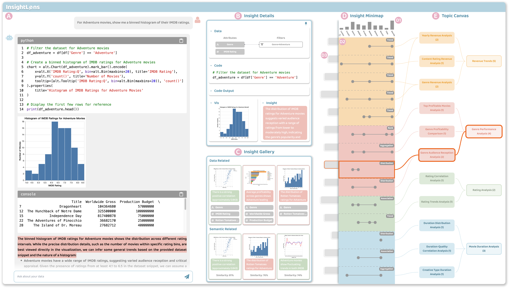
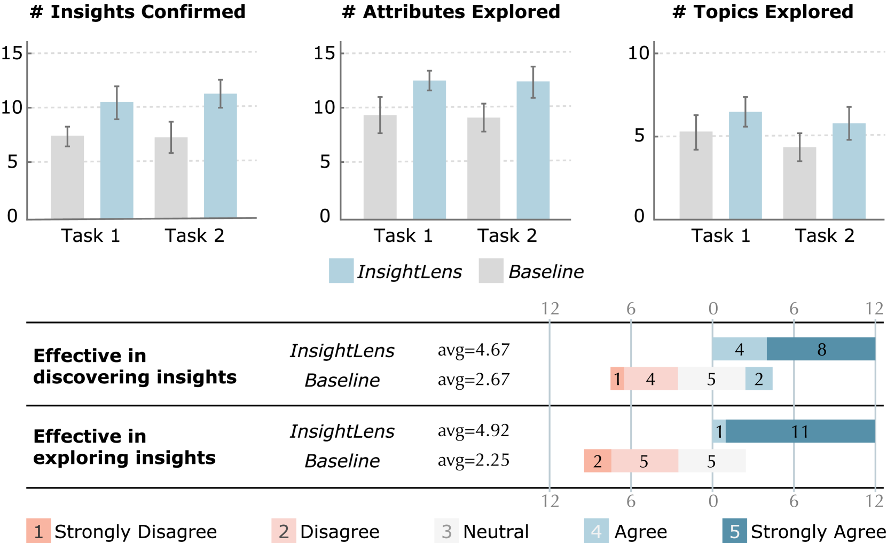
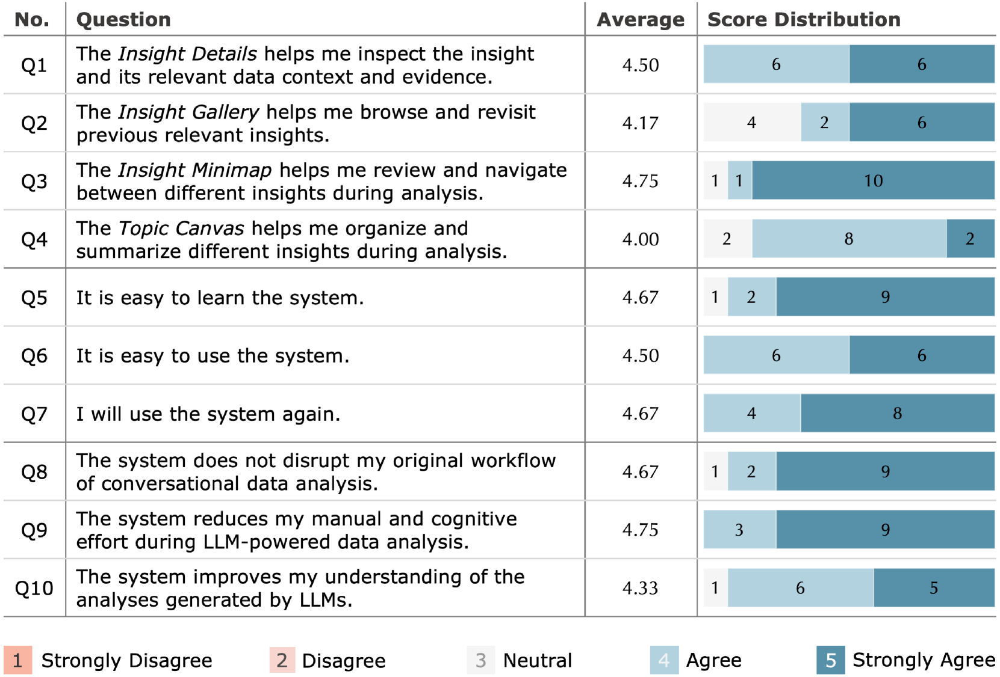

# InsightLens：在大型语言模型支持的数据分析中，挖掘并探索对话语境的深层见解。

发布时间：2024年04月02日

`Agent` `数据分析` `交互式系统`

> InsightLens: Discovering and Exploring Insights from Conversational Contexts in Large-Language-Model-Powered Data Analysis

# 摘要

> 大型语言模型（LLMs）的兴起极大地提升了自然语言界面（NLIs）在数据分析领域的能力。LLMs能够进行复杂的多步推理，根据用户分析目的生成深刻的数据见解。但这些见解往往与分析对话中的众多上下文，如代码、图表和自然语言解释，混杂在一起，使得在LLMs的聊天界面中难以高效地识别和解读这些见解。本文首先通过对八位资深数据分析师的研究，深入了解他们在利用LLM进行数据分析时的工作流程和遇到的问题。接着，我们提出了一个基于LLM的多代理框架，旨在自动提取、关联和整理分析过程中的见解。在此基础上，我们开发了InsightLens，这是一个交互式的系统，它通过多角度展示复杂的对话上下文，帮助用户更容易地发现和探索数据见解。通过与十二位数据分析师的用户体验研究，我们证明了InsightLens的有效性，它能显著降低用户在手动和认知上的努力，同时不打断他们的对话式数据分析流程，带来更加高效的分析体验。

> The proliferation of large language models (LLMs) has revolutionized the capabilities of natural language interfaces (NLIs) for data analysis. LLMs can perform multi-step and complex reasoning to generate data insights based on users' analytic intents. However, these insights often entangle with an abundance of contexts in analytic conversations such as code, visualizations, and natural language explanations. This hinders efficient identification, verification, and interpretation of insights within the current chat-based interfaces of LLMs. In this paper, we first conduct a formative study with eight experienced data analysts to understand their general workflow and pain points during LLM-powered data analysis. Then, we propose an LLM-based multi-agent framework to automatically extract, associate, and organize insights along with the analysis process. Based on this, we introduce InsightLens, an interactive system that visualizes the intricate conversational contexts from multiple aspects to facilitate insight discovery and exploration. A user study with twelve data analysts demonstrates the effectiveness of InsightLens, showing that it significantly reduces users' manual and cognitive effort without disrupting their conversational data analysis workflow, leading to a more efficient analysis experience.

[Arxiv](https://arxiv.org/abs/2404.01644)