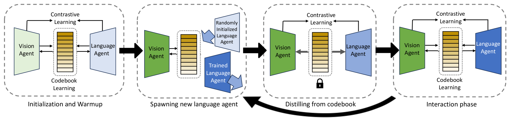
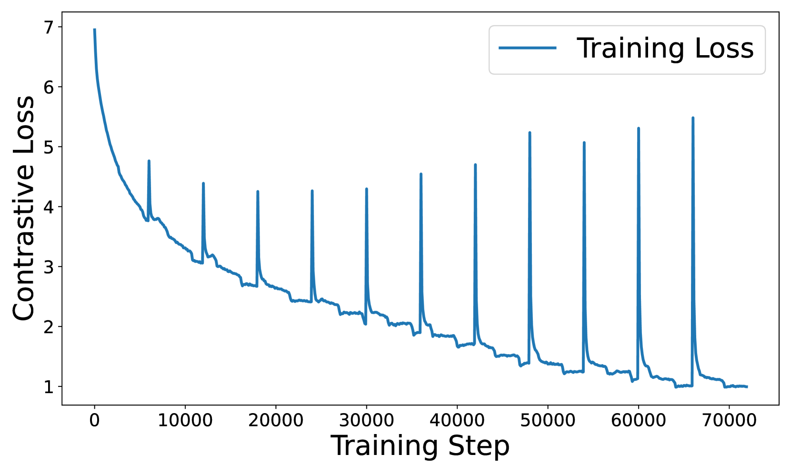
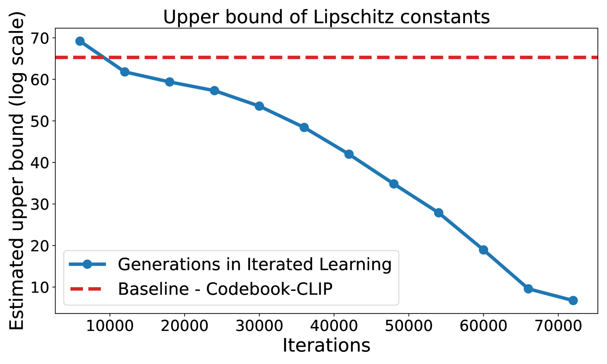
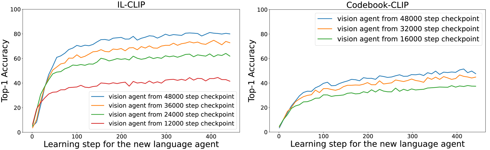
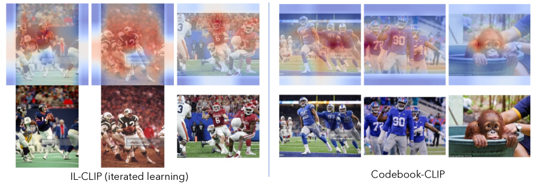

# 通过迭代学习，大型视觉-语言模型的组合能力得到了显著提升。

发布时间：2024年04月02日

`RAG` `计算机视觉`

> Iterated Learning Improves Compositionality in Large Vision-Language Models

# 摘要

> 人类视觉与自然语言共有的一个根本特性是它们都具有组合性。尽管大型视觉与语言预训练模型带来了性能上的提升，但近期研究显示，大多数乃至所有的顶尖视觉-语言模型在处理组合性问题时仍显吃力。它们难以辨别“一位穿白色衣服的女孩面对一位穿黑色衣服的男士”与“一位穿黑色衣服的女孩面对一位穿白色衣服的男士”两幅图片的差异。而且，以往的研究指出，单纯的规模扩大——无论是模型大小还是训练数据量——并不能解决组合性问题。本文提出了一种创新的迭代训练算法，旨在促进模型的组合性。我们参考了数十年来认知科学的研究成果，该成果将文化传递——即教育新一代的必要性——视为促使人类发展出组合性语言的关键归纳前提。具体而言，我们将视觉-语言对比学习视为视觉智能体与语言智能体之间的刘易斯信号博弈，并通过在训练过程中迭代地重置智能体的权重来模拟文化传递。每轮迭代后，这种训练方法促使模型产生更易于学习的特征表征，这是组合性语言的一个典型属性：例如，我们的模型在CC3M和CC12M数据集上训练后，在SugarCrepe基准测试中分别将标准CLIP性能提升了4.7%和4.0%。

> A fundamental characteristic common to both human vision and natural language is their compositional nature. Yet, despite the performance gains contributed by large vision and language pretraining, recent investigations find that most-if not all-our state-of-the-art vision-language models struggle at compositionality. They are unable to distinguish between images of " a girl in white facing a man in black" and "a girl in black facing a man in white". Moreover, prior work suggests that compositionality doesn't arise with scale: larger model sizes or training data don't help. This paper develops a new iterated training algorithm that incentivizes compositionality. We draw on decades of cognitive science research that identifies cultural transmission-the need to teach a new generation-as a necessary inductive prior that incentivizes humans to develop compositional languages. Specifically, we reframe vision-language contrastive learning as the Lewis Signaling Game between a vision agent and a language agent, and operationalize cultural transmission by iteratively resetting one of the agent's weights during training. After every iteration, this training paradigm induces representations that become "easier to learn", a property of compositional languages: e.g. our model trained on CC3M and CC12M improves standard CLIP by 4.7%, 4.0% respectfully in the SugarCrepe benchmark.

[Arxiv](https://arxiv.org/abs/2404.02145)