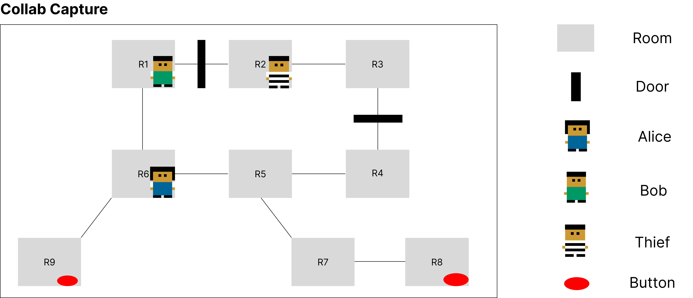
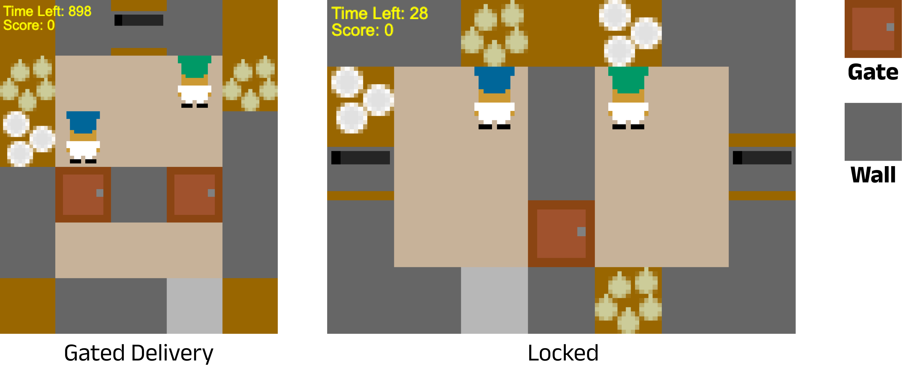
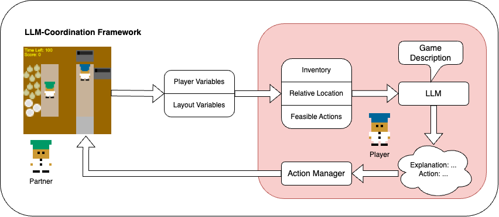
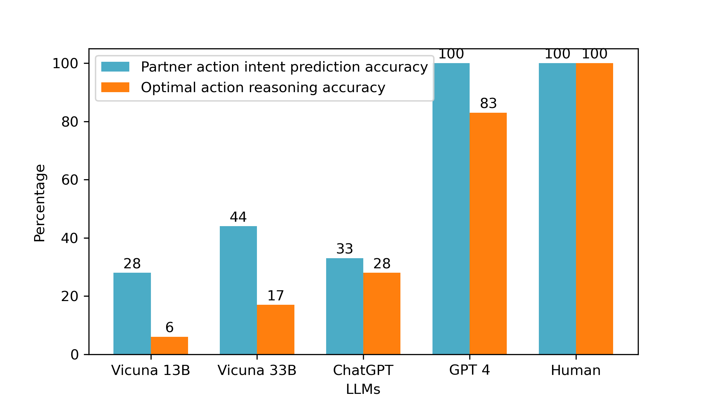
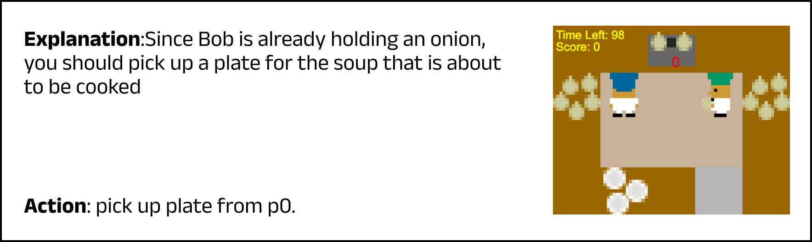
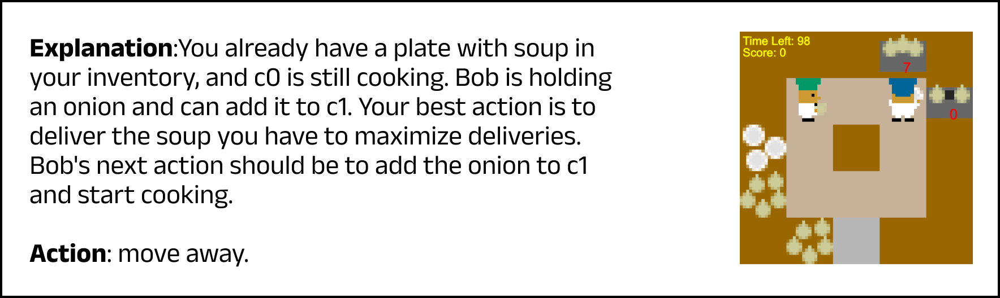
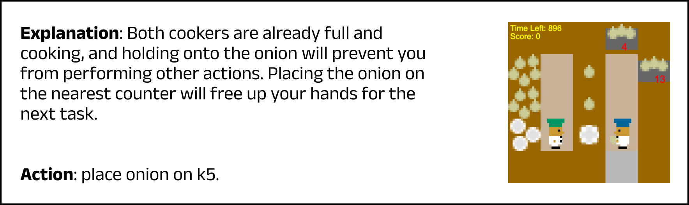
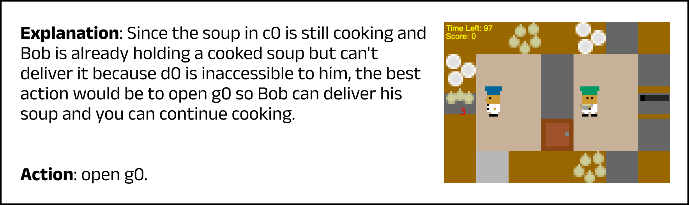

# LLM-协调：探究大型语言模型内多代理协作能力的综合评估与深入分析

发布时间：2024年04月02日

`分类：Agent` `人工智能` `多智能体系统`

> LLM-Coordination: Evaluating and Analyzing Multi-agent Coordination Abilities in Large Language Models

# 摘要

> 大型语言模型（LLMs）所展现的推理和心理理论（ToM）能力，使其成为构建协调智能体的理想选择。本研究提出了一项新的LLM-协调基准测试，专注于分析LLMs在纯协调游戏场景中的表现，这类游戏中的参与者需协作以实现最大化收益。该基准测试包含两项任务：（1）\emph{代理协调}，LLMs在4种纯协调游戏中扮演积极的合作角色；（2）\emph{协调问答（QA）}，LLMs需回答4个游戏中的198个选择题，以评估环境理解、ToM推理和联合规划三项关键推理技能。为实现LLMs的多智能体协调，我们引入了认知架构协调（CAC）框架，该框架支持不同LLMs作为即插即用的模块，用于纯协调游戏。研究发现，搭载GPT-4-turbo的LLM智能体在需要基于环境常识的行动游戏中，表现出与最先进的强化学习算法相媲美的性能。零样本协调实验显示，与强化学习方法相比，LLM智能体对新伙伴具有较强的适应性。然而，协调QA的结果显示LLMs在ToM推理和联合规划方面仍有提升空间。此外，分析还揭示了LLMs理解环境及其伙伴的信念和意图，对于它们协调规划能力的重要性。相关代码已在 \url{https://github.com/eric-ai-lab/llm_coordination} 上发布。

> The emergent reasoning and Theory of Mind (ToM) abilities demonstrated by Large Language Models (LLMs) make them promising candidates for developing coordination agents. In this study, we introduce a new LLM-Coordination Benchmark aimed at a detailed analysis of LLMs within the context of Pure Coordination Games, where participating agents need to cooperate for the most gain. This benchmark evaluates LLMs through two distinct tasks: (1) \emph{Agentic Coordination}, where LLMs act as proactive participants for cooperation in 4 pure coordination games; (2) \emph{Coordination Question Answering (QA)}, where LLMs are prompted to answer 198 multiple-choice questions from the 4 games for evaluation of three key reasoning abilities: Environment Comprehension, ToM Reasoning, and Joint Planning. Furthermore, to enable LLMs for multi-agent coordination, we introduce a Cognitive Architecture for Coordination (CAC) framework that can easily integrate different LLMs as plug-and-play modules for pure coordination games. Our findings indicate that LLM agents equipped with GPT-4-turbo achieve comparable performance to state-of-the-art reinforcement learning methods in games that require commonsense actions based on the environment. Besides, zero-shot coordination experiments reveal that, unlike RL methods, LLM agents are robust to new unseen partners. However, results on Coordination QA show a large room for improvement in the Theory of Mind reasoning and joint planning abilities of LLMs. The analysis also sheds light on how the ability of LLMs to understand their environment and their partner's beliefs and intentions plays a part in their ability to plan for coordination. Our code is available at \url{https://github.com/eric-ai-lab/llm_coordination}.

[Arxiv](https://arxiv.org/abs/2310.03903)