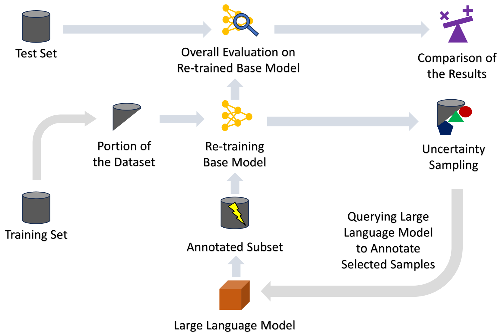
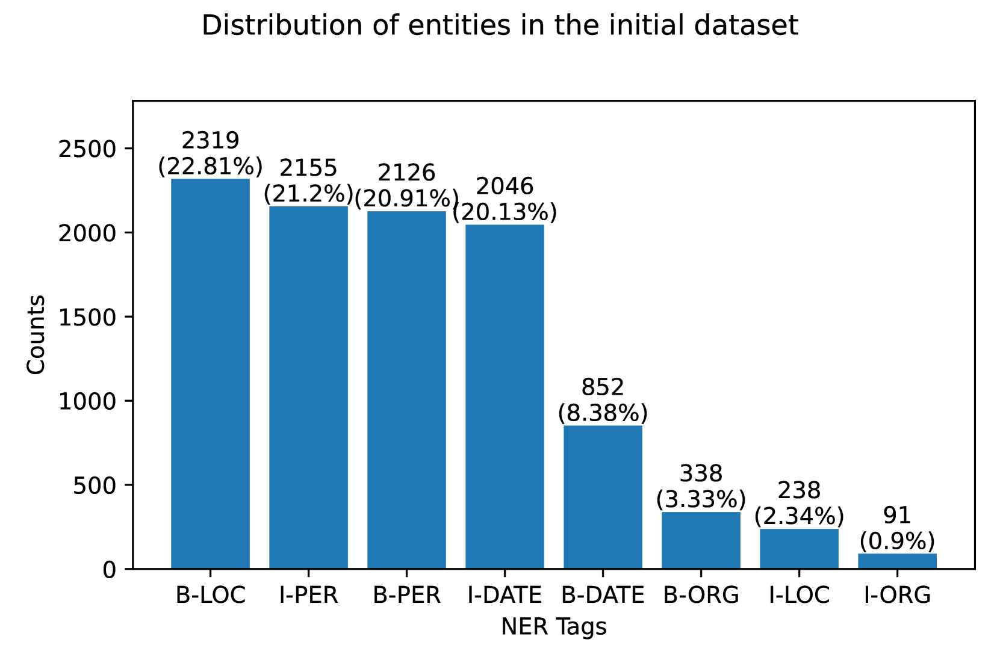
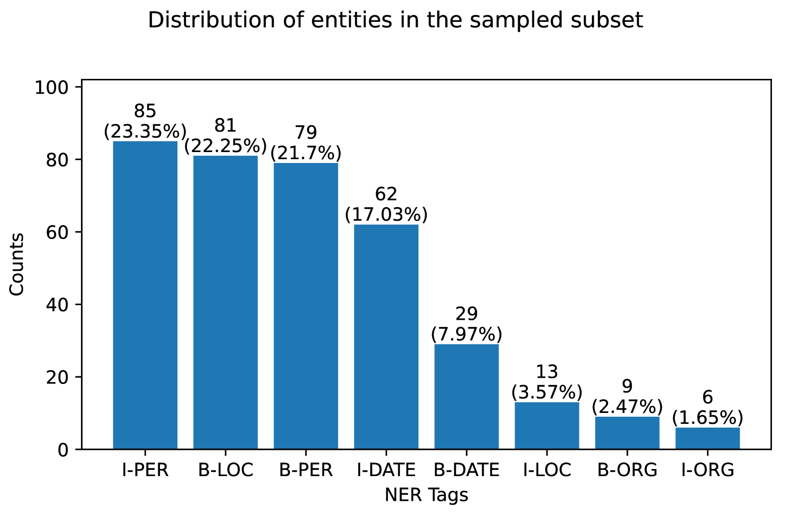
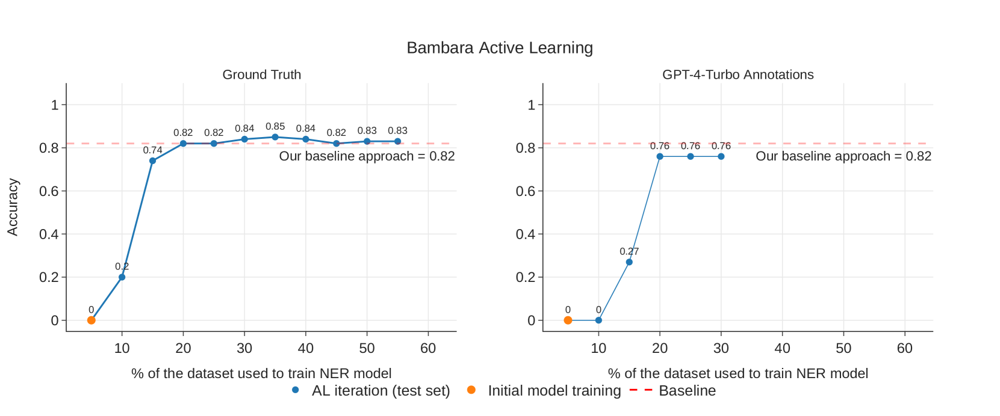
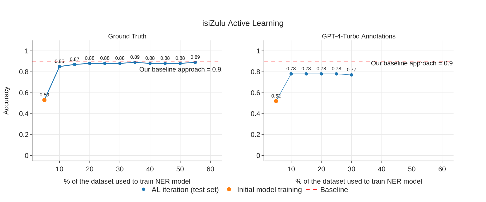

# 大型语言模型（LLM）循环应用：借助其注释功能，为低资源语言的主动学习提供支持。

发布时间：2024年04月02日

`LLM应用` `低资源语言`

> LLMs in the Loop: Leveraging Large Language Model Annotations for Active Learning in Low-Resource Languages

# 摘要

> 低资源语言在AI发展道路上因标注资源和专业知识的匮乏而遭遇重重阻碍，导致它们既稀有又昂贵。数据的不足和缺乏现成工具使得问题更加严峻，特别是考虑到这些语言在众多自然语言处理数据集中可能未得到充分展现。为填补这一空白，我们提出利用大型语言模型（LLMs）在主动学习循环中的潜力，以辅助数据标注。我们首先进行评估，以确保注释者之间的一致性和协议，从而筛选出合适的LLM注释器。接着，该注释器被融入到一个基于主动学习原则的分类器训练循环中，从而大幅减少所需查询的数据量。通过实证评估，尤其是运用GPT-4-Turbo，我们证明了其性能接近当前的最先进水平，并且显著降低了数据需求，据估计与人工注释相比，潜在的成本节约至少可达42.45倍。我们的方案展现出极大的潜力，能够大幅降低低资源环境下自动化所需的金钱和计算成本。这种方法通过连接低资源语言与AI的鸿沟，推动了更广泛的参与度，并有潜力在多样化的语言环境中实现自动化。

> Low-resource languages face significant barriers in AI development due to limited linguistic resources and expertise for data labeling, rendering them rare and costly. The scarcity of data and the absence of preexisting tools exacerbate these challenges, especially since these languages may not be adequately represented in various NLP datasets. To address this gap, we propose leveraging the potential of LLMs in the active learning loop for data annotation. Initially, we conduct evaluations to assess inter-annotator agreement and consistency, facilitating the selection of a suitable LLM annotator. The chosen annotator is then integrated into a training loop for a classifier using an active learning paradigm, minimizing the amount of queried data required. Empirical evaluations, notably employing GPT-4-Turbo, demonstrate near-state-of-the-art performance with significantly reduced data requirements, as indicated by estimated potential cost savings of at least 42.45 times compared to human annotation. Our proposed solution shows promising potential to substantially reduce both the monetary and computational costs associated with automation in low-resource settings. By bridging the gap between low-resource languages and AI, this approach fosters broader inclusion and shows the potential to enable automation across diverse linguistic landscapes.

[Arxiv](https://arxiv.org/abs/2404.02261)