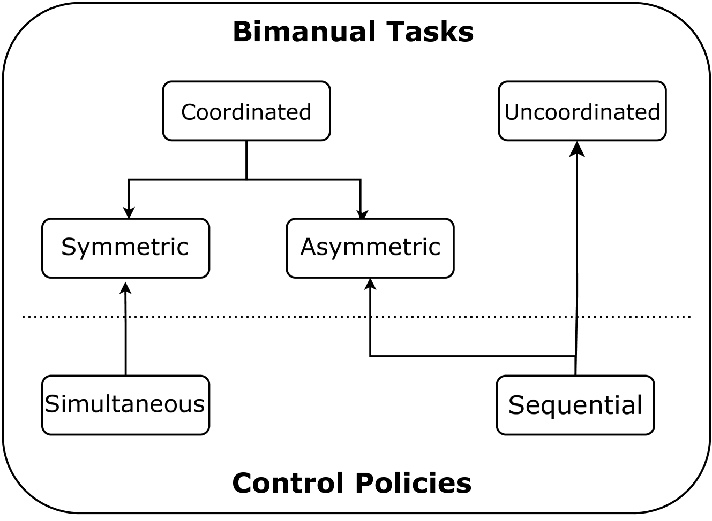
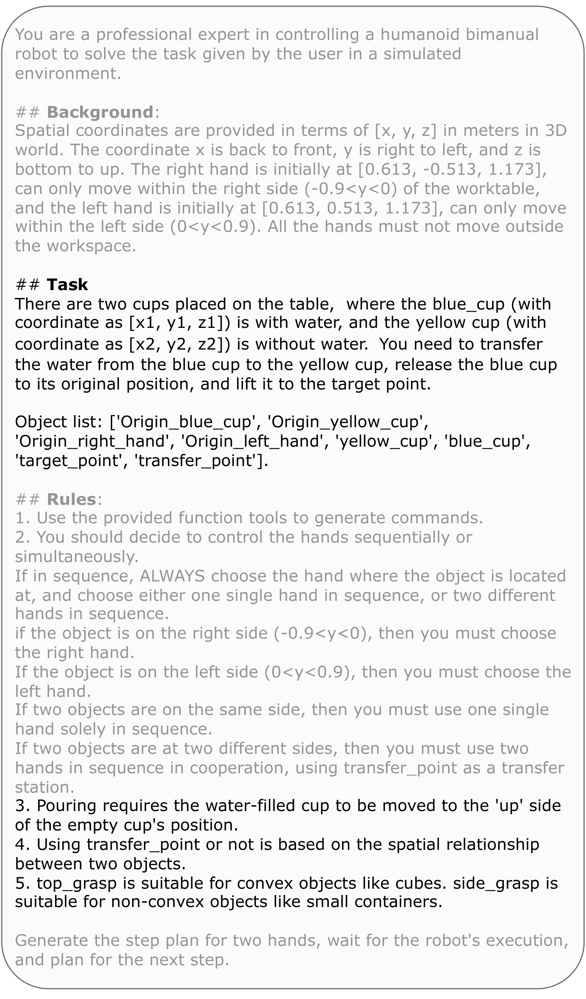
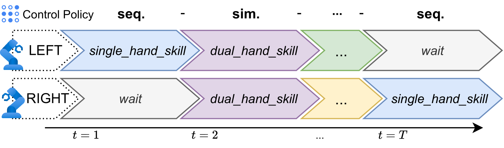
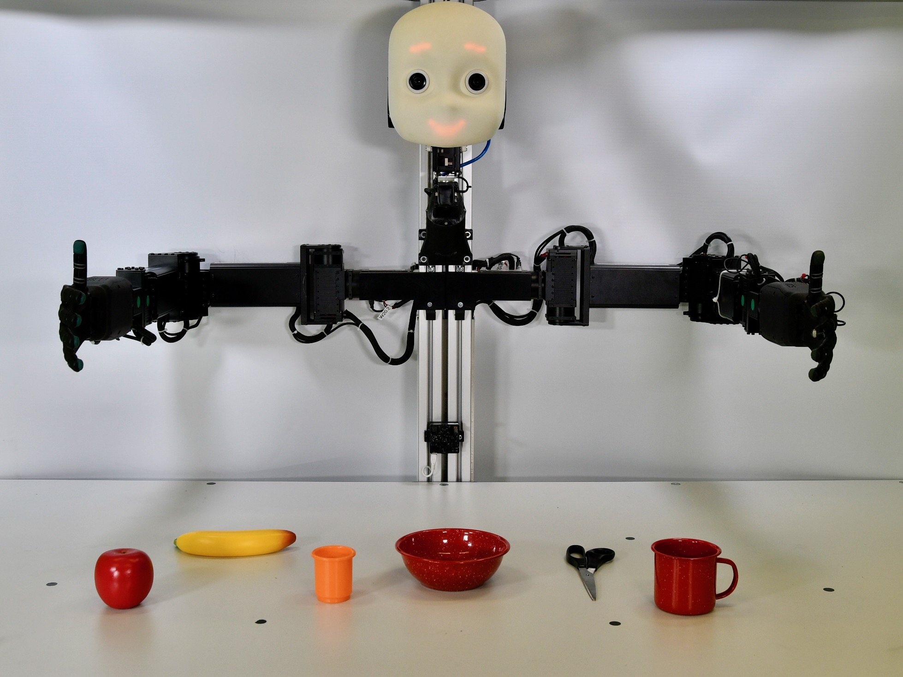
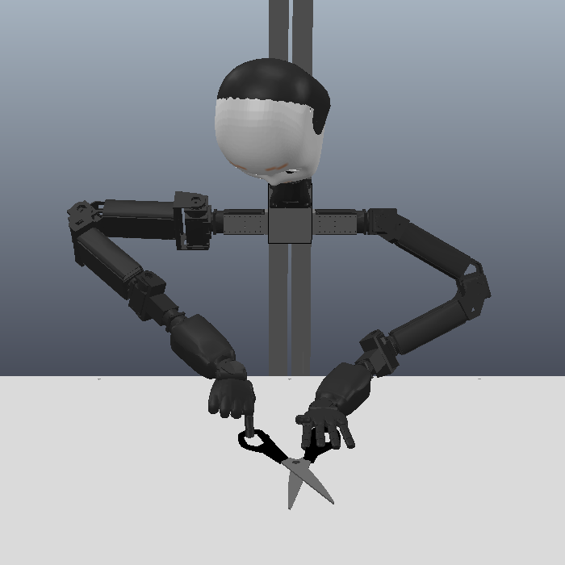
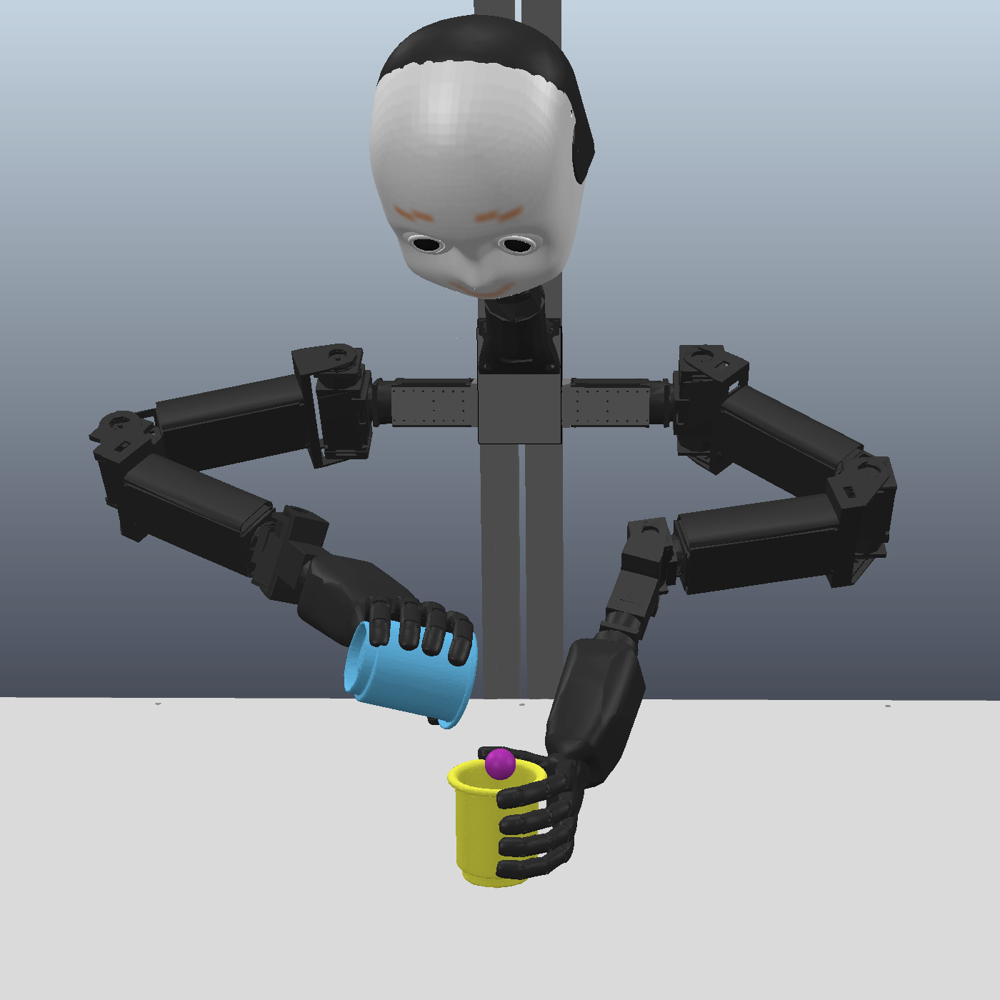
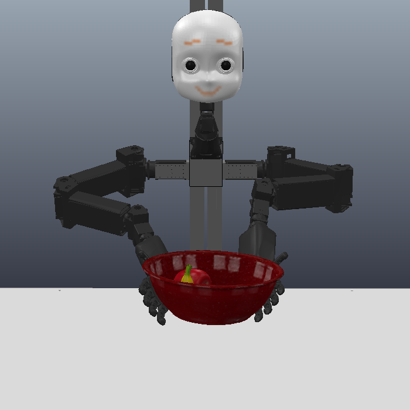
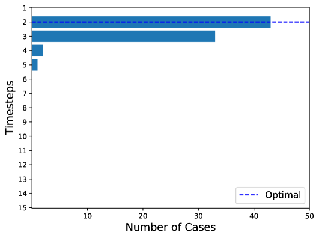
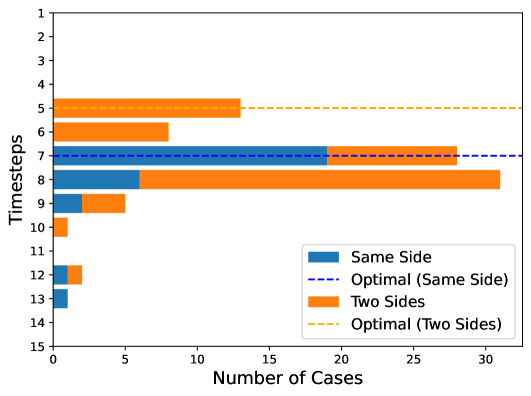
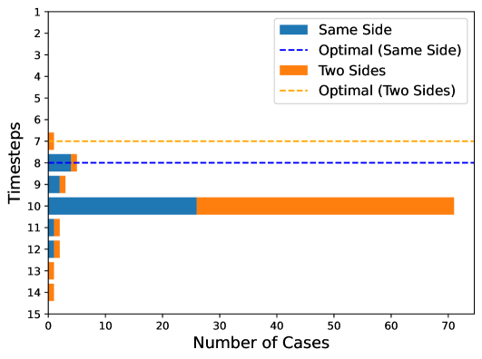

# 通过大型语言模型，我们能够精准地指挥双手机器人的协同工作。

发布时间：2024年04月02日

`Agent` `机器人` `控制策略`

> Large Language Models for Orchestrating Bimanual Robots

# 摘要

> 虽然机器人在处理复杂操作任务上取得了飞速进步，但为双手臂机器人设计能够处理双手任务的控制策略依然充满挑战，这主要因为需要精准的时间和空间协调。大型语言模型（LLMs）凭借其逐步推理和情境学习能力，已经成功掌控了众多机器人操作任务。然而，由于语言沟通依赖于一系列离散符号序列，LLM在连续空间中进行双手任务协调面临着独特难题。为了首次应对这一挑战，我们推出了名为LABOR的语言模型驱动的双手协调系统，该系统使用LLM来分析任务配置，并制定出应对长期双手任务的协调控制策略。在模拟环境中，通过对NICOL人形机器人执行的日常任务进行测试，LABOR代理的成功率接近最优表现。而对失败原因的分析，按空间和时间协调以及技能选择分类，揭示了这些因素在不同任务中的差异性。更多项目详情，请访问 http://labor-agent.github.io。

> Although there has been rapid progress in endowing robots with the ability to solve complex manipulation tasks, generating control policies for bimanual robots to solve tasks involving two hands is still challenging because of the difficulties in effective temporal and spatial coordination. With emergent abilities in terms of step-by-step reasoning and in-context learning, Large Language Models (LLMs) have taken control of a variety of robotic tasks. However, the nature of language communication via a single sequence of discrete symbols makes LLM-based coordination in continuous space a particular challenge for bimanual tasks. To tackle this challenge for the first time by an LLM, we present LAnguage-model-based Bimanual ORchestration (LABOR), an agent utilizing an LLM to analyze task configurations and devise coordination control policies for addressing long-horizon bimanual tasks. In the simulated environment, the LABOR agent is evaluated through several everyday tasks on the NICOL humanoid robot. Reported success rates indicate that overall coordination efficiency is close to optimal performance, while the analysis of failure causes, classified into spatial and temporal coordination and skill selection, shows that these vary over tasks. The project website can be found at http://labor-agent.github.io

[Arxiv](https://arxiv.org/abs/2404.02018)