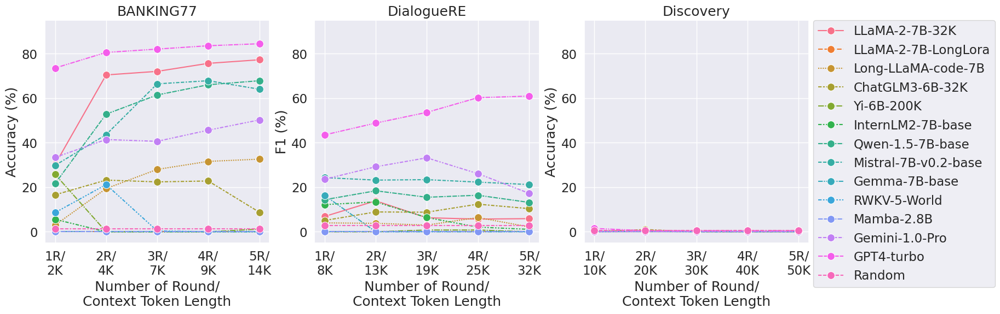
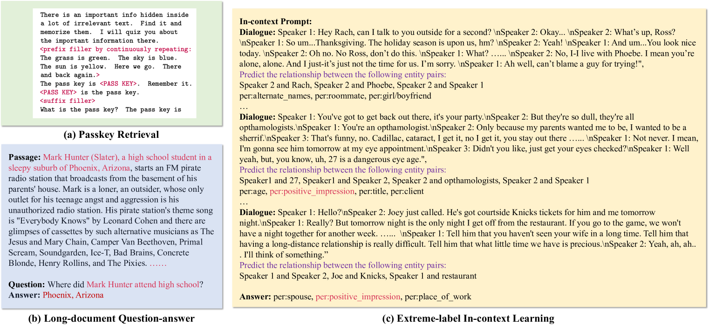
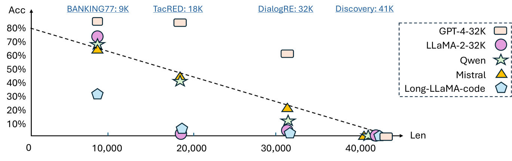
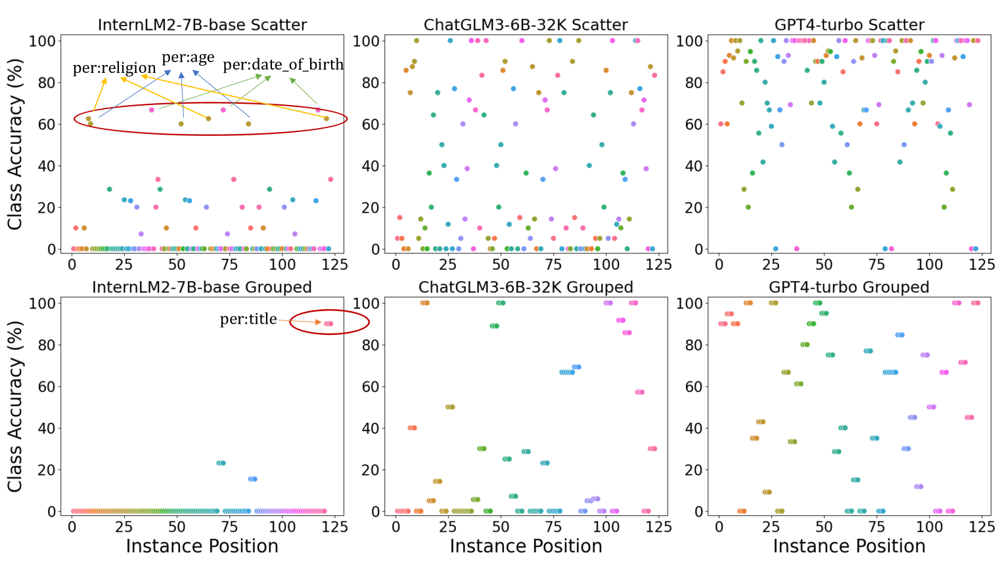

# 长篇幅的语境对于大型语言模型来说，在进行长距离的情境学习时显得颇为棘手。

发布时间：2024年04月02日

`LLM理论` `长文本处理` `基准测试`

> Long-context LLMs Struggle with Long In-context Learning

# 摘要

> 大型语言模型（LLMs）已在驾驭长文本序列方面取得突破，但目前的性能评估多依赖于困惑度等指标，这些指标未必能全面反映其在现实情境中的表现。本研究推出了一项针对长文本上下文学习的专项基准测试（LIConBench），专注于极端标签分类任务。我们精选了六个数据集，标签类别从28到174不等，输入长度从2K到50K，以考察模型对不同长度输入的理解能力。该基准测试要求LLMs全面理解输入内容，准确识别广泛的标签类别。我们对13种长文本LLMs进行了评估，结果显示，在20K标记长度内，这些模型表现尚可，且能从长文本窗口中获益。但一旦上下文长度超过20K，多数模型（GPT-4除外）的性能会显著下降。这暴露了现有LLMs在处理长文本和理解丰富上下文方面的不足。我们发现模型倾向于选择序列末尾的标签进行预测，而在长序列中进行综合推理的能力仍需加强。本研究表明，深入理解长文本上下文对现有LLMs而言仍是一大挑战。LIConBench基准测试为评估未来长文本LLMs提供了更为贴近实际的评估方法。

> Large Language Models (LLMs) have made significant strides in handling long sequences exceeding 32K tokens. However, their performance evaluation has largely been confined to metrics like perplexity and synthetic tasks, which may not fully capture their abilities in more nuanced, real-world scenarios. This study introduces a specialized benchmark (LIConBench) focusing on long in-context learning within the realm of extreme-label classification. We meticulously selected six datasets with a label range spanning 28 to 174 classes covering different input (few-shot demonstration) length from 2K to 50K. Our benchmark requires LLMs to comprehend the entire input to recognize the massive label spaces to make correct prediction. We evaluate 13 long-context LLMs on our benchmarks. We find that the long-context LLMs perform relatively well under the token length of 20K and the performance benefits from utilizing the long context window. However, after the context window exceeds 20K, most LLMs except GPT-4 will dip dramatically. This suggests a notable gap in current LLM capabilities for processing and understanding long, context-rich sequences. Further analysis revealed a tendency among models to favor predictions for labels presented towards the end at the sequence. Their ability to reason over multiple pieces in the long sequence is yet to be improved. Our study reveals that long context understanding and reasoning is still a challenging task for the existing LLMs. We believe LIConBench could serve as a more realistic evaluation for the future long context LLMs.

[Arxiv](https://arxiv.org/abs/2404.02060)