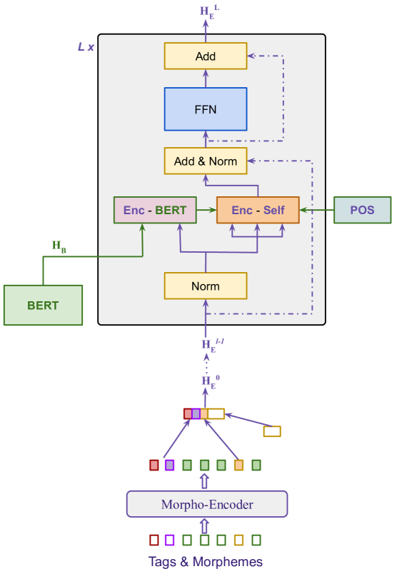
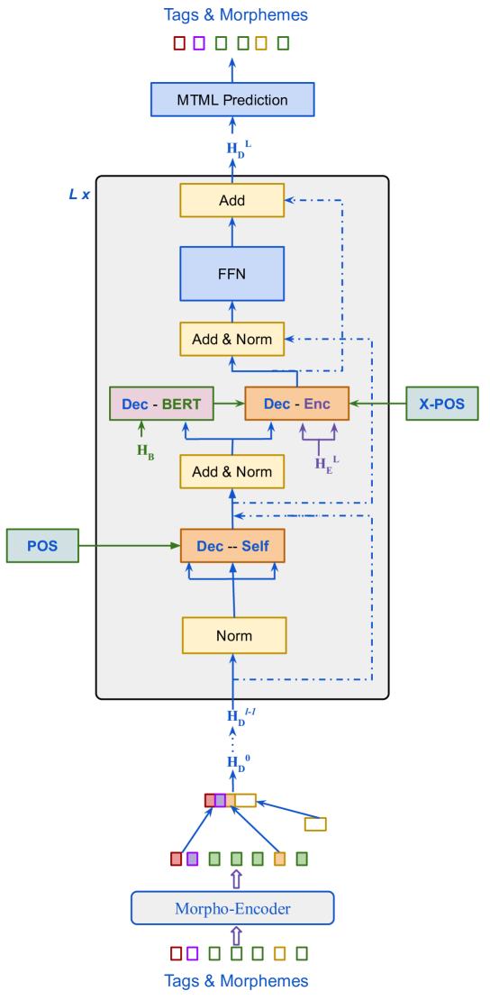

# 在资源有限的情况下，通过形态建模来提升神经机器翻译的性能。

发布时间：2024年04月02日

`LLM应用` `机器翻译` `低资源语言处理`

> Low-resource neural machine translation with morphological modeling

# 摘要

> 神经机器翻译（NMT）中的形态建模为形态丰富的语言实现开放词汇翻译开辟了新径。但现有技术，如子词切分和字符级模型，仅关注词汇的表面形态。本研究提出了一种针对低资源语言的复杂形态建模框架。采用双层变换器结构来捕捉输入中的形态特征。目标端输出则结合多任务多标签训练和束搜索解码器，以提升翻译质量。我们还提出了一种通用的注意力增强策略，不仅便于整合预训练语言模型，还能有效模拟源目标语言的词序关系。经过多种数据增强技术的测试，证实了它们在提升低资源环境下翻译性能方面的有效性。通过公开的平行语料库，我们在Kinyarwanda至英语翻译任务上验证了方案的有效性，最终模型与大型多语言模型相比表现出色。我们期望这些成果能激发更多利用显式形态信息以及模型和数据增强技术在低资源NMT中的应用。

> Morphological modeling in neural machine translation (NMT) is a promising approach to achieving open-vocabulary machine translation for morphologically-rich languages. However, existing methods such as sub-word tokenization and character-based models are limited to the surface forms of the words. In this work, we propose a framework-solution for modeling complex morphology in low-resource settings. A two-tier transformer architecture is chosen to encode morphological information at the inputs. At the target-side output, a multi-task multi-label training scheme coupled with a beam search-based decoder are found to improve machine translation performance. An attention augmentation scheme to the transformer model is proposed in a generic form to allow integration of pre-trained language models and also facilitate modeling of word order relationships between the source and target languages. Several data augmentation techniques are evaluated and shown to increase translation performance in low-resource settings. We evaluate our proposed solution on Kinyarwanda - English translation using public-domain parallel text. Our final models achieve competitive performance in relation to large multi-lingual models. We hope that our results will motivate more use of explicit morphological information and the proposed model and data augmentations in low-resource NMT.

[Arxiv](https://arxiv.org/abs/2404.02392)