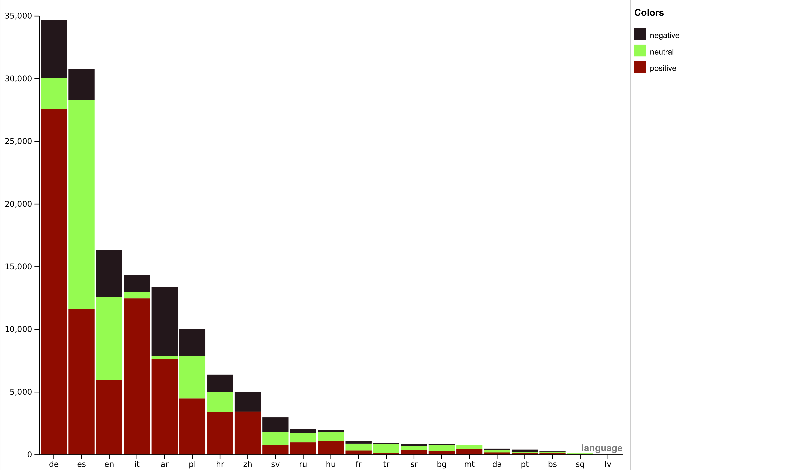
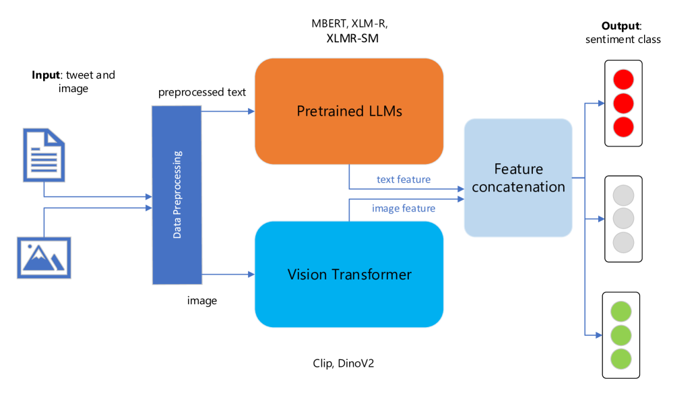
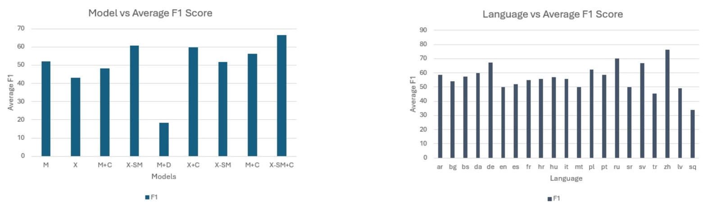
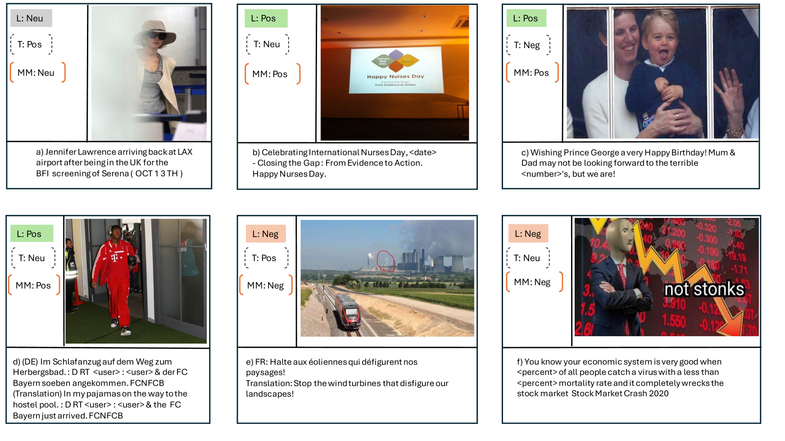

# M2SA：一款针对推文情感分析的多模态、多语言模型

发布时间：2024年04月02日

`LLM应用` `情感分析` `多模态处理`

> M2SA: Multimodal and Multilingual Model for Sentiment Analysis of Tweets

# 摘要

> 近些年，多模态自然语言处理因其能从多种数据类型中学习而备受瞩目。但在多语种情境下对多模态任务进行分析时，还需进一步阐明。过往对推特情感分析的研究多以英语为主，本文通过简化的数据整合流程，将文本型推特情感数据集转化为多模态格式，弥补了研究空缺。本研究为情感研究领域开辟了新路径。我们还利用扩充后的数据集进行了基础实验，实验结果显示，在单模态与多模态设置的比较中，采用针对情感优化的大型语言模型作为文本编码器，效果尤为突出。

> In recent years, multimodal natural language processing, aimed at learning from diverse data types, has garnered significant attention. However, there needs to be more clarity when it comes to analysing multimodal tasks in multi-lingual contexts. While prior studies on sentiment analysis of tweets have predominantly focused on the English language, this paper addresses this gap by transforming an existing textual Twitter sentiment dataset into a multimodal format through a straightforward curation process. Our work opens up new avenues for sentiment-related research within the research community. Additionally, we conduct baseline experiments utilising this augmented dataset and report the findings. Notably, our evaluations reveal that when comparing unimodal and multimodal configurations, using a sentiment-tuned large language model as a text encoder performs exceptionally well.

[Arxiv](https://arxiv.org/abs/2404.01753)