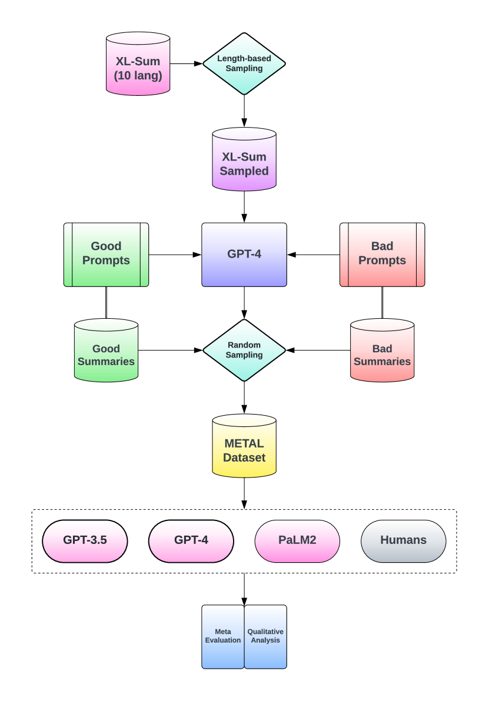
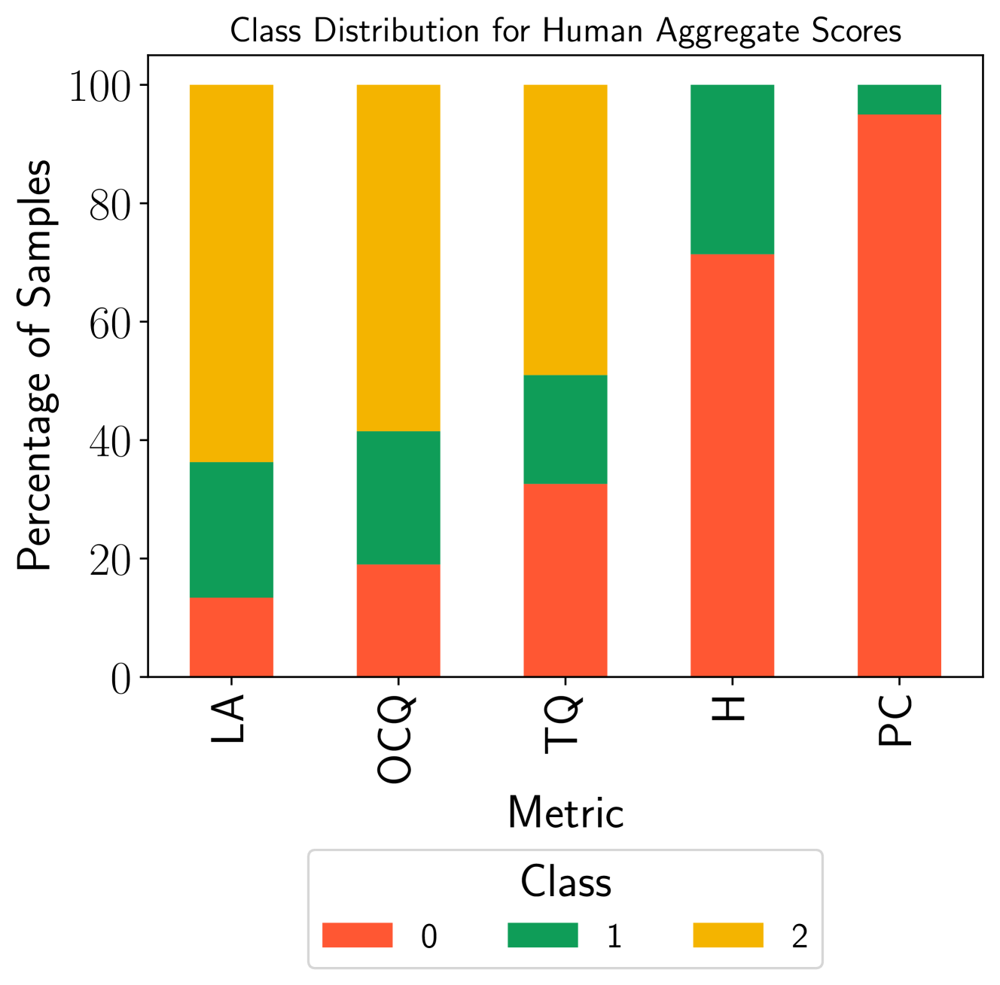
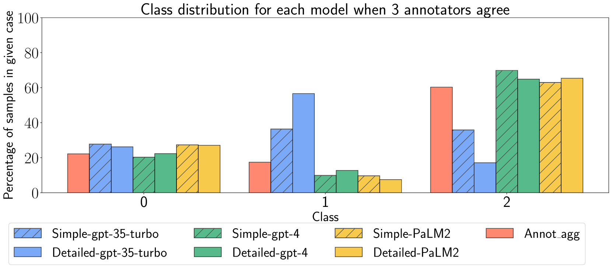
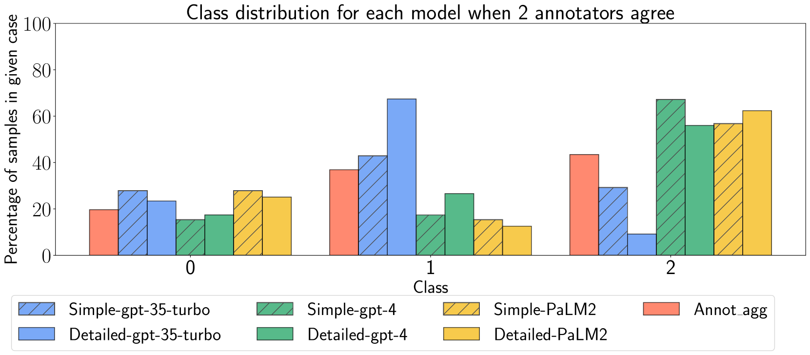
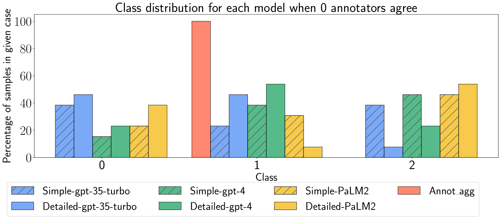
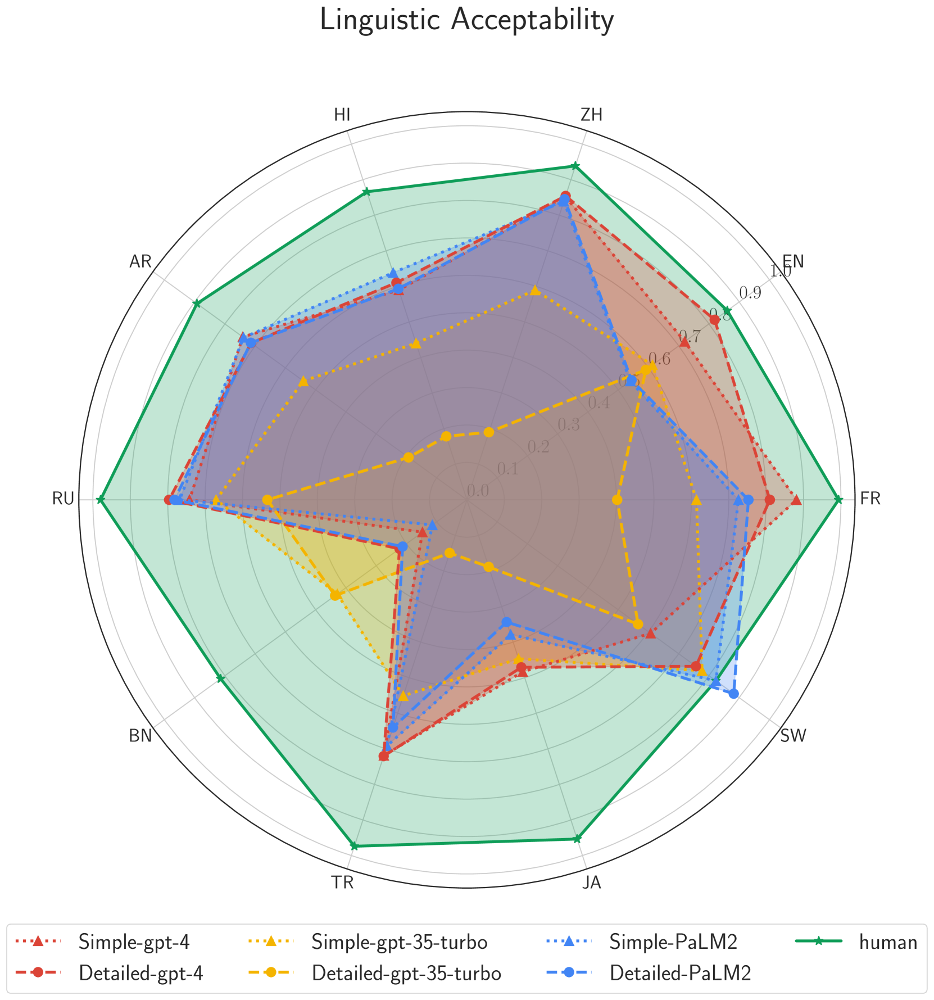
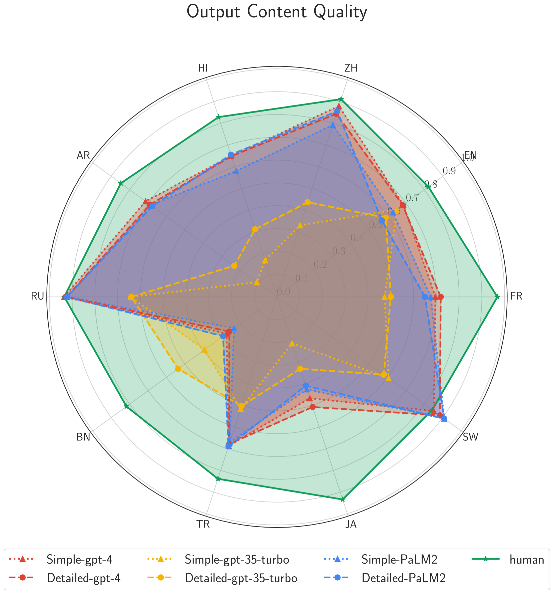
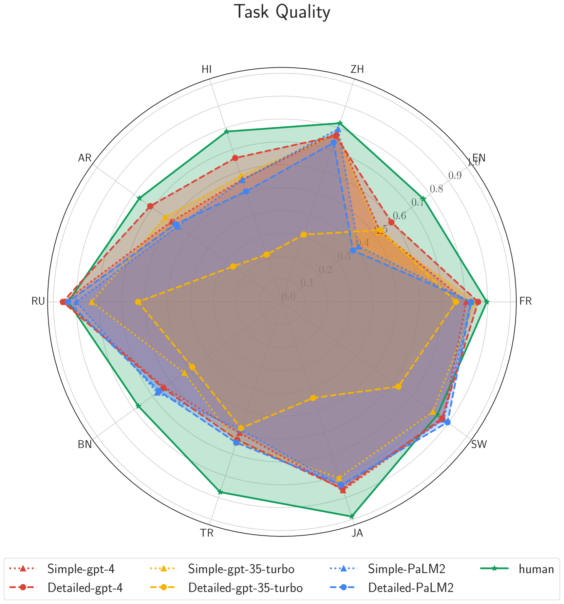
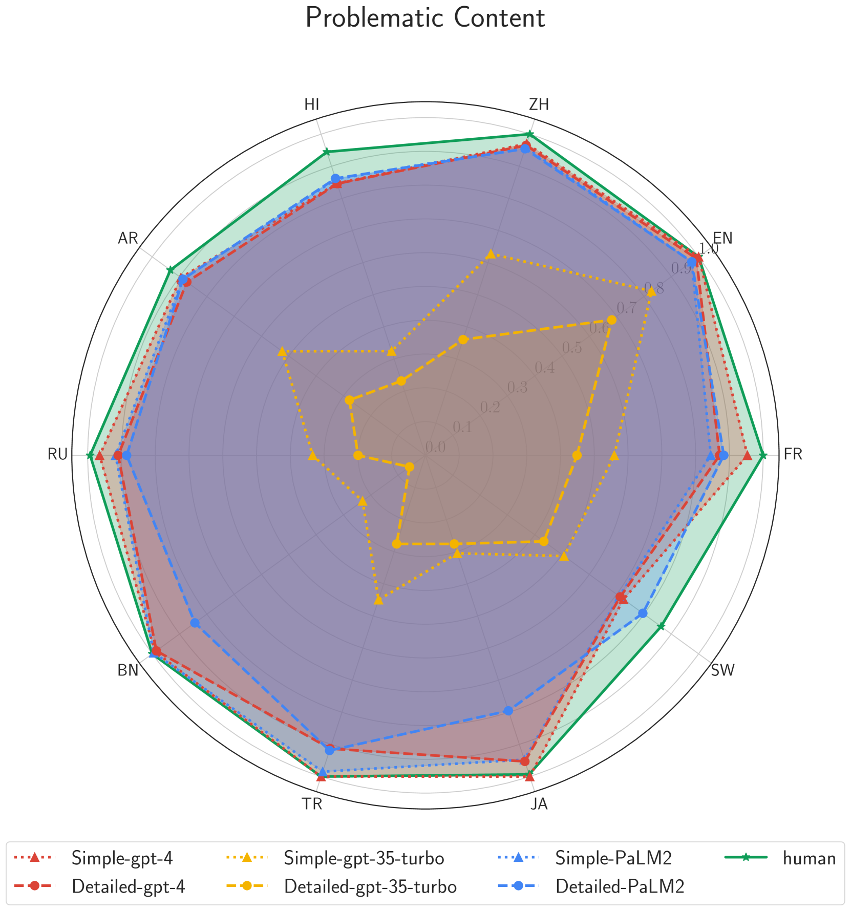
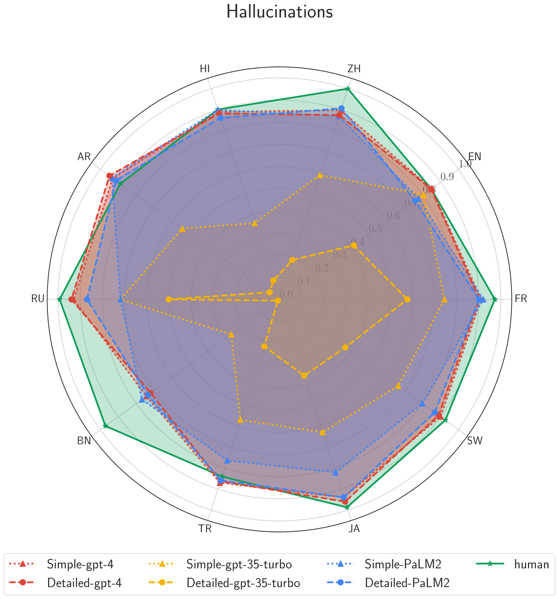

# METAL：探索多语言间的元评估方法

发布时间：2024年04月02日

`LLM应用` `机器学习评估`

> METAL: Towards Multilingual Meta-Evaluation

# 摘要

> 随着大型语言模型（LLMs）在各项任务中精准度逼近人类，它们在现实世界的应用也日益广泛。研究显示，LLMs在多项NLP标准测试中表现突出。但评估LLMs面临挑战，因为测试数据集可能受到污染，传统评估方法也有局限。鉴于获取人类评估的成本高昂，人们越来越倾向于利用LLMs作为主观评价的参照标准。然而，先前的研究发现，基于LLM的评估器可能存在偏差，与人类评价的一致性不高。本研究提出了一个全新的框架，旨在多语言环境下全面评估LLMs作为评估器的效果。我们构建了一个涵盖10种语言的数据集，收集了母语者对摘要任务的评价，专门用于评价基于LLM的评估器，即元评估（METAL）。我们对基于GPT-3.5-Turbo、GPT-4和PaLM2的评估器进行了性能比较。结果显示，基于GPT-4的评估器在跨语言评估中表现最佳，而GPT-3.5-Turbo则不尽人意。此外，我们还分析了LLM评估器的推理过程，发现其推理常常与人类评判者的推理不符。

> With the rising human-like precision of Large Language Models (LLMs) in numerous tasks, their utilization in a variety of real-world applications is becoming more prevalent. Several studies have shown that LLMs excel on many standard NLP benchmarks. However, it is challenging to evaluate LLMs due to test dataset contamination and the limitations of traditional metrics. Since human evaluations are difficult to collect, there is a growing interest in the community to use LLMs themselves as reference-free evaluators for subjective metrics. However, past work has shown that LLM-based evaluators can exhibit bias and have poor alignment with human judgments. In this study, we propose a framework for an end-to-end assessment of LLMs as evaluators in multilingual scenarios. We create a carefully curated dataset, covering 10 languages containing native speaker judgments for the task of summarization. This dataset is created specifically to evaluate LLM-based evaluators, which we refer to as meta-evaluation (METAL). We compare the performance of LLM-based evaluators created using GPT-3.5-Turbo, GPT-4, and PaLM2. Our results indicate that LLM-based evaluators based on GPT-4 perform the best across languages, while GPT-3.5-Turbo performs poorly. Additionally, we perform an analysis of the reasoning provided by LLM-based evaluators and find that it often does not match the reasoning provided by human judges.

[Arxiv](https://arxiv.org/abs/2404.01667)