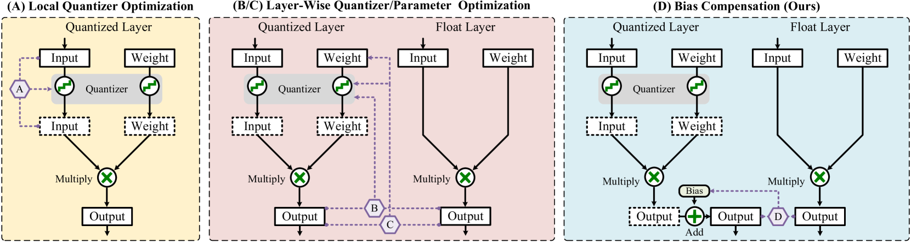
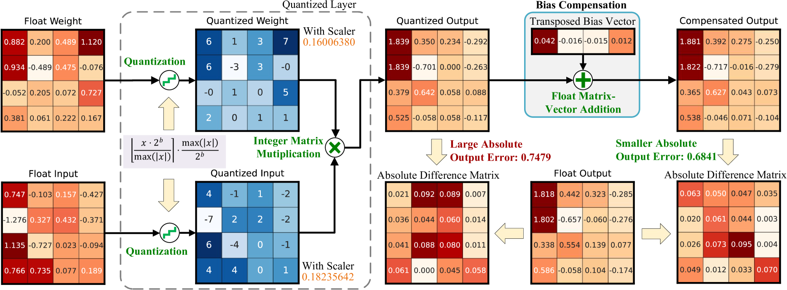
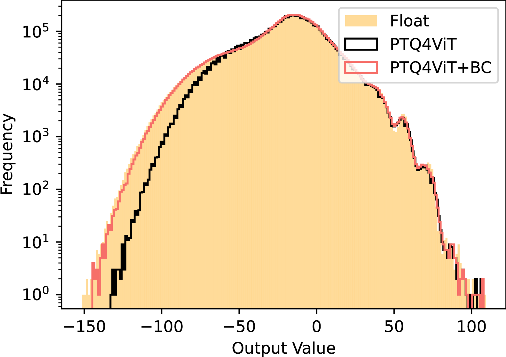
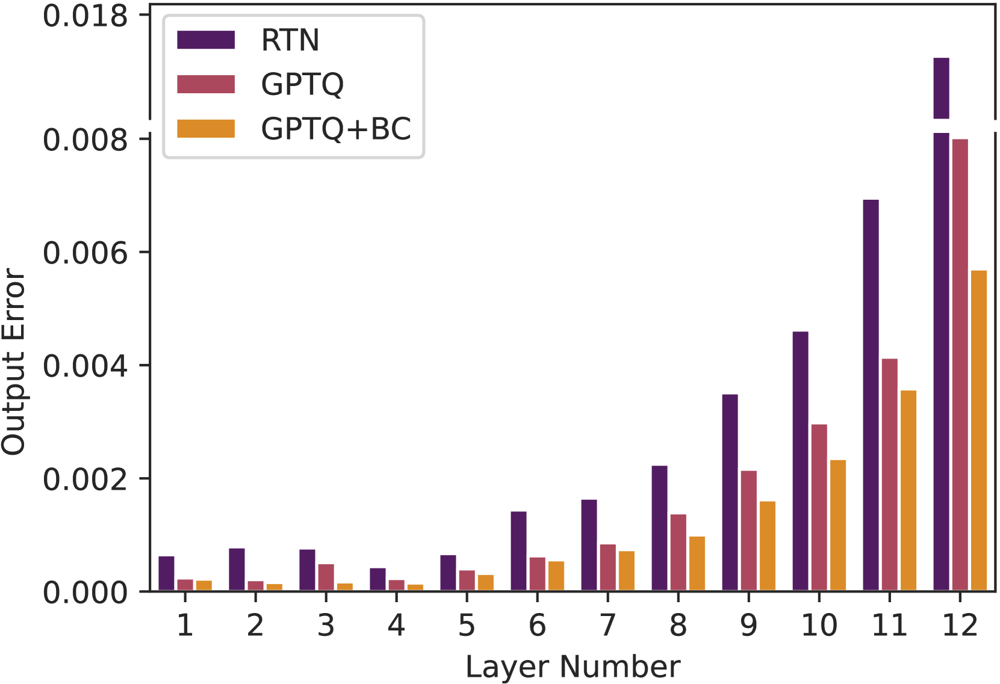
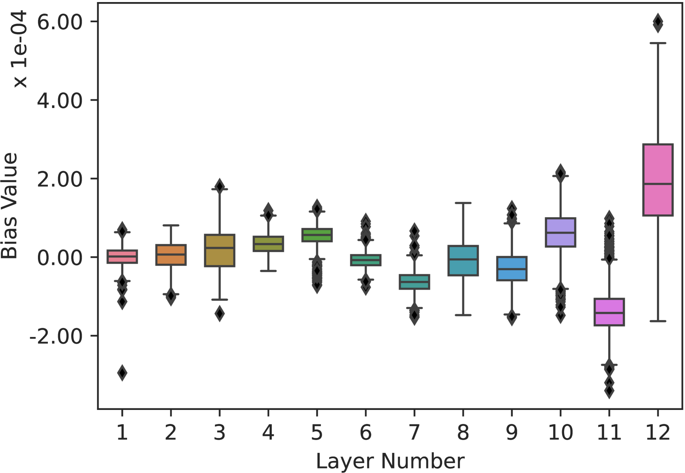

# 采用偏差校正法降低量化输出误差

发布时间：2024年04月02日

`LLM理论` `计算机视觉`

> Minimize Quantization Output Error with Bias Compensation

# 摘要

> 量化技术能有效降低深度神经网络的资源消耗，但同时也可能带来输出误差，影响模型的实际应用。本文提出了一种新颖的偏差补偿方法，通过直接识别偏差向量来减少输出误差，实现了无需微调的超低精度量化。这种方法的优势在于，它将输出误差最小化问题转化为一个简单的凸问题，提供了一种高效的求解策略。我们在Vision Transformer和大型语言模型上进行了大量实验，证实了该方法能显著降低量化误差，提升模型在视觉和语言任务上的表现。例如，在ImageNet-1k图像识别任务中，使用4位PTQ的ViT-B模型准确率提升了36.89%，在WikiText2语言模型任务中，3位GPTQ的困惑度降低了5.97%。相关代码已在GitHub上公开。

> Quantization is a promising method that reduces memory usage and computational intensity of Deep Neural Networks (DNNs), but it often leads to significant output error that hinder model deployment. In this paper, we propose Bias Compensation (BC) to minimize the output error, thus realizing ultra-low-precision quantization without model fine-tuning. Instead of optimizing the non-convex quantization process as in most previous methods, the proposed BC bypasses the step to directly minimize the quantizing output error by identifying a bias vector for compensation. We have established that the minimization of output error through BC is a convex problem and provides an efficient strategy to procure optimal solutions associated with minimal output error,without the need for training or fine-tuning. We conduct extensive experiments on Vision Transformer models and Large Language Models, and the results show that our method notably reduces quantization output error, thereby permitting ultra-low-precision post-training quantization and enhancing the task performance of models. Especially, BC improves the accuracy of ViT-B with 4-bit PTQ4ViT by 36.89% on the ImageNet-1k task, and decreases the perplexity of OPT-350M with 3-bit GPTQ by 5.97 on WikiText2.The code is in https://github.com/GongCheng1919/bias-compensation.

[Arxiv](https://arxiv.org/abs/2404.01892)