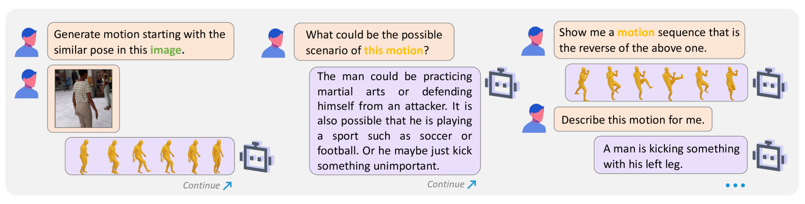
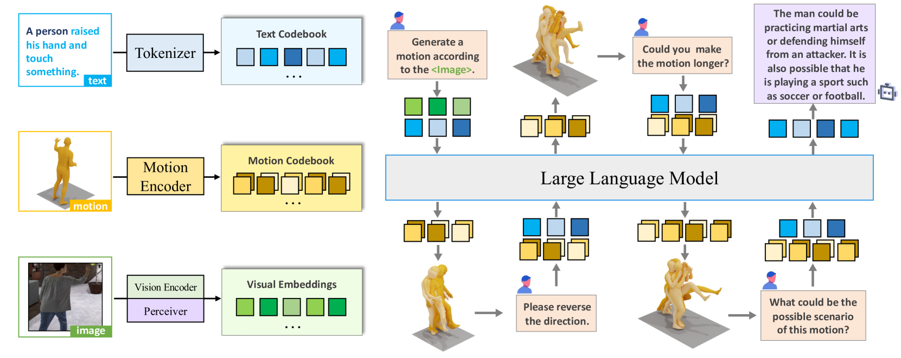
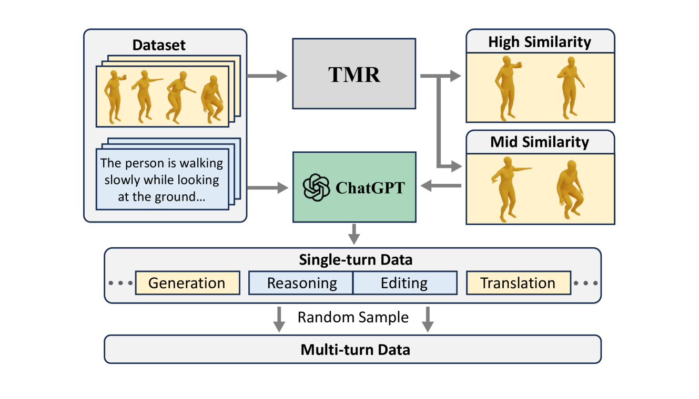
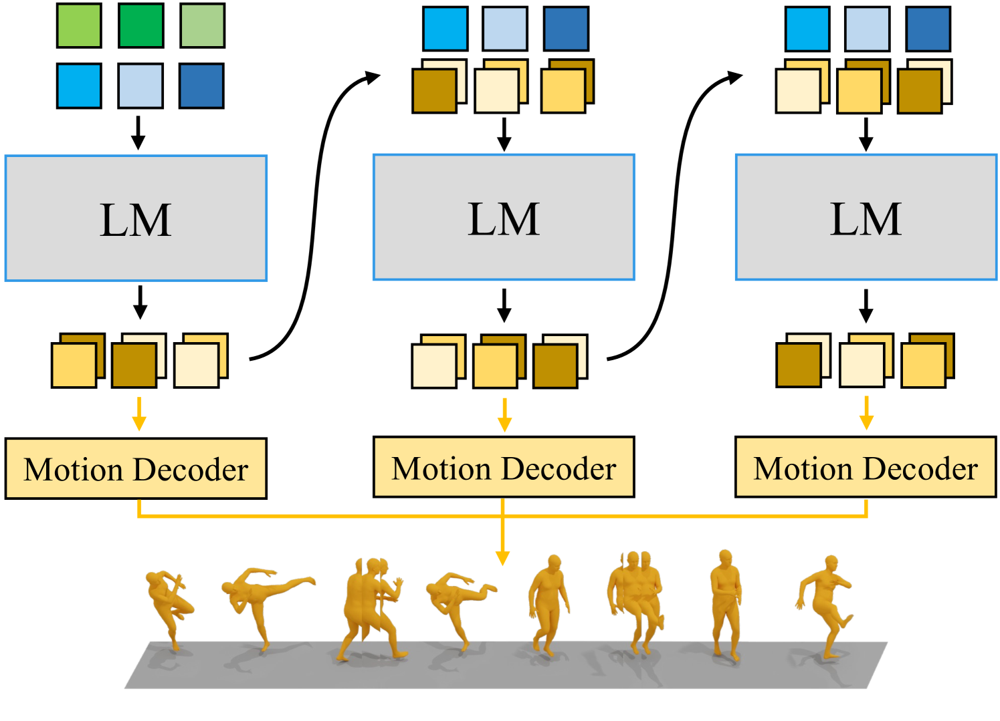
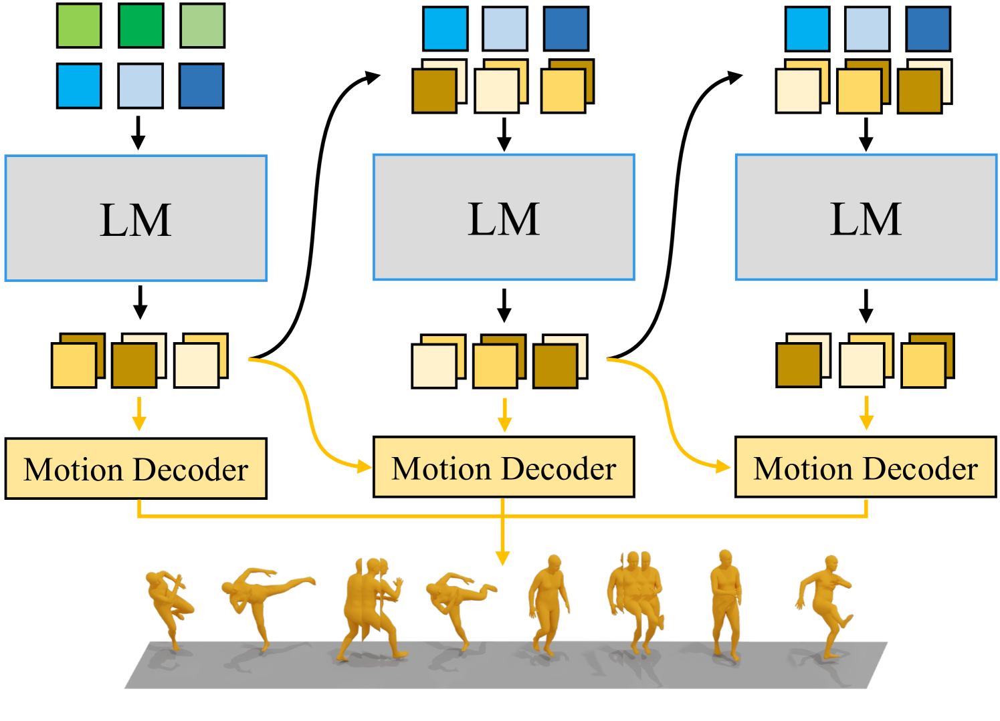
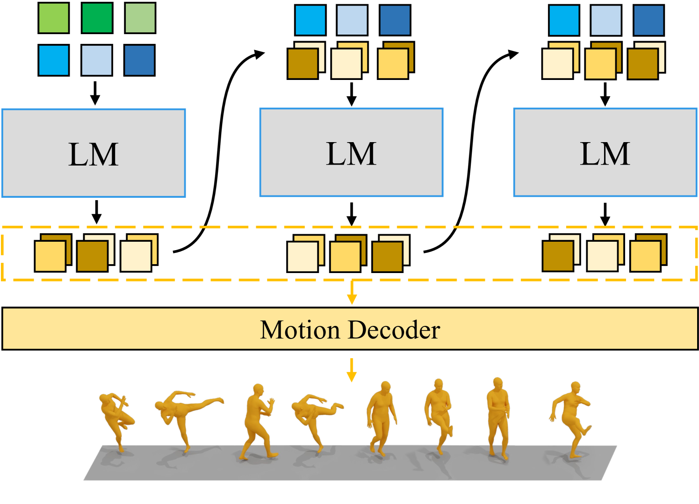
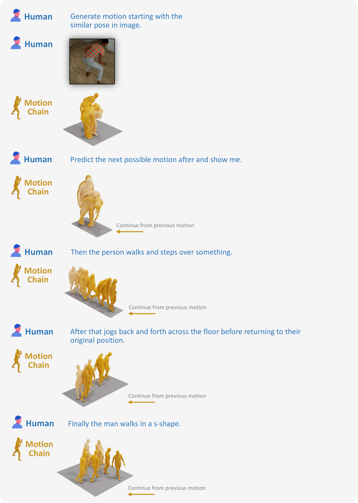
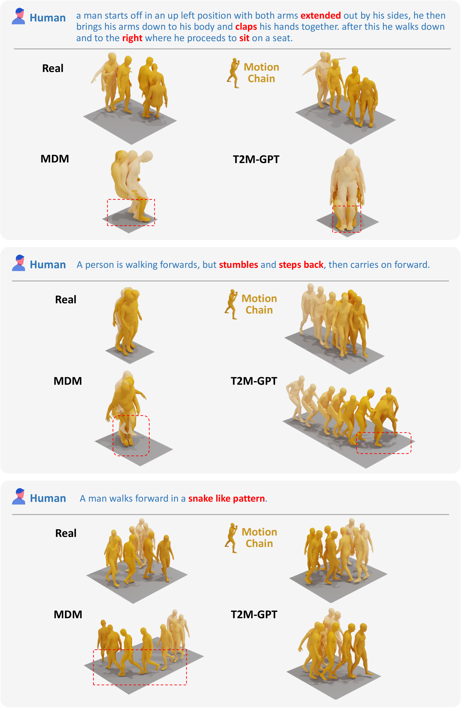
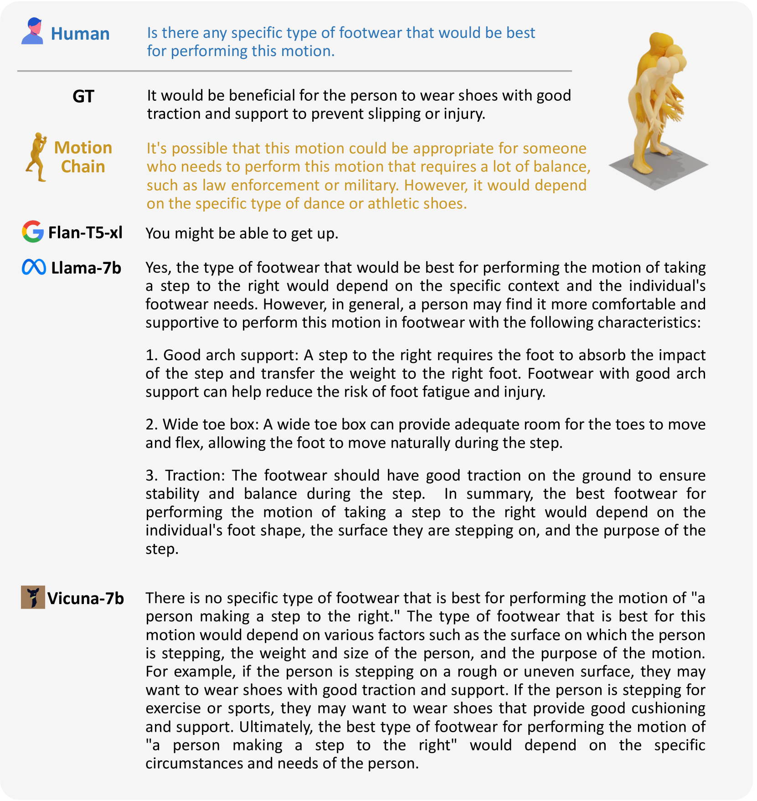
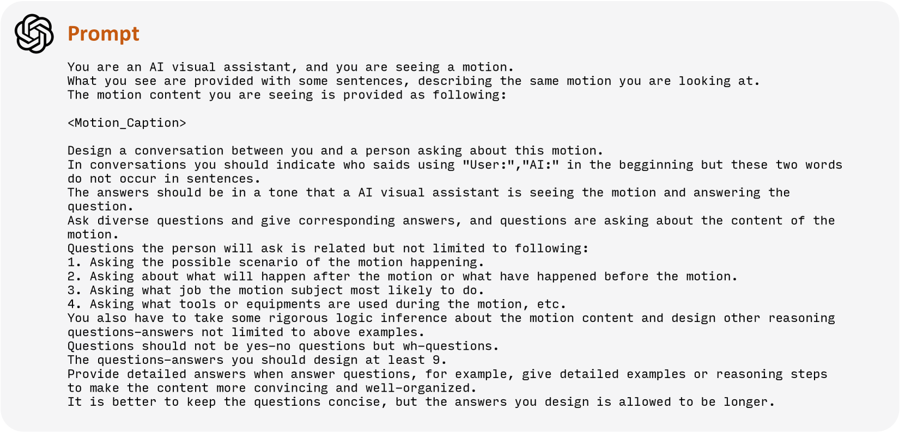

# MotionChain：借助多模态提示实现的交互式动作控制方案

发布时间：2024年04月02日

`LLM应用` `机器人` `游戏角色`

> MotionChain: Conversational Motion Controllers via Multimodal Prompts

# 摘要

> 近期语言模型的发展已证明其在处理多轮对话和保持交流语境方面的高超能力。然而，这种能力在其他多模态生成模型中，尤其是人类运动模型中，还未被充分挖掘。通过将多轮对话融入控制虚拟人物连续动作的过程中，生成性人类运动模型能够为机器人、游戏角色等具身系统提供直观、逐步的人类动作执行方法。我们在此介绍MotionChain——一款通过多模态提示生成连贯、长期人类动作的对话式运动控制器。MotionChain由多模态分词器和视觉-运动感知语言模型组成，能够将文本、图像、动作等不同数据类型转换为离散标记。利用大规模的语言、视觉-语言和视觉-运动数据，MotionChain能够理解多轮对话中的指令，并根据这些提示生成相应的人类动作。大量实验证实了MotionChain的有效性，其在对话驱动的动作生成方面达到了最先进的水平，并提供了更直观的虚拟人物控制和互动方式。

> Recent advancements in language models have demonstrated their adeptness in conducting multi-turn dialogues and retaining conversational context. However, this proficiency remains largely unexplored in other multimodal generative models, particularly in human motion models. By integrating multi-turn conversations in controlling continuous virtual human movements, generative human motion models can achieve an intuitive and step-by-step process of human task execution for humanoid robotics, game agents, or other embodied systems. In this work, we present MotionChain, a conversational human motion controller to generate continuous and long-term human motion through multimodal prompts. Specifically, MotionChain consists of multi-modal tokenizers that transform various data types such as text, image, and motion, into discrete tokens, coupled with a Vision-Motion-aware Language model. By leveraging large-scale language, vision-language, and vision-motion data to assist motion-related generation tasks, MotionChain thus comprehends each instruction in multi-turn conversation and generates human motions followed by these prompts. Extensive experiments validate the efficacy of MotionChain, demonstrating state-of-the-art performance in conversational motion generation, as well as more intuitive manners of controlling and interacting with virtual humans.

[Arxiv](https://arxiv.org/abs/2404.01700)